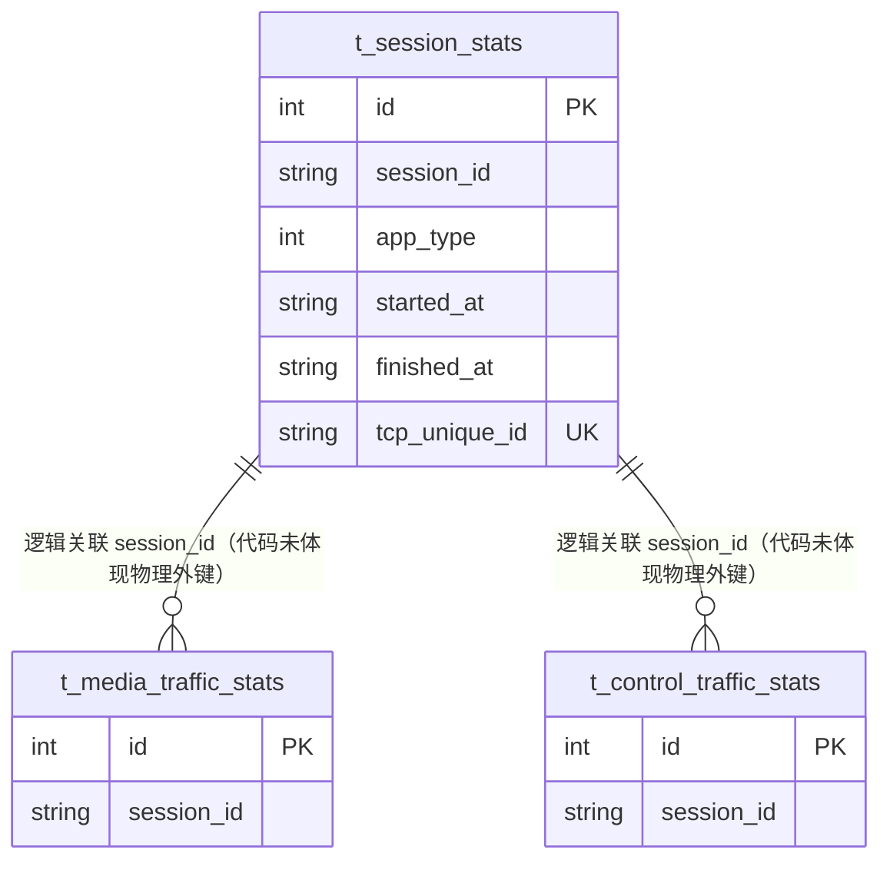

# 会话统计（SessionStats）数据模型

> 生成时间：2026-08-11
> 实体定义：`t_session_stats` 表 → src/dao/db_local_sqlite.go（CREATE TABLE，LOCAL_MODE）+ src/dao/db_init.go（CREATE TABLE，GaussDB）+ src/models/db/traffic_stats.go（entity `SessionStats`）

## 概述

SessionStats 记录一次会话的起止信息，tcp_unique_id 唯一标识一条 TCP 连接，持久化于表 t_session_stats，会话开始/结束时写入，媒体/控制流量统计按 session_id 与其逻辑关联。

## ER 图

## 字段表

| 字段 | 类型 | 含义 | 约束 |
| --- | --- | --- | --- |
| id | int | 主键，自增 | PRIMARY KEY AUTOINCREMENT；entity tag `orm:"auto;pk;column(id)"` |
| session_id | string / TEXT | 会话标识 | NOT NULL；索引 idx_session_session、复合索引 idx_session_session_app(session_id, app_type) |
| app_type | int / INTEGER | 应用类型 | NOT NULL；索引 idx_session_app |
| started_at | string / TEXT | 会话开始时间（RFC3339） | DEFAULT '' |
| finished_at | string / TEXT | 会话结束时间 | DEFAULT '' |
| tcp_unique_id | string / TEXT | TCP 连接唯一标识 | UNIQUE INDEX t_tcp_unique_id（src/dao/db_local_sqlite.go） |

## 数据生命周期

### 创建

会话开始上报触发：service/traffic_stats_service.go 经 SessionStatsDao.Exist（src/dao/traffic_stats_dao.go，按 tcp_unique_id 判重）不存在时 sd.Insert 写入，started_at 取上报值。

### 更新

会话结束上报触发：同 tcp_unique_id 再次上报时走 sd.UpdatebySession（src/dao/traffic_stats_dao.go）——先 GetIdByTcpUniqueId 取回 id，再仅更新 finished_at 列。

### 归档/删除

定时清理：src/scheduler/task_scheduler.go 触发 service/traffic_stats_service.go 的 CleanOldStats → cleanSessionStats，事务内删除 started_at 早于 cutoffTime（当前时间减 constants.CleanupMonths 个月）的记录。

## 缓存数据结构

无。

## 补充说明

tcp_unique_id 唯一索引是会话幂等写入的关键：开始/结束两次上报通过它归并为一行。session_id 与两张流量统计表均为逻辑关联（代码未体现物理外键），清理时三表分别删除，无级联一致性保证。关联实体见 [media_traffic_stats 数据模型](data-model-media-traffic-stats.md)、[control_traffic_stats 数据模型](data-model-control-traffic-stats.md)。
