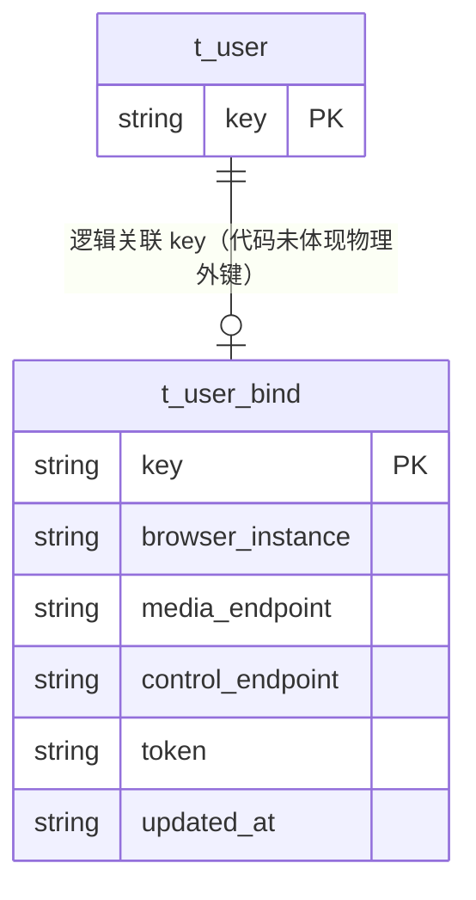

# 用户绑定（UserBind）数据模型

> 生成时间：2026-08-11
> 实体定义：`t_user_bind` 表 → src/dao/db_local_sqlite.go（CREATE TABLE，LOCAL_MODE）+ src/dao/db_init.go（CREATE TABLE，GaussDB）+ src/models/db/user.go（entity `UserBind`）

## 概述

UserBind 记录用户与云浏览器实例的绑定关系及各通道 endpoint（媒体/控制/TLS/内部地址）与 token，持久化于表 t_user_bind，登录链路与 user-bind 更新接口负责写入。

## ER 图

## 字段表

| 字段 | 类型 | 含义 | 约束 |
| --- | --- | --- | --- |
| key | string / TEXT | 用户标识主键（与 t_user.key 同值） | PRIMARY KEY；entity tag `orm:"pk;column(key)"` |
| browser_instance | string / TEXT | 绑定的浏览器实例标识 | DEFAULT '' |
| media_endpoint | string / TEXT | 媒体通道地址 | DEFAULT '' |
| control_endpoint | string / TEXT | 控制通道地址 | DEFAULT '' |
| media_tls_endpoint | string / TEXT | 媒体通道 TLS 地址 | DEFAULT '' |
| control_tls_endpoint | string / TEXT | 控制通道 TLS 地址 | DEFAULT '' |
| inner_media_endpoint | string / TEXT | 内部媒体地址 | DEFAULT '' |
| inner_browser_endpoint | string / TEXT | 内部浏览器地址 | DEFAULT '' |
| token | string / TEXT | 访问令牌 | DEFAULT '' |
| updated_at | string / TEXT | 心跳/更新时间（entity 字段名为 Heartbeats，`column(updated_at)`） | DEFAULT '' |

注：entity 中 BrowserCap 字段 tag `orm:"-"` 不落库。

## 数据生命周期

### 创建

登录接口触发：controllers/login_controller.go → service/browser_service.go 的 insertOrUpdate，ubd.Get 查不到时 ubd.Insert，写入浏览器实例与各 endpoint。

### 更新

三条路径：① 登录时 browser_service.go 的 insertOrUpdate 对已存在记录 ubd.Update 刷新 endpoint；② login 链路成功后 UpdateUserToken（service/browser_service.go）刷新 token；③ `/user-bind/v1/update` 接口（controllers/login_controller.go → service/user_service.go 的 UpdateUserBind）刷新绑定信息。

### 归档/删除

代码未体现删除路径。

## 缓存数据结构

无。

## 补充说明

与 t_user 为逻辑关联（代码未体现物理外键），孤儿绑定记录风险由登录链路先写 User 的顺序兜底。Heartbeats 字段名与列名 updated_at 不一致，语义为最近心跳时间，注意读写侧口径。关联实体见 [user 数据模型](data-model-user.md)。
