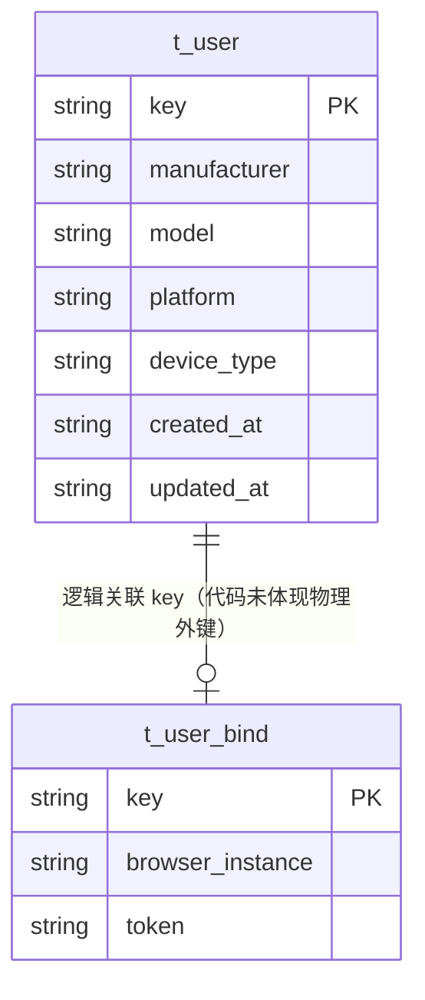

# 用户（User）数据模型

> 生成时间：2026-08-11
> 实体定义：`t_user` 表 → src/dao/db_local_sqlite.go（CREATE TABLE，LOCAL_MODE）+ src/dao/db_init.go（CREATE TABLE，GaussDB）+ src/models/db/user.go（entity `User`）

## 概述

User 记录终端用户设备信息（厂商/型号/分辨率/MCC/MNC 等），主键 key 为用户标识，持久化于表 t_user，登录鉴权链路（controllers/login_controller.go、controllers/exlogin_controller.go → service/user_service.go）创建或更新。

## ER 图

## 字段表

| 字段 | 类型 | 含义 | 约束 |
| --- | --- | --- | --- |
| key | string / TEXT | 用户标识主键 | PRIMARY KEY；entity tag `orm:"pk;column(key)"` |
| manufacturer | string / TEXT | 终端厂商 | NOT NULL |
| model | string / TEXT | 终端型号 | NOT NULL |
| extend_model | string / TEXT | 扩展型号 | DEFAULT '' |
| country | string / TEXT | 国家码 | DEFAULT '' |
| platform | string / TEXT | 平台 | DEFAULT '' |
| width | string / TEXT | 屏幕宽 | DEFAULT '' |
| height | string / TEXT | 屏幕高 | DEFAULT '' |
| mcc | string / TEXT | 移动国家码 MCC | DEFAULT '' |
| mnc | string / TEXT | 移动网络码 MNC | DEFAULT '' |
| device_type | string / TEXT | 设备类型 | DEFAULT '' |
| created_at | string / TEXT | 创建时间 | DEFAULT ''；entity json 忽略 |
| updated_at | string / TEXT | 更新时间 | DEFAULT '' |

## 数据生命周期

### 创建

登录接口触发：controllers/login_controller.go / controllers/exlogin_controller.go 调用 service/user_service.go 的 CreateOrUpdateUser，ud.Get 查不到（orm.ErrNoRows）时 ud.Insert，updated_at 取当前时间（time.DateTime 格式）。

### 更新

同一登录路径：用户已存在时 ud.Update 刷新设备字段与 updated_at。

### 归档/删除

代码未体现删除路径。

## 缓存数据结构

无。

## 补充说明

User 与 UserBind 通过相同 key 在代码层关联（登录链路先后写入），代码未体现物理外键；关联实体见 [user_bind 数据模型](data-model-user-bind.md)。
