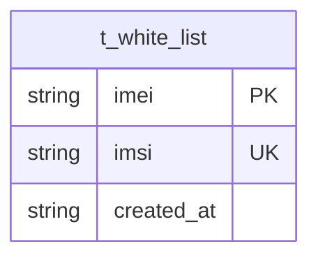

# 白名单（WhiteList）数据模型

> 生成时间：2026-08-11
> 实体定义：`t_white_list` 表 → src/dao/db_local_sqlite.go（CREATE TABLE，LOCAL_MODE）+ src/dao/db_init.go（CREATE TABLE，GaussDB）+ src/models/db/white_list.go（entity `WhiteList`）

## 概述

WhiteList 记录合法终端的 IMEI+IMSI 组合，主键 imei，imsi 由 UNIQUE INDEX 兜底唯一（Beego 不支持复合 pk），持久化于表 t_white_list；由白名单导入链路（controllers/auth_controller.go → service/whitelist_manage_service.go）写入，由鉴权链路（service/auth_service.go）只读消费，并配有进程内鉴权结果缓存 authCache。

## ER 图

## 字段表

| 字段 | 类型 | 含义 | 约束 |
| --- | --- | --- | --- |
| imei | char(15) / TEXT | 设备标识，15 位纯数字 | PRIMARY KEY；entity tag `orm:"pk;column(imei);size(15)"` |
| imsi | char(15) / TEXT | 用户身份标识，15 位纯数字 | NOT NULL + UNIQUE INDEX idx_white_list_imsi（Beego 不支持复合 pk，唯一性靠索引兜底） |
| created_at | varchar(255) / TEXT | 创建时间 | DEFAULT '' |

## 数据生命周期

### 创建

白名单导入触发：firstImport 模式要求表为空后按 1000 条/批分片 InsertMulti；update 模式走 ClearAndInsert 事务（DELETE 全表 + 批量插入，失败整批回滚）。created_at 由 service 统一置导入时刻（`2006-01-02 15:04:05` 格式）。

### 更新

无单条更新路径；update 导入即整表覆盖重建。

### 归档/删除

update 导入事务内 DELETE 全表；代码未体现单条删除路径。

## 缓存数据结构

authCache（src/service/auth_cache.go）：进程内 `map[string]cacheEntry`，key 为 `imei|imsi`，value 为鉴权结果 + 过期时间；TTL 30min（authCacheTTL），容量上限 1000（authCacheCapacity），写入后超限按 expireAt 升序惰性清理最旧 500 条（authCacheEvictCount），RWMutex 保护读写。

## 补充说明

t_white_list 与其他表无关联；导入上限 200000 条（maxImportCount）由 service 层强校验兜底全量导出与缓存规模。
