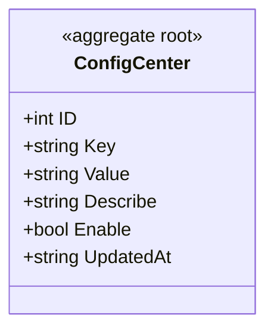

# 配置中心 对象模型

> 生成时间：2026-08-11
> 聚合根：ConfigCenter（src/models/db/config_center.go）

## 概述

ConfigCenter 聚合承载服务级键值配置：以 config_key 为业务键存储配置值、描述与启用开关，供运行期查询与热更新。一致性边界为单条键值配置。模型层定位为 src/models/db，核心 service 为 src/service/config_center_service.go。

## 类图

## 对象说明

| 对象 | 类型 | 代码位置 | 职责 |
| --- | --- | --- | --- |
| ConfigCenter | 聚合根 | src/models/db/config_center.go | 键值配置实体，落 t_config_center 表，实现 Validate 接口 |

## 补充说明

聚合内仅一个实体，无下辖值对象；Enable 开关控制配置是否生效。ConfigCenter 实现 src/models/req 定义的 IRequest 校验接口（当前 Validate 为空实现）。

与持久态表结构的对应：归数据模型资产承载（待补）。
