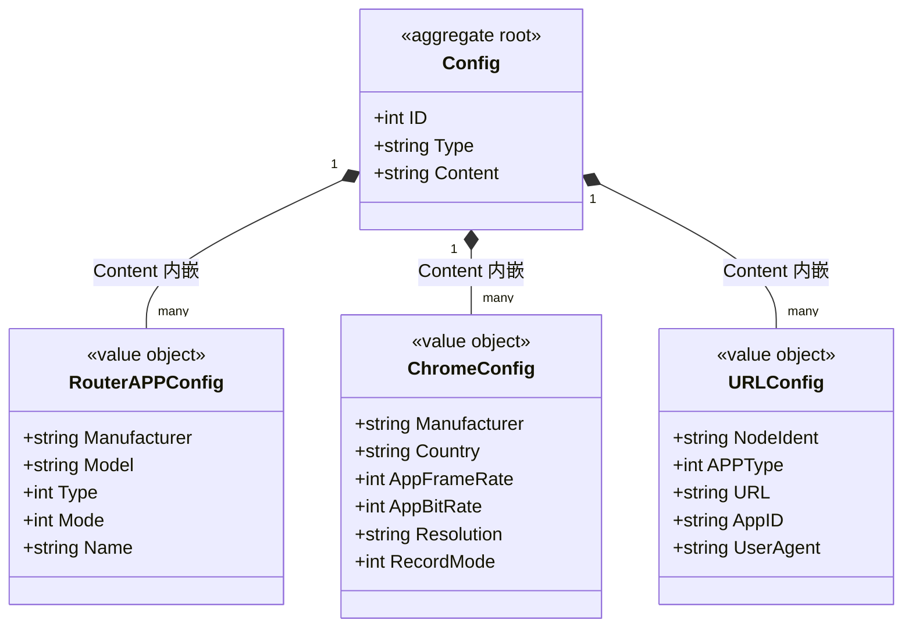

# 浏览器配置 对象模型

> 生成时间：2026-08-11
> 聚合根：Config（src/models/db/browser_config.go）

## 概述

Config 聚合承载浏览器运行配置的分类型存储：一行 Config 按 Type 区分配置类别，Content 以 JSON 文本承载具体配置内容（路由 APP 配置、Chrome 参数、URL 配置三类值对象）。一致性边界为单行配置记录。模型层定位为 src/models/db，请求侧镜像结构见 src/models/req/request_entity.go。

## 类图

## 对象说明

| 对象 | 类型 | 代码位置 | 职责 |
| --- | --- | --- | --- |
| Config | 聚合根 | src/models/db/browser_config.go | 浏览器配置记录，Type 分类、Content 存 JSON，落 t_config 表 |
| RouterAPPConfig | 值对象 | src/models/db/browser_config.go | 路由 APP 配置（厂商/型号/类型/模式） |
| ChromeConfig | 值对象 | src/models/db/browser_config.go | Chrome 流化参数（帧率/码率/分辨率等） |
| URLConfig | 值对象 | src/models/db/browser_config.go | URL 站点配置（节点/应用/UA/媒体类型标记） |

## 补充说明

三类配置值对象以 JSON 数组形式内嵌于 Config.Content，无独立表；请求侧存在同构的 RouteAppConfig/ChromeConfig/URLConfigs（src/models/req/request_entity.go），经 SyncBrowserConfigRequest 批量同步入库。值对象跨 db 与 req 两包重复定义，属代码现状。

与持久态表结构的对应：归数据模型资产承载（待补）。
