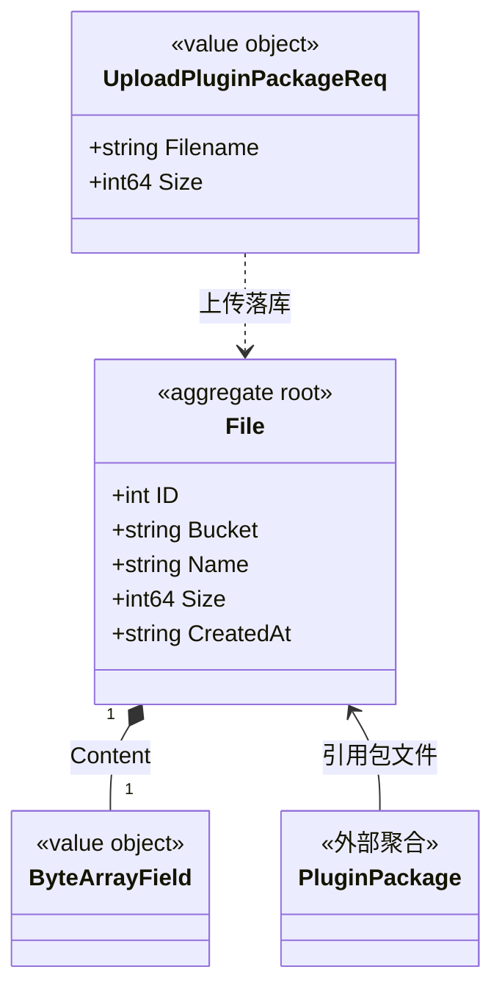

# 文件 对象模型

> 生成时间：2026-08-11
> 聚合根：File（src/models/db/file.go）

## 概述

File 聚合承载以对象存储语义（Bucket+Name）组织的二进制文件：Content 为自定义 ByteArrayField 字节数组，支撑插件包等文件的上传与下发。一致性边界为单个文件记录。模型层定位为 src/models/db，核心 service 为 src/service/file_service.go。

## 类图

## 对象说明

| 对象 | 类型 | 代码位置 | 职责 |
| --- | --- | --- | --- |
| File | 聚合根 | src/models/db/file.go | 文件记录（Bucket/Name/内容/大小），落 t_file 表 |
| ByteArrayField | 值对象 | src/models/db/file.go | ORM 自定义字节数组类型，实现 SetRaw/RawValue/FieldType |
| UploadPluginPackageReq | 值对象 | src/models/req/plugin_entity.go | 文件上传请求（含大小上限校验） |
| FileServiceImpl | 领域服务 | src/service/file_service.go | 文件上传/下载/删除编排 |

## 补充说明

File 按 Bucket+Name 寻址，Content 经 ByteArrayField 适配 GaussDB bytea 与本地 SQLite。PluginPackage 聚合通过 PackageBucket 引用本聚合文件（持标识，不持对象）。

与持久态表结构的对应：归数据模型资产承载（待补）。
