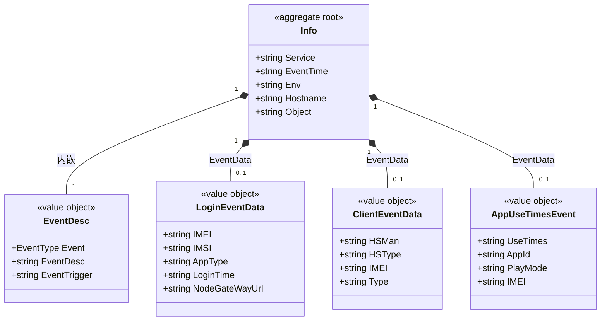

# 事件 对象模型

> 生成时间：2026-08-11
> 聚合根：Info（src/models/events/base.go）

## 概述

事件聚合承载埋点事件的构建与上报：Info 为事件根对象，内嵌 EventDesc（事件类型描述），按事件类型挂载不同 EventData 值对象（登录/客户端异常/应用使用时长），经 EventServiceImpl 上报。一致性边界为单个事件。模型层定位为 src/models/events，核心 service 为 src/service/event_service.go。

## 类图

## 对象说明

| 对象 | 类型 | 代码位置 | 职责 |
| --- | --- | --- | --- |
| Info | 聚合根 | src/models/events/base.go | 事件根对象，经 NewInfo 按 EventType 构建，ToJSON 序列化上报 |
| EventDesc | 值对象 | src/models/events/base.go | 事件类型描述（登录/登录异常/客户端异常/使用时长），由 eventTypeMap 提供 |
| LoginEventData | 值对象 | src/models/events/base.go | 登录埋点数据 |
| ClientEventData | 值对象 | src/models/events/base.go | 客户端异常埋点数据 |
| AppUseTimesEvent | 值对象 | src/models/events/base.go | 应用使用时长埋点数据（req 包有同名请求镜像） |
| EventServiceImpl | 领域服务 | src/service/event_service.go | 事件上报编排 |

## 补充说明

EventData 字段为 interface{}，运行时按事件类型挂载对应值对象，图中三类 EventData 为可空组合。LoginError 事件类型已定义常量但未在 eventTypeMap 中登记描述，代码现状如此。

与持久态表结构的对应：归数据模型资产承载（待补，事件经上报通道外发、不落本地表）。
