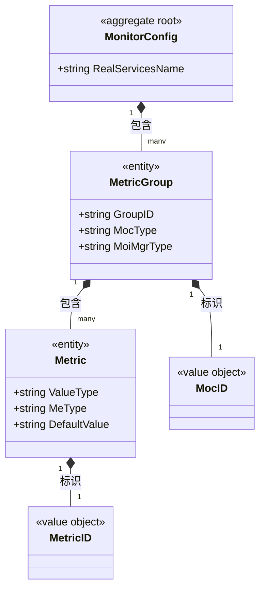

# 监控 对象模型

> 生成时间：2026-08-11
> 聚合根：MonitorConfig（src/models/monitor/metric.go）

## 概述

监控聚合承载 CSP 监控指标的上报配置与采集：MonitorConfig 为监控配置根（与 monitor.json 结构一致），下辖 MetricGroup（按 MocId 分组的指标组）与 Metric（单个指标定义）；MonitorServiceImpl 按配置周期调用指标采集函数并上报。一致性边界为整份监控配置。模型层定位为 src/models/monitor，核心 service 为 src/service/monitor_service.go。

## 类图

## 对象说明

| 对象 | 类型 | 代码位置 | 职责 |
| --- | --- | --- | --- |
| MonitorConfig | 聚合根 | src/models/monitor/metric.go | 监控配置根，含指标组列表与真实服务名 |
| MetricGroup | 实体 | src/models/monitor/metric.go | 指标组（按 MocId/MocType 分组） |
| Metric | 实体 | src/models/monitor/metric.go | 单指标定义（值类型/缺省值） |
| MetricID | 值对象 | src/models/monitor/metric.go | 指标 ID（在线用户/分机型在线/实例支持数/应用流量/站点流量），自定义 JSON 反序列化 |
| MocID | 值对象 | src/models/monitor/metric.go | 管理对象类 ID，自定义 JSON 反序列化 |
| MonitorServiceImpl | 领域服务 | src/service/monitor_service.go | 加载 monitor.json、按 metricFunMap 采集并上报，编排 TrafficStats 聚合的查询结果 |

## 补充说明

MonitorConfig 从配置文件（默认 /opt/csp/gids/module/conf/monitor.json）加载，非 ORM 实体、不落库；MetricID/MocID 为 int 新类型并实现字符串 JSON 反序列化。MonitorServiceImpl 跨聚合引用 TrafficStatsService 的统计结果（经 service 间接访问，未入图）。

与持久态表结构的对应：归数据模型资产承载（待补）。
