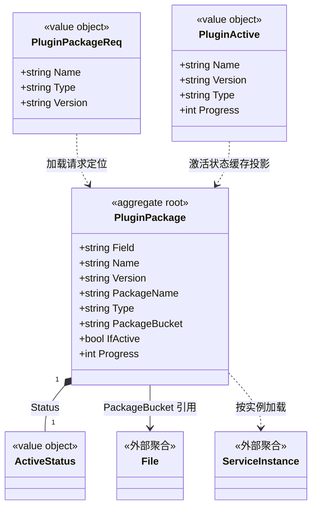

# 插件包 对象模型

> 生成时间：2026-08-11
> 聚合根：PluginPackage（src/models/db/plugin_info.go）

## 概述

PluginPackage 聚合承载浏览器插件包的全生命周期：上传登记、按实例加载进度跟踪（Status/Progress）、激活切换。业务键为 Type:Name:Version 三元组（Field 列）。一致性边界为单个插件包记录及其激活状态。模型层定位为 src/models/db，核心 service 为 src/service/plugin_service.go。

## 类图

## 对象说明

| 对象 | 类型 | 代码位置 | 职责 |
| --- | --- | --- | --- |
| PluginPackage | 聚合根 | src/models/db/plugin_info.go | 插件包记录与加载状态，落 t_plugin_package 表 |
| ActiveStatus | 值对象 | src/models/db/plugin_info.go | 加载状态枚举（Completed/Failed/Doing/NotStart） |
| PluginActive | 值对象 | src/models/db/plugin_info.go | 当前激活插件的缓存投影（MarshalBinary 供 Redis 存储） |
| PluginPackageReq | 值对象 | src/models/req/plugin_entity.go | 插件加载/查询请求，GetKey 生成业务键 |
| PluginServiceImpl | 领域服务 | src/service/plugin_service.go | 编排插件上传、加载进度收集（progressChan）与激活切换 |

## 补充说明

PluginPackage 经 GetField 保证业务键一致性；跨聚合引用 File 仅持 PackageBucket 标识。加载进度经 channel 聚合各 ServiceInstance 回报，ServiceInstance 仅画引用方向不展开。

与持久态表结构的对应：归数据模型资产承载（待补）。
