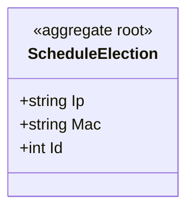

# 定时任务选主 对象模型

> 生成时间：2026-08-11
> 聚合根：ScheduleElection（src/models/db/schedule_election.go）

## 概述

ScheduleElection 聚合承载定时任务选主信息：以本机 Ip/Mac/Id 标识当前主节点，经 MarshalBinary 序列化后写入缓存（键 gids.timerElection）。一致性边界为单条选主记录。模型层定位为 src/models/db；当前代码仓内未发现 ORM 注册与落库表，持久化方式判定为缓存值对象语义，聚合根定性待确认。

## 类图

## 对象说明

| 对象 | 类型 | 代码位置 | 职责 |
| --- | --- | --- | --- |
| ScheduleElection | 聚合根（待确认） | src/models/db/schedule_election.go | 定时任务选主记录，实现 MarshalBinary/UnmarshalBinary/GetKey 供缓存读写 |

## 补充说明

该对象无 orm tag、无 TableName、未注册 Beego 模型，仅在缓存中以 gids.timerElection 为键存取；src 内未发现直接读写方（仅有 master_election_service_stub_test.go 桩测试），实际消费链路代码未体现，待确认。

与持久态表结构的对应：归数据模型资产承载（待补）。
