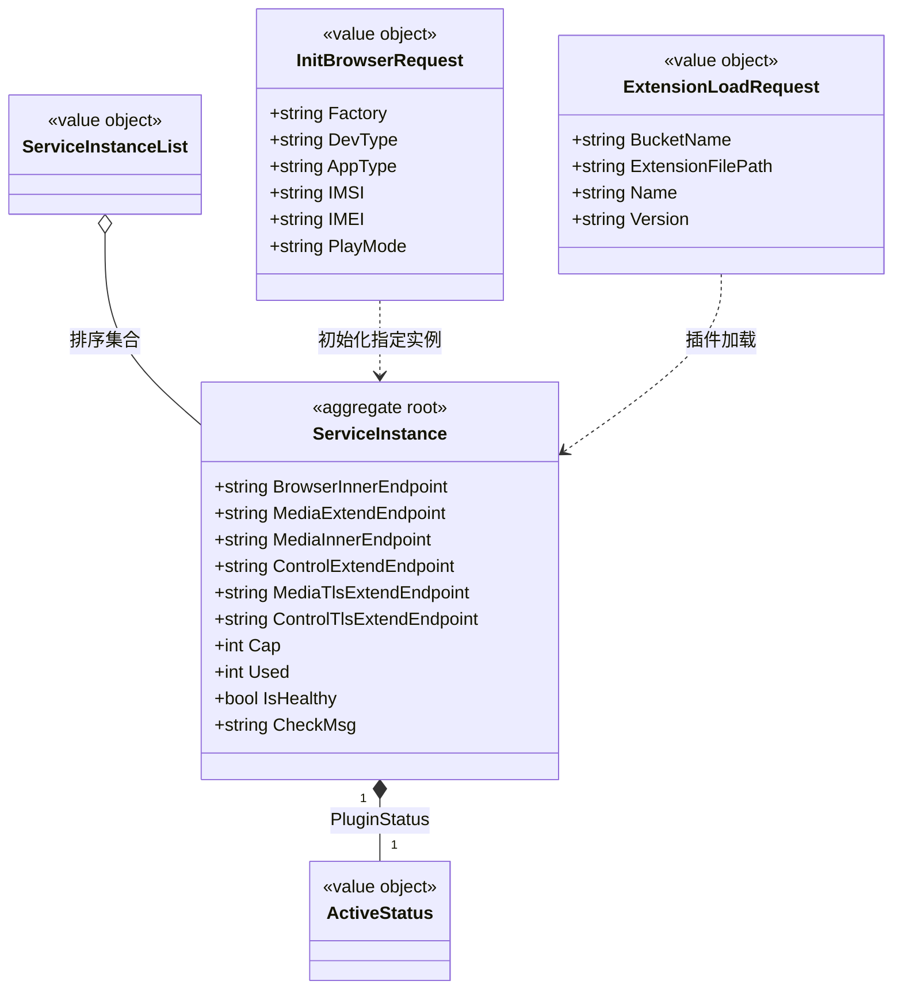

# 浏览器网关实例 对象模型

> 生成时间：2026-08-11
> 聚合根：ServiceInstance（src/models/browsergateway/service_instance.go）

## 概述

ServiceInstance 聚合承载浏览器网关（BrowserGW）实例的注册与调度状态：内外网/媒体/控制/TLS 端点、容量（Cap/Used）、健康与插件状态，是实例分配（按使用率排序选最闲实例）的一致性边界。模型层定位为 src/models/browsergateway，核心 service 为 src/service/browser_service.go。

## 类图

## 对象说明

| 对象 | 类型 | 代码位置 | 职责 |
| --- | --- | --- | --- |
| ServiceInstance | 聚合根 | src/models/browsergateway/service_instance.go | 浏览器网关实例注册信息与调度状态 |
| ServiceInstanceList | 值对象 | src/models/browsergateway/service_instance.go | 实例集合，实现 sort.Interface 按使用率升序 |
| ActiveStatus | 值对象 | src/models/db/plugin_info.go | 插件状态枚举，首现于 object-model-plugin-package.md，此处引用 |
| InitBrowserRequest | 值对象 | src/models/browsergateway/req.go | 初始化浏览器实例请求 |
| ExtensionLoadRequest | 值对象 | src/models/browsergateway/req.go | 插件加载请求 |
| BrowserServiceImpl | 领域服务 | src/service/browser_service.go | 实例筛选（就绪条件：插件 Complete 且 Cap>0 且健康）与分配 |

## 补充说明

ServiceInstance 为运行态注册信息，GetKey 以 BrowserInnerEndpoint 为标识；ServiceInstanceList 的 Less 以 Used*100/Cap 计算使用率排序。实例与 UserBind 聚合的关联由 UserBind 侧持 BrowserInstance 标识完成。

与持久态表结构的对应：归数据模型资产承载（待补）。
