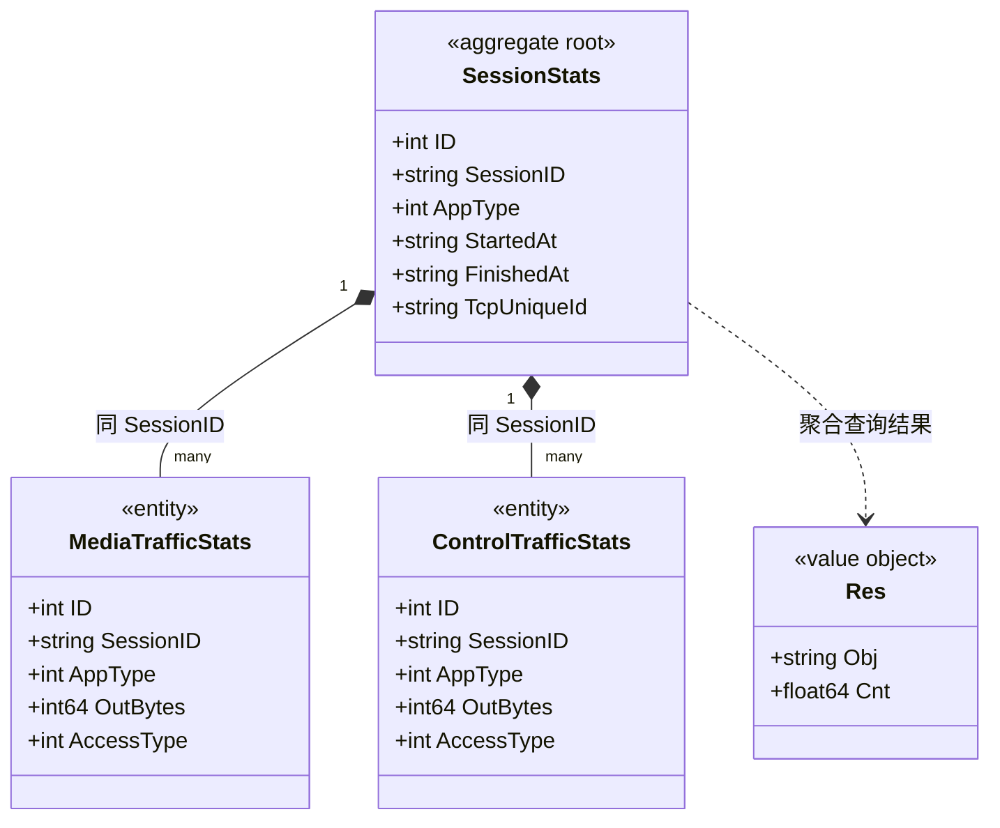

# 流量统计 对象模型

> 生成时间：2026-08-11
> 聚合根：SessionStats（src/models/db/traffic_stats.go）

## 概述

流量统计聚合承载会话维度的用量数据：以 SessionStats（会话起止与 TCP 标识）为根，媒体流量与控制流量两类统计实体按 SessionID 关联同一会话。一致性边界为同 SessionID 的一组统计记录（代码未体现物理外键）。模型层定位为 src/models/db，核心 service 为 src/service/traffic_stats_service.go。

## 类图

## 对象说明

| 对象 | 类型 | 代码位置 | 职责 |
| --- | --- | --- | --- |
| SessionStats | 聚合根 | src/models/db/traffic_stats.go | 会话统计，落 t_session_stats 表 |
| MediaTrafficStats | 实体 | src/models/db/traffic_stats.go | 媒体面流量统计，落 t_media_traffic_stats 表 |
| ControlTrafficStats | 实体 | src/models/db/traffic_stats.go | 控制面流量统计，落 t_control_traffic_stats 表 |
| Res | 值对象 | src/service/traffic_stats_service.go | SQL 聚合查询结果行（对象+计数），供监控指标使用 |
| TrafficStatsServiceImpl | 领域服务 | src/service/traffic_stats_service.go | 统计入库、按月批量导出 CSV、在线/流量指标聚合查询 |

## 补充说明

三类统计各自落独立表、按 SessionID 逻辑关联，DAO 以各自实体为单位读写；聚合根定性为 SessionStats 是按"会话为一致性单元"归集，待确认。Res 仅存在于 service 层查询返回，不落库。

与持久态表结构的对应：归数据模型资产承载（待补）。
