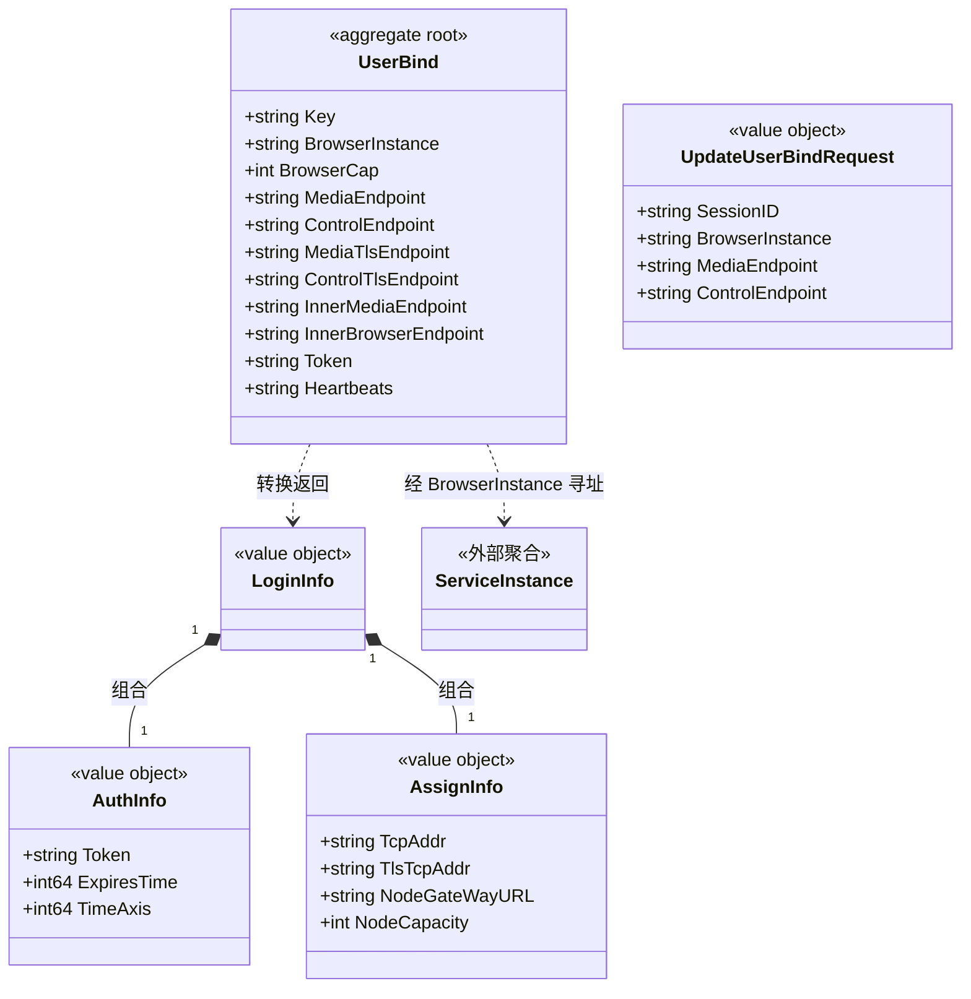

# 用户实例绑定 对象模型

> 生成时间：2026-08-11
> 聚合根：UserBind（src/models/db/user.go）

## 概述

UserBind 聚合承载"用户会话 → 浏览器实例"的绑定关系：记录某会话被分配的浏览器实例及各协议端点（media/control/TLS/内网）、访问令牌与心跳时间，是登录重路由与实例寻址的一致性边界。模型层定位为 src/models/db，核心 service 为 src/service/browser_service.go 与 src/service/user_service.go。

## 类图

## 对象说明

| 对象 | 类型 | 代码位置 | 职责 |
| --- | --- | --- | --- |
| UserBind | 聚合根 | src/models/db/user.go | 会话与浏览器实例的绑定记录，落 t_user_bind 表，含端点/令牌/心跳 |
| UpdateUserBindRequest | 值对象 | src/models/req/request_entity.go | 实例侧回写绑定信息的请求 |
| LoginInfo | 值对象 | src/models/resp/response_entity.go | 登录响应体，组合 AuthInfo 与 AssignInfo |
| AuthInfo | 值对象 | src/models/resp/response_entity.go | 令牌与有效期 |
| AssignInfo | 值对象 | src/models/resp/response_entity.go | 分配的接入地址与节点容量 |
| BrowserServiceImpl | 领域服务 | src/service/browser_service.go | 编排 UserBind 的创建/校验/过期判断与实例路由 |

## 补充说明

UserBind 以 Key（会话标识）整体读写；BrowserCap 标注 `orm:"-"` 不落库，为运行态容量快照。跨聚合引用 ServiceInstance 仅持 BrowserInstance 标识（..>）。tranUserBindToLoginInfo 将绑定转换为登录响应值对象。

与持久态表结构的对应：归数据模型资产承载（待补）。
