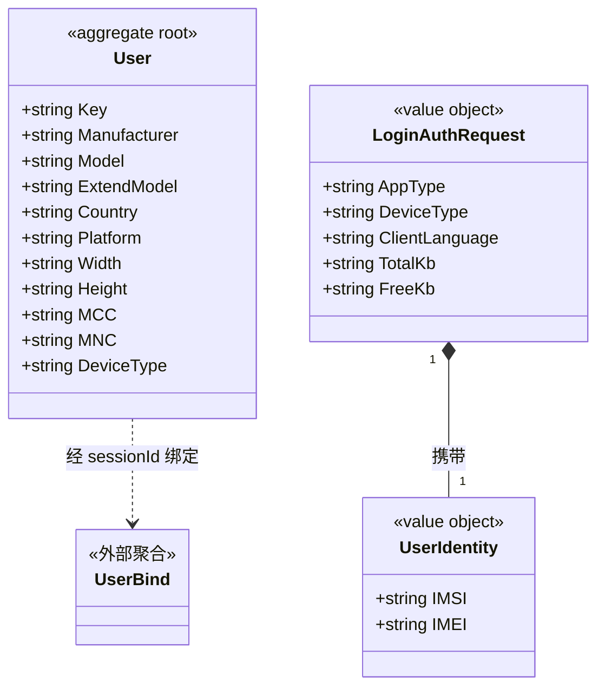

# 用户 对象模型

> 生成时间：2026-08-11
> 聚合根：User（src/models/db/user.go）

## 概述

User 聚合承载云浏览器终端用户（设备）档案：以设备厂商/型号/平台等硬件与网络属性描述一个注册用户，Key 为主键，生命周期由登录鉴权流程创建与更新。一致性边界内仅 User 一个实体；UserIdentity 为登录请求中标识用户的值对象。模型层定位为 src/models/db（Beego ORM 实体）与 src/models/req（请求对象），核心 service 为 src/service/user_service.go。

## 类图

## 对象说明

| 对象 | 类型 | 代码位置 | 职责 |
| --- | --- | --- | --- |
| User | 聚合根 | src/models/db/user.go | 用户设备档案，记录厂商/型号/平台/屏幕/运营商等属性，落 t_user 表 |
| UserIdentity | 值对象 | src/models/req/request_entity.go | 以 IMSI+IMEI 标识一个用户，登录请求内嵌 |
| LoginAuthRequest | 值对象 | src/models/req/request_entity.go | 登录鉴权请求，承载设备与网络信息，经 getUserFormReq 转换为 User |
| UserServiceImpl | 领域服务 | src/service/user_service.go | 编排 User 建档与 UserBind 查询 |

## 补充说明

User 由登录链路（LoginAuthRequest → getUserFormReq）创建或更新，自身不感知实例绑定；UserBind 属独立聚合（object-model-user-bind.md），User 对其仅经 sessionId 间接关联（图中 ..>）。UserIdentity 仅存在于请求侧，不落库。

与持久态表结构的对应：归数据模型资产承载（待补）。
