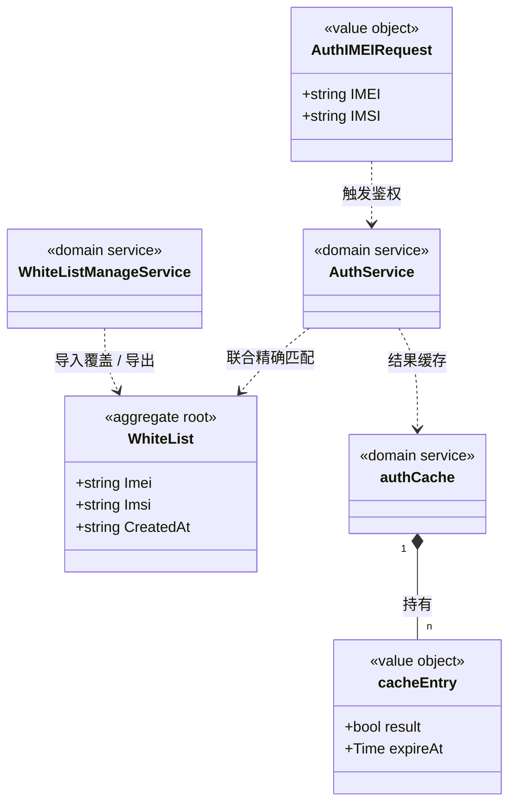

# 白名单 对象模型

> 生成时间：2026-08-11
> 聚合根：WhiteList（src/models/db/white_list.go）

## 概述

WhiteList 聚合承载终端接入白名单：以 IMEI（主键）+IMSI 联合精确匹配表达一个合法终端，生命周期由白名单导入（CSV）创建/覆盖，由鉴权流程只读消费。一致性边界内仅 WhiteList 一个实体；AuthIMEIRequest 为鉴权请求值对象；authCache 为进程内鉴权结果缓存（非聚合成员，属领域服务协作组件）。模型层定位为 src/models/db（Beego ORM 实体）与 src/models/req（请求对象），核心 service 为 src/service/auth_service.go 与 src/service/whitelist_manage_service.go。

## 类图

## 对象说明

| 对象 | 类型 | 代码位置 | 职责 |
| --- | --- | --- | --- |
| WhiteList | 聚合根 | src/models/db/white_list.go | 终端白名单记录（IMEI pk + IMSI 唯一索引），落 t_white_list 表 |
| AuthIMEIRequest | 值对象 | src/models/req/auth_request.go | 联合鉴权请求（IMEI+IMSI），Validate 仅非空检查 |
| cacheEntry | 值对象 | src/service/auth_cache.go | 鉴权缓存条目（result + expireAt），仅存于内存 |
| AuthService | 领域服务 | src/service/auth_service.go | 联合鉴权编排：格式校验→缓存→逃生态→联合匹配 |
| WhiteListManageService | 领域服务 | src/service/whitelist_manage_service.go | 白名单 CSV 导入（firstImport/update）与导出 |
| authCache | 领域服务 | src/service/auth_cache.go | RWMutex+map 进程内鉴权结果缓存（TTL 30min） |

## 补充说明

WhiteList 自身无行为方法，全部判定逻辑收在 AuthService；authCache/authImportLock 为包级协作组件而非 WhiteList 聚合成员。AuthIMEIRequest 仅存在于请求侧，不落库。

与持久态表结构的对应：归数据模型资产承载（[data-model-white-list.md](../data-model/data-model-white-list.md)）。
