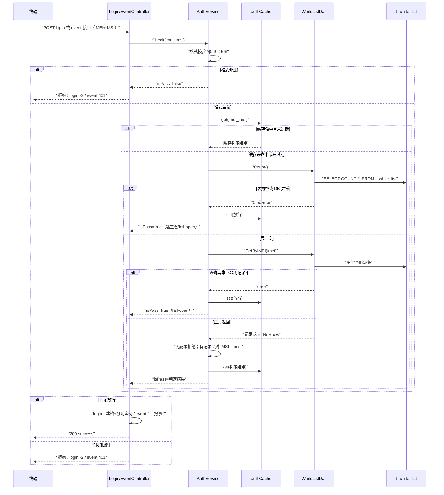

# 终端鉴权判定业务流程

> 最近更新：用户主动梳理（spec-business-flow-analyze），2026-08-06

## 1. 流程概述

终端携带 IMEI+IMSI 发起登录或事件上报，GIDS 对两要素做联合鉴权判定，放行合法终端、拒绝非法终端。判定逻辑由 login 链路与 event 链路共用，仅拒绝时的响应码不同。

## 2. 触发条件与前置条件

- 触发条件（login 链路，内部 server）：终端 POST `/app-api/devicetcp/app/login/v1/gridLoginAuth`、`/gridLoginAuthOpenBrowser`、`/deviceLoginAuth` 任一入口
- 触发条件（event 链路，内部 + 外部 server 均注册）：终端 POST `/app-api/center/public/client/sendClientEvent`、`/sendAppUseTimesEvent` 任一入口
- 前置条件：无业务前置——鉴权判定本身即是两链路业务处理的最前置环节；请求体须可解析出 IMEI/IMSI 字段

## 3. 主流程

两条链路共用同一段判定逻辑（`AuthService.Check`），步骤表按判定主路径展开，入口差异见步骤 1 与步骤 7：

| 步骤 | 动作 | 责任模块 | 代码位置 |
|------|------|---------|---------|
| 1 | 接收请求，解析 body 出 IMEI/IMSI | controllers | controllers/login_controller.go loginAuth / controllers/event_controller.go SendClientEvent·SendAppUseTimesEvent |
| 2 | 鉴权前置调用 Check(imei, imsi) | controllers | login_controller.go loginAuth 内联调用 / event_controller.go rejectIfAuthFailed |
| 3 | 格式校验：IMEI/IMSI 均须 15 位纯数字，非法短路 | service | service/auth_service.go Check |
| 4 | 查询鉴权缓存（key=imei_imsi，TTL 30 分钟） | service | service/auth_cache.go get |
| 5 | 缓存未命中回源：逃生态判定 → 按 IMEI 查行比对 IMSI | service/dao | service/auth_service.go checkFromStore / dao/white_list.go Count·GetByIMEI |
| 6 | 判定结果写缓存并返回 | service | service/auth_cache.go set |
| 7 | 拒绝：login 链路返回 -2，event 链路返回 401 | controllers | login_controller.go loginAuth / event_controller.go rejectIfAuthFailed |
| 8 | 放行：继续业务——login 建档并分配实例，event 上报事件 | controllers/service | login_controller.go loginAuth 后续段 / event_controller.go ReportEvent |

## 4. 分支与异常处理

| 条件/异常 | 处理路径 | 代码位置 |
|----------|---------|---------|
| IMEI 或 IMSI 非 15 位纯数字 | Check 短路返回 isPass=false、isFormatValid=false；两链路均按拒绝处理（不区分 formatValid） | service/auth_service.go Check |
| 缓存命中且未过期 | 直接返回缓存结果，不回源 DB | service/auth_cache.go get |
| 缓存过期 | 视为未命中，回源后重写缓存 | service/auth_cache.go get |
| 白名单表为空（逃生态） | 一律放行，避免未配置导致全量阻断 | service/auth_service.go checkFromStore |
| Count() DB 异常 | fail-open 放行 + 错误日志，不阻断主流程 | service/auth_service.go checkFromStore |
| GetByIMEI 返回 ErrNoRows | 拒绝：IMEI 未注册 | service/auth_service.go checkFromStore |
| GetByIMEI 其他 DB 异常 | fail-open 放行 + 错误日志 | service/auth_service.go checkFromStore |
| IMEI 有记录但 IMSI 不一致 | 拒绝：IMEI+IMSI 须组合精确匹配同一行 | service/auth_service.go checkFromStore |
| 拒绝时响应码分流 | login 链路统一返回 -2（ClientFailed），event 链路统一返回 401（AuthFailed） | login_controller.go loginAuth / event_controller.go rejectIfAuthFailed |
| 缓存容量超 1000 条 | 写后惰性清理：按过期时间升序删最旧 500 条，无独立 goroutine | service/auth_cache.go set·cleanLocked |
| 白名单导入成功（管理面） | ClearCache 全量失效，新名单立即生效 | service/auth_manage_service.go Import → auth_service.go ClearCache |
| login 后续实例分配失败 | 鉴权已通过，返回空实例不报错（RouteToInstance 异常降级） | login_controller.go loginAuth |

## 5. 涉及实体与状态变更

| 实体/存储 | 操作 | 状态变更 |
|----------|------|---------|
| t_white_list（DB 表，AuthWhitelist 实体：IMEI 主键 + IMSI） | 读 | 鉴权流程内无变更（写入属白名单管理流程） |
| authCache（进程内存 map，读写锁保护） | 读写 | 无 → 生效：回源判定后 set，TTL 30 分钟；生效 → 过期：get 判过期后回源重建；超容量 → 惰性清理最旧 500 条；全部 → 清空：ClearCache（白名单导入触发） |

## 6. 代码映射

| 角色 | 文件 | 函数/类 |
|------|------|--------|
| 路由注册（内部 server） | src/routers/beego_router.go | RegisterInternalRouter → LoginController·EventController |
| 路由注册（外部 server，仅 event 链路） | src/routers/beego_router.go | RegisterExternalRouter → EventController |
| 接入层·login 链路 | src/controllers/login_controller.go | LoginController.loginAuth（被 GridLoginAuth/GridLoginAuthOpenBrowser/DeviceLoginAuth 复用） |
| 接入层·event 链路 | src/controllers/event_controller.go | EventController.SendClientEvent·SendAppUseTimesEvent·rejectIfAuthFailed |
| 业务层·鉴权判定 | src/service/auth_service.go | AuthService.Check·checkFromStore·ClearCache |
| 业务层·鉴权缓存 | src/service/auth_cache.go | authCache.get·set·clear·cleanLocked |
| 数据层 | src/dao/white_list.go | WhiteListDao.Count·GetByIMEI |
| 数据实体 | src/models/db/white_list.go | AuthWhitelist（TableName=t_white_list，init 注册 orm） |
| 返回码定义 | src/common/constants/retcode/retcode.go | ClientFailed=-2·AuthFailed=401·Success=200 |

## 7. 外部交互

无服务间调用：鉴权判定全程在服务进程内完成（内存缓存 + DB 查询）。存储依赖 t_white_list 表——生产环境 GaussDB，LOCAL_MODE 本地 SQLite（src/data/gids.db）；docs/external-call/ 无本流程相关出站调用文档，无引用。
