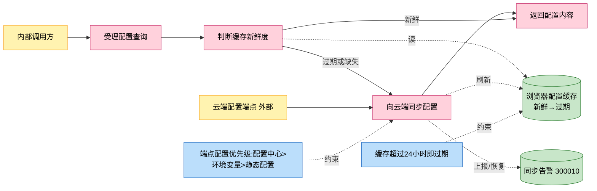
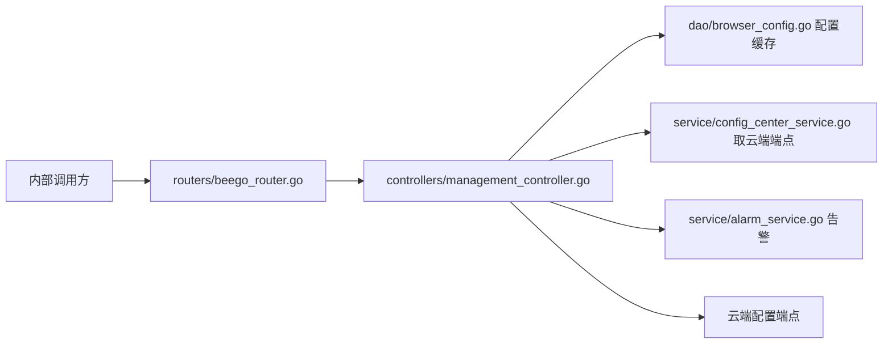
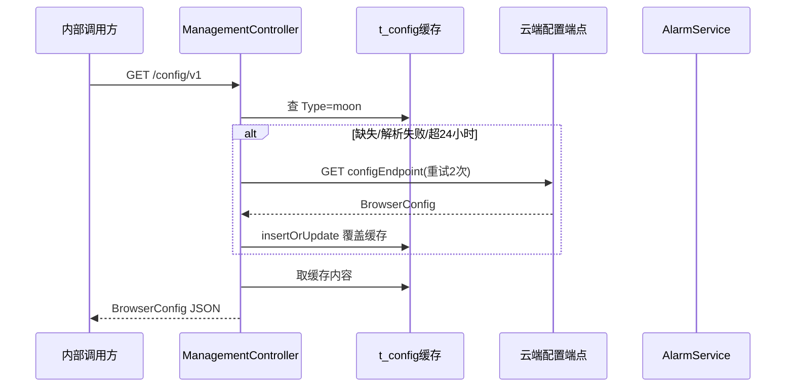

# 浏览器配置查询与同步

> 功能域概述：从云端配置端点（moon）拉取浏览器路由/浏览器内核/URL 三类配置缓存到本地，查询时超 24 小时自动刷新；同步失败上报告警、成功恢复告警。
> 接口数：2（仅内部 server 注册）　核心模块：controllers, dao, service(告警/配置中心)

## 1. 功能故事（多彩建模）

实现逻辑速览（1~3 句，每句 ≤30 字，业务语言，禁文件名/函数名/行号）：

查询配置先看本地缓存，超一天或缺失就先向云端同步。同步成功更新缓存并恢复告警，失败上报告警。

术语表：

| 术语 | 人话解释 | 出处 |
|---|---|---|
| moon 配置 | 云端下发的浏览器配置总称，本地缓存 Type=moon | src/controllers/management_controller.go |
| BrowserConfig | 三类配置合集：应用路由、浏览器内核参数、URL 清单 | src/controllers/management_controller.go |
| 配置中心 | DB 里的动态 KV，覆盖静态配置项（如云端端点地址） | src/service/config_center_service.go |
| 告警 300010 | 配置同步失败时上报、成功时恢复的告警 ID | src/service/alarm_service.go |

## 2. 实现方案

| 模块 | 承载功能（引用文件） |
|---|---|
| controllers/management_controller.go | 两个接口入口、新鲜度判断、同步编排、告警联动（src/controllers/management_controller.go） |
| dao/browser_config.go | Config 缓存表存取（src/dao/browser_config.go） |
| service/config_center_service.go | 云端端点等动态配置读取（src/service/config_center_service.go） |
| service/alarm_service.go | 同步失败/成功告警（src/service/alarm_service.go） |

## 3. 接口清单

| 接口 | 路径/入口（含注册处） | 请求结构 | 响应结构 | 状态 |
|---|---|---|---|---|
| SyncBrowserConfig | POST /rpc-api/center/config/syncBrowserConfig；入口 src/controllers/management_controller.go；注册 src/routers/beego_router.go（仅内部） | 无请求体 | BaseResponse | 在用 |
| ListConfig | GET /config/v1；入口/注册同上 | 无 | BrowserConfig（src/controllers/management_controller.go）：{routeAppConfigList, chromeConfigList, urlConfigList} | 在用 |
| （出向）云端配置拉取 | GET {moon::configEndpoint}（src/controllers/management_controller.go）；enableHttps=true 时走 {moon::httpsConfigEndpoint} | 无；重试 2 次 | DataResponse 壳内嵌 BrowserConfig | 在用 |

## 4. 关键数据结构

| 结构 | 定义位置 | 关键字段（含义+约束） |
|---|---|---|
| BrowserConfig | src/controllers/management_controller.go | RouteAPPConfigList（应用路由）、ChromeConfigList（内核参数）、URLConfigs（URL 清单） |
| db.Config | src/models/db/browser_config.go | Type（缓存键，固定 moon）、Content（配置 JSON 串）、UpdatedAt（新鲜度判断依据） |

## 5. 调用关系

关键分支与异步环节（各一句，带证据文件）：

- 手动同步失败返回 500 并上报告警 300010，成功则恢复该告警（src/controllers/management_controller.go）
- 查询路径上的自动同步失败只记日志不阻断查询（src/controllers/management_controller.go）
- 云端端点读取顺序：配置中心 DB > app.conf 默认值，enableHttps=true 切 https 端点（src/controllers/management_controller.go）
- 代码注释已标注：多实例部署时同步需加分布式锁，当前未实现（src/controllers/management_controller.go）

## 6. 外部文档引用

| 文档类型 | 引用文档 | 引用点 |
|---|---|---|
| 关键类（必须） | [docs/business/key-class/README.md](../key-class/README.md) | AlarmService（同步告警联动，src/controllers/management_controller.go 调用）、ConfigCenterService（云端端点取值，src/controllers/management_controller.go 调用）、https.Builder（云端拉取请求构造，src/controllers/management_controller.go） |
| 接口文档 | [spec-interface-browser-config.md](../interface/spec-interface-browser-config.md) | 两个配置接口的契约对照 |
| 外部接口文档 | [external-call-muen-cloud.md](../../technical/external-call/external-call-muen-cloud.md)、[external-call-csp-alarm.md](../../technical/external-call/external-call-csp-alarm.md) | （出向）云端 moon 配置端点拉取契约（与第 3 节出向行对应）及同步告警 300010 上报通道 |
| 基础框架文档 | [rpc-beego-web.md](../../technical/framework-usage/rpc-beego-web.md) | Beego Web：路由注册与请求处理（src/routers/beego_router.go、src/controllers/management_controller.go） |
| 基础框架文档 | [rpc-http-client.md](../../technical/framework-usage/rpc-http-client.md) | https.Builder 出向拉取云端配置（src/controllers/management_controller.go） |
| 基础框架文档 | [storage-beego-orm.md](../../technical/framework-usage/storage-beego-orm.md) | Beego ORM：Config 缓存表存取（src/dao/browser_config.go） |
| 基础框架文档 | [config-beego-appconfig.md](../../technical/framework-usage/config-beego-appconfig.md) | 端点多来源取值约定（src/controllers/management_controller.go） |
| struct 结构文档 | [spec-structure-AIAction.md](../../architecture/module-structure/spec-structure-AIAction.md) | 本功能在 controllers/service/dao 分层中的位置 |
