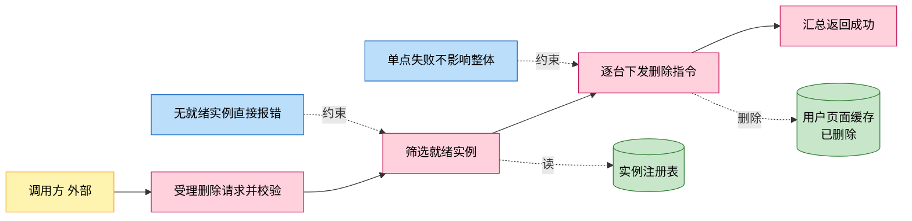
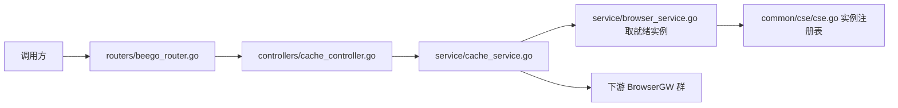
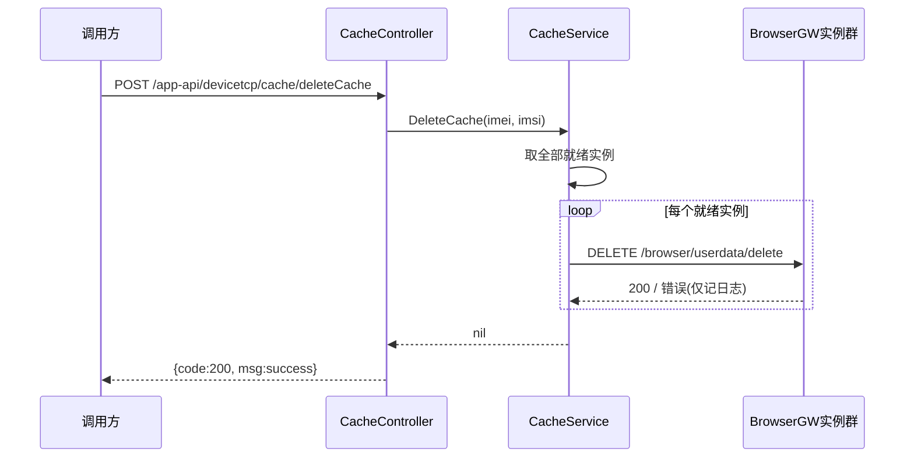

# 用户数据缓存删除

> 功能域概述：按用户（IMEI+IMSI）通知所有就绪的浏览器网关实例删除该用户的页面缓存数据，单台失败不影响整体结果。
> 接口数：1（内外双 server 同注册）　核心模块：controllers, service, common/cse

## 1. 功能故事（多彩建模）

实现逻辑速览（1~3 句，每句 ≤30 字，业务语言，禁文件名/函数名/行号）：

收到删除请求后筛出全部就绪实例，逐台下发删除指令。单台失败只记日志，整体仍报成功。

术语表：

| 术语 | 人话解释 | 出处 |
|---|---|---|
| BrowserGW | 浏览器网关实例，用户页面缓存实际所在处 | src/models/browsergateway/service_instance.go |
| 就绪实例 | 插件装完、容量有余、健康在线的实例 | src/service/browser_service.go |
| IMEI/IMSI | 终端设备与 SIM 卡标识，定位用户缓存的键 | src/models/req/request_entity.go |

## 2. 实现方案

| 模块 | 承载功能（引用文件） |
|---|---|
| controllers/cache_controller.go | 路由声明、参数校验、失败审计日志、响应封装（src/controllers/cache_controller.go） |
| service/cache_service.go | 逐台下发的业务编排与裸 HTTP 调用（src/service/cache_service.go） |
| service/browser_service.go | 就绪实例筛选（src/service/browser_service.go） |
| common/cse/cse.go | BrowserGW 实例注册表来源（src/common/cse/cse.go） |

## 3. 接口清单

| 接口 | 路径/入口（含注册处） | 请求结构 | 响应结构 | 状态 |
|---|---|---|---|---|
| DeleteCache | POST /app-api/devicetcp/cache/deleteCache；入口 src/controllers/cache_controller.go；注册 src/routers/beego_router.go（内外双 server 均注册） | DeleteCacheRequest（src/models/req/request_entity.go）：{imei, imsi} 均必填，Validate 非空校验 | BaseResponse（src/models/resp/base.go）：{code,msg} | 在用 |
| （出向）BrowserGW 删除用户数据 | DELETE http://{browserGWInnerEndpoint}/browsergw/browser/userdata/delete（src/service/cache_service.go） | JSON {imei, imsi}；超时 5s | 仅接受 HTTP 200，否则记日志 | 在用 |

## 4. 关键数据结构

| 结构 | 定义位置 | 关键字段（含义+约束） |
|---|---|---|
| DeleteCacheRequest | src/models/req/request_entity.go | IMEI（json imei，必填）；IMSI（同约束） |

## 5. 调用关系

关键分支与异步环节（各一句，带证据文件）：

- imei/imsi 为空直接报错，解析失败返回 code=-2（src/service/cache_service.go、src/controllers/cache_controller.go）
- 无任何就绪实例返回错误（src/service/cache_service.go）
- 单实例失败不中断、不上抛，整体仍报成功（src/service/cache_service.go）
- 失败时额外写一条"删除用户数据"审计日志（src/controllers/cache_controller.go）

## 6. 外部文档引用

| 文档类型 | 引用文档 | 引用点 |
|---|---|---|
| 关键类（必须） | [docs/business/key-class/README.md](../key-class/README.md) | BrowserService（取就绪实例，src/service/cache_service.go 调用 NewBrowserService）、Cse（实例注册表数据源，src/common/cse/cse.go） |
| 接口文档 | [spec-interface-cache-clean.md](../interface/spec-interface-cache-clean.md) | deleteCache 对外接口契约对照 |
| 外部接口文档 | [external-call-browser-gateway.md](../../technical/external-call/external-call-browser-gateway.md) | （出向）userdata/delete 调用契约，与第 3 节出向行对应 |
| 基础框架文档 | [rpc-beego-web.md](../../technical/framework-usage/rpc-beego-web.md) | Beego Web：路由注册与请求处理（src/routers/beego_router.go、src/controllers/cache_controller.go） |
| 基础框架文档 | [rpc-go-chassis-cse.md](../../technical/framework-usage/rpc-go-chassis-cse.md) | CSE 服务发现：实例注册表（src/common/cse/cse.go） |
| struct 结构文档 | [spec-structure-AIAction.md](../../architecture/module-structure/spec-structure-AIAction.md) | 本功能在 controllers/service/common 分层中的位置 |
