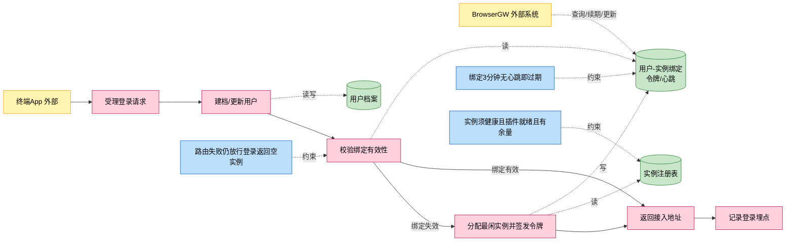
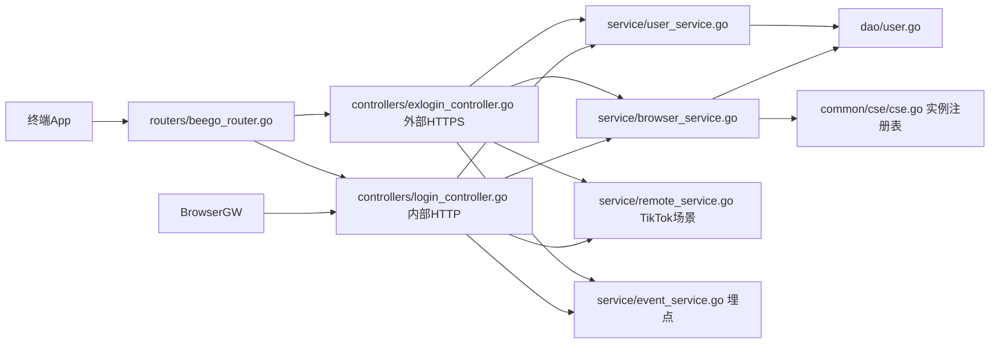
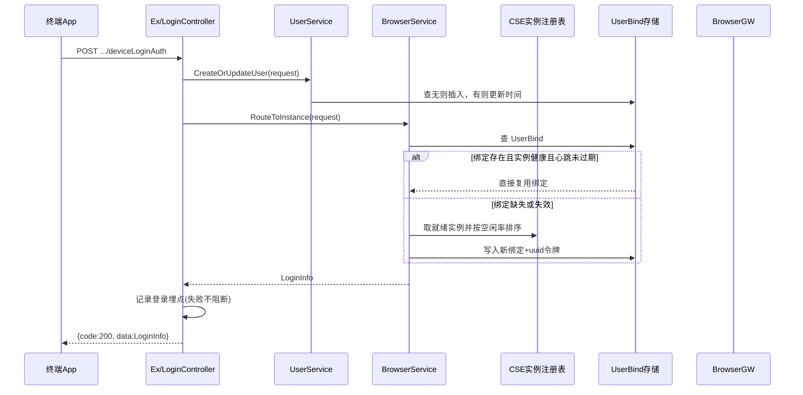

# 终端登录鉴权与实例分配

> 功能域概述：终端 App 登录时完成用户建档，为其分配一台就绪的浏览器网关（BrowserGW）实例并签发 token，返回接入地址；BrowserGW 侧通过 user-bind 接口查询/续期/更新绑定关系。
> 接口数：6 个唯一路径（9 处注册：3 个登录接口内外双 server 注册 + 3 个 user-bind 内部注册）　核心模块：controllers, service, dao, common/cse

## 1. 功能故事（多彩建模）

实现逻辑速览（1~3 句，每句 ≤30 字，业务语言，禁文件名/函数名/行号）：

终端登录先建档或更新用户档案，再查绑定：绑定有效直接用，失效则挑最空闲实例重新分配并签发令牌。TikTok 类应用还要转发云端换取云端令牌。登录结果无论成败都记一条登录埋点。

术语表：

| 术语 | 人话解释 | 出处 |
|---|---|---|
| BrowserGW | 浏览器网关实例，真正承载云浏览器会话的下游服务 | src/models/browsergateway/service_instance.go |
| 就绪实例 | 插件装完（Completed）、容量有余、健康在线的实例 | src/service/browser_service.go |
| UserBind | 用户与实例的绑定记录，含令牌、接入地址、心跳时间 | src/models/db/user.go |
| IMEI/IMSI | 终端设备与 SIM 卡标识，拼成用户主键 `imei_imsi` | src/service/user_service.go |
| Muen | TikTok 类应用的云端登录服务，登录需转发换 token | src/service/remote_service.go |
| GridLogin | 网格登录，响应中剥离直连地址只留网关地址 | src/controllers/exlogin_controller.go |
| CSE | 服务注册发现中心，watch 得到 BrowserGW 实例注册表 | src/common/cse/cse.go |

## 2. 实现方案

| 模块 | 承载功能（引用文件） |
|---|---|
| controllers/exlogin_controller.go | 外部 HTTPS 登录三接口入口，与内部版逻辑镜像（src/controllers/exlogin_controller.go） |
| controllers/login_controller.go | 内部 HTTP 登录三接口 + user-bind 三接口（src/controllers/login_controller.go） |
| service/user_service.go | 用户建档/更新、user-bind 查询续期更新（src/service/user_service.go） |
| service/browser_service.go | 实例筛选排序分配、绑定校验、令牌签发、预开浏览器（src/service/browser_service.go） |
| service/remote_service.go | TikTok 场景转发 Muen 云端登录（src/service/remote_service.go） |
| service/event_service.go | 登录埋点落本地审计文件（src/service/event_service.go） |
| common/cse/cse.go | watch 并缓存 BrowserGW 实例注册表（src/common/cse/cse.go） |
| dao/user.go | User/UserBind 的 ORM 存取（src/dao/user.go） |

## 3. 接口清单

| 接口 | 路径/入口（含注册处） | 请求结构 | 响应结构 | 状态 |
|---|---|---|---|---|
| GridLoginAuth | POST /app-api/devicetcp/app/login/v1/gridLoginAuth；外部入口 src/controllers/exlogin_controller.go、内部入口 src/controllers/login_controller.go；注册 src/routers/beego_router.go | LoginAuthRequest（src/models/req/request_entity.go）：imei/imsi、机型、appType 等，Validate 恒过 | DeviceLoginAuthResponse（src/models/resp/response_entity.go）：{code,msg,data:LoginInfo}，剥离直连地址 | 在用，27.0 起注入终端鉴权（[feature-terminal-auth](feature-terminal-auth.md)） |
| GridLoginAuthOpenBrowser | POST /app-api/devicetcp/app/login/v1/gridLoginAuthOpenBrowser；入口/注册同上 | LoginAuthRequest | DeviceLoginAuthResponse，登录同时异步预开浏览器 | 在用，27.0 起注入终端鉴权 |
| DeviceLoginAuth | POST /app-api/devicetcp/app/login/v1/deviceLoginAuth；入口/注册同上 | LoginAuthRequest | DeviceLoginAuthResponse；appType=2 时 data 替换为 Muen 令牌 | 在用，27.0 起注入终端鉴权（[feature-terminal-auth](feature-terminal-auth.md)） |
| GetUserBind | GET /user-bind/v1/:sessionID；入口 src/controllers/login_controller.go；注册 src/routers/beego_router.go | 路径参数 sessionID | db.UserBind（src/models/db/user.go）全字段 JSON | 在用 |
| ExpiredUserBind | PUT /user-bind/v1/:sessionId；入口/注册同上 | 路径参数 sessionId | BaseResponse（src/models/resp/base.go） | 在用 |
| UpdateUserBind | POST /user-bind/v1/update；入口/注册同上 | UpdateUserBindRequest（src/models/req/request_entity.go）：sessionID 必填，其余端点选填 | BaseResponse | 在用 |
| （出向）BrowserGW 预开浏览器 | POST http://{browserGWInnerEndpoint}/browsergw/browser/preOpen（src/service/browser_service.go） | InitBrowserRequest（src/models/browsergateway/req.go） | 只看成功码，失败仅记日志 | 在用 |
| （出向）Muen 云端登录 | POST {moon::titokEndpoint}/app-api/devicetcp/app/login/v1/deviceLoginAuth（src/service/remote_service.go） | LoginAuthRequest 透传；重试 2 次 | DeviceLoginAuthResponse，取 data 替换本端 LoginInfo | 在用 |

## 4. 关键数据结构

| 结构 | 定义位置 | 关键字段（含义+约束） |
|---|---|---|
| LoginAuthRequest | src/models/req/request_entity.go | IMEI/IMSI（用户主键来源）、AppType（=2 走 Muen）、Manufacturer/Model/Platform 等建档字段 |
| db.User | src/models/db/user.go | Key（pk，`imei_imsi` 拼接）、机型/平台等档案字段、CreatedAt/UpdatedAt |
| db.UserBind | src/models/db/user.go | Key（pk，同用户主键）、BrowserInstance（实例内网地址）、六类端点、Token（uuid）、Heartbeats（即 updated_at，3 分钟过期） |
| ServiceInstance | src/models/browsergateway/service_instance.go | BrowserInnerEndpoint（实例主键）、Cap/Used（负载排序依据）、PluginStatus、IsHealthy |
| LoginInfo | src/models/resp/response_entity.go | AuthInfo{Token,ExpiresTime,TimeAxis} + AssignInfo{各接入地址,NodeCapacity} |

## 5. 调用关系

关键分支与异步环节（各一句，带证据文件）：

- 解析/校验失败返回 HTTP 400 + code=-2（src/controllers/controller.go）
- 实例路由失败仅告警，登录仍成功、返回空 LoginInfo（src/controllers/login_controller.go）
- appType=2（TikTok）转发 Muen 云端登录，Muen 失败则整体报 -1（src/service/remote_service.go）
- OpenBrowser 变体向全部就绪实例异步 goroutine 预开浏览器，单台失败只记日志（src/service/browser_service.go）
- 登录埋点失败不导致登录失败（src/controllers/login_controller.go）

## 6. 外部文档引用

| 文档类型 | 引用文档 | 引用点 |
|---|---|---|
| 关键类（必须） | [docs/business/key-class/README.md](../key-class/README.md) | LoginController（登录入口编排）、BrowserService（实例分配与令牌签发，src/service/browser_service.go）、UserService（建档与绑定维护，src/service/user_service.go）、Cse（实例注册表，src/common/cse/cse.go）、UserBind（绑定核心模型，src/models/db/user.go）、ServiceInstance（实例负载排序，src/models/browsergateway/service_instance.go） |
| 接口文档 | [spec-interface-device-login.md](../interface/spec-interface-device-login.md) | 登录三接口与 user-bind 三接口的契约对照 |
| 外部接口文档 | [external-call-browser-gateway.md](../../technical/external-call/external-call-browser-gateway.md)、[external-call-muen-cloud.md](../../technical/external-call/external-call-muen-cloud.md) | （出向）BrowserGW preOpen 与 Muen 云端登录转发调用契约，与第 3 节出向行对应 |
| 基础框架文档 | [rpc-beego-web.md](../../technical/framework-usage/rpc-beego-web.md) | Beego Web：路由注册与请求处理（src/routers/beego_router.go、src/controllers/login_controller.go） |
| 基础框架文档 | [rpc-go-chassis-cse.md](../../technical/framework-usage/rpc-go-chassis-cse.md) | CSE 服务发现：watch BrowserGW 实例（src/common/cse/cse.go） |
| 基础框架文档 | [storage-beego-orm.md](../../technical/framework-usage/storage-beego-orm.md) | Beego ORM：User/UserBind 存取（src/dao/user.go） |
| 基础框架文档 | [rpc-http-client.md](../../technical/framework-usage/rpc-http-client.md) | https.Builder 出向调用（src/service/remote_service.go、src/service/browser_service.go） |
| struct 结构文档 | [spec-structure-AIAction.md](../../architecture/module-structure/spec-structure-AIAction.md) | 本功能在 controllers/service/dao/common 分层中的位置 |
