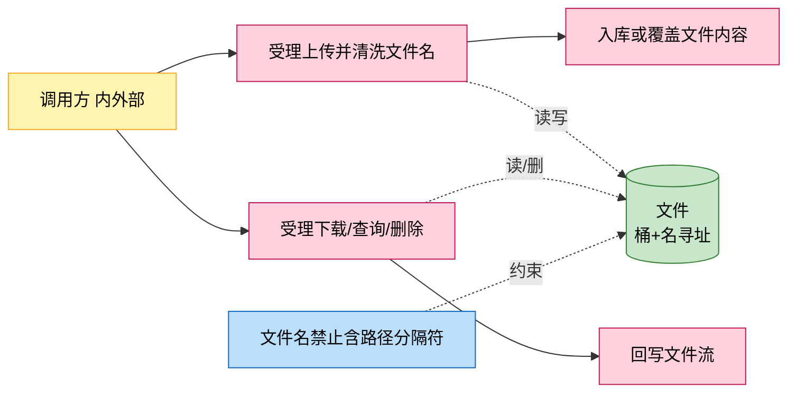
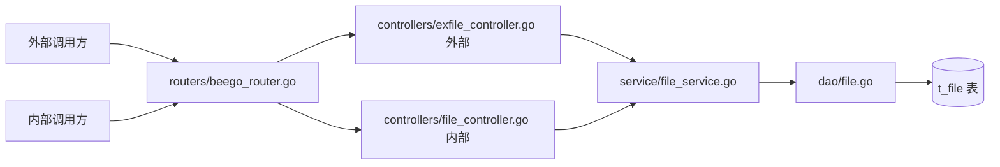
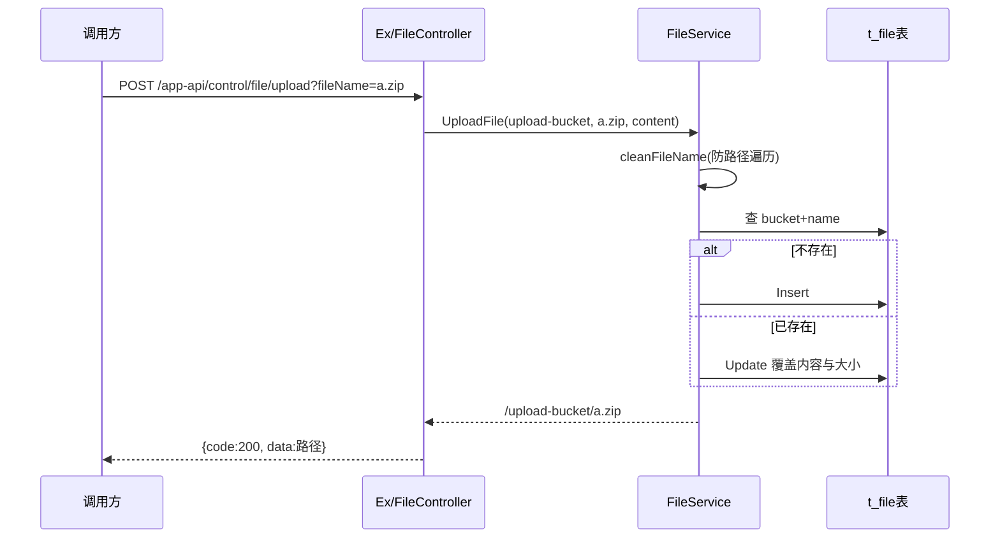

# 文件上传下载管理

> 功能域概述：提供文件（含插件包等大文件）的上传、下载、存在性查询与删除，文件内容以字节数组形式落在 t_file 表，按 bucket+name 寻址，带路径遍历防护。
> 接口数：6 个唯一路径（8 处注册：2 个 app-api 路径内外双注册 + 4 个 file/v1 内部路径）　核心模块：controllers, service, dao

## 1. 功能故事（多彩建模）

实现逻辑速览（1~3 句，每句 ≤30 字，业务语言，禁文件名/函数名/行号）：

上传先清洗文件名防目录穿越，按桶+名寻址，存在则覆盖内容。下载按桶+名取出字节流原样回写响应。

术语表：

| 术语 | 人话解释 | 出处 |
|---|---|---|
| bucket | 文件桶，文件的命名空间，如 upload-bucket、extension | src/common/constants/base.go |
| UploadBucket | 外部上传专用桶，固定值 upload-bucket | src/common/constants/base.go |
| 路径遍历防护 | 清洗文件名并拒绝含 / 或 \ 的名字 | src/service/file_service.go |
| ByteArrayField | ORM 自定义字节数组字段类型，落 bytea 列 | src/models/db/file.go |

## 2. 实现方案

| 模块 | 承载功能（引用文件） |
|---|---|
| controllers/exfile_controller.go | 外部上传/下载两接口入口（src/controllers/exfile_controller.go） |
| controllers/file_controller.go | 内部同名两接口 + file/v1 四接口（src/controllers/file_controller.go） |
| service/file_service.go | 文件名清洗、上传覆盖、下载、删除编排（src/service/file_service.go） |
| dao/file.go | File 实体 ORM 存取（src/dao/file.go） |
| models/db/file.go | File 实体与 ByteArrayField 类型（src/models/db/file.go） |

## 3. 接口清单

| 接口 | 路径/入口（含注册处） | 请求结构 | 响应结构 | 状态 |
|---|---|---|---|---|
| HandleUpload | POST /app-api/control/file/upload?fileName=xx；外部入口 src/controllers/exfile_controller.go、内部入口 src/controllers/file_controller.go；注册 src/routers/beego_router.go | 查询参数 fileName 必填；请求体为文件原始字节 | DataResponse：data 为路径 "/{bucket}/{name}" | 在用 |
| HandleDownload | GET /app-api/control/file/download/:fileName；入口/注册同上 | 路径参数 fileName | application/octet-stream 文件流 | 在用 |
| Upload | POST /file/v1/:bucketName/:name；入口 src/controllers/file_controller.go；注册 src/routers/beego_router.go（仅内部） | multipart 表单字段 file；路径参数桶+名 | 文件路径字符串 | 在用 |
| Download | GET /file/v1/:bucket/:name；入口/注册同上 | 路径参数桶+名 | application/octet-stream 文件流 | 在用 |
| Exist | GET /file/v1/:bucket/:name/exist；入口/注册同上 | 路径参数桶+名 | 200 存在 / 404 不存在 | 在用 |
| HandleDelete | DELETE /file/v1/:bucketName/:fileName；入口/注册同上 | 路径参数桶+名 | BaseResponse | 在用 |

## 4. 关键数据结构

| 结构 | 定义位置 | 关键字段（含义+约束） |
|---|---|---|
| db.File | src/models/db/file.go | ID（自增 pk）、Bucket+Name（联合寻址）、Content（bytea 字节内容）、Size、CreatedAt |

## 5. 调用关系

关键分支与异步环节（各一句，带证据文件）：

- 文件名清洗后含路径分隔符直接拒绝（src/service/file_service.go）
- Exist 查询异常返回 500，不存在返回 404（src/controllers/file_controller.go）
- 同名再上传为覆盖语义而非报错（src/service/file_service.go）
- 内部版 HandleDownload 缺少 fileName 时错误码用 -1，外部版用 -2，两版不一致（src/controllers/file_controller.go、src/controllers/exfile_controller.go）

## 6. 外部文档引用

| 文档类型 | 引用文档 | 引用点 |
|---|---|---|
| 关键类（必须） | [docs/business/key-class/README.md](../key-class/README.md) | BaseDao（File ORM 存取基座，src/dao/file.go 依赖）；本功能无专属关键类，文件服务为薄编排层（src/service/file_service.go） |
| 接口文档 | [spec-interface-file-transfer.md](../interface/spec-interface-file-transfer.md) | 六个文件接口的契约对照 |
| 外部接口文档 | 无引用 | 本功能无出向外部调用，文件落库 t_file（src/dao/file.go），接口清单无（出向）行 |
| 基础框架文档 | [rpc-beego-web.md](../../technical/framework-usage/rpc-beego-web.md) | Beego Web：路由注册与 multipart/文件流处理（src/routers/beego_router.go、src/controllers/file_controller.go） |
| 基础框架文档 | [storage-beego-orm.md](../../technical/framework-usage/storage-beego-orm.md) | Beego ORM：File 实体与自定义字节字段（src/dao/file.go、src/models/db/file.go） |
| struct 结构文档 | [spec-structure-AIAction.md](../../architecture/module-structure/spec-structure-AIAction.md) | 本功能在 controllers/service/dao/models 分层中的位置 |
