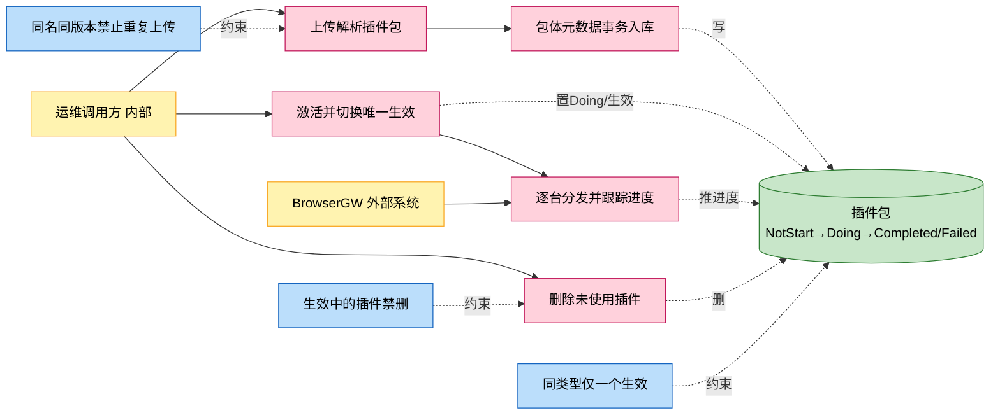
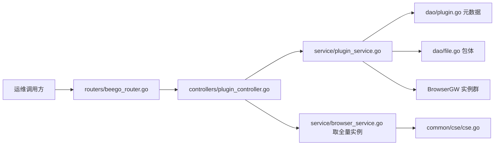
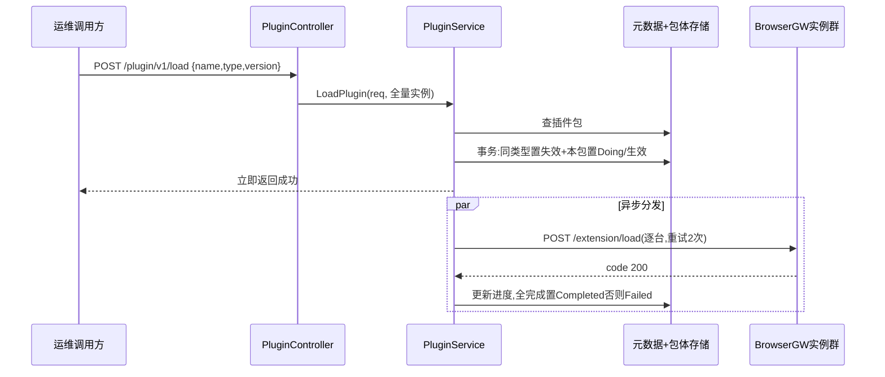

# 插件包管理

> 功能域概述：管理 Chrome 扩展插件包的生命周期——上传（zip 内含 package.json 元数据）、查询、删除、激活加载；加载时把激活包分发给全部浏览器网关实例并异步跟踪进度。
> 接口数：5（仅内部 server 注册）　核心模块：controllers, service, dao, common/cse

## 1. 功能故事（多彩建模）

实现逻辑速览（1~3 句，每句 ≤30 字，业务语言，禁文件名/函数名/行号）：

上传解析 zip 里的元数据，包体与元数据一个事务入库。激活时同类型只留一个生效，再逐台实例分发，异步累计进度。使用中的插件禁止删除。

术语表：

| 术语 | 人话解释 | 出处 |
|---|---|---|
| 插件包 | Chrome 扩展 zip 包，必须内含 package.json 元数据 | src/service/plugin_service.go |
| ChromeExtend | 当前唯一支持的插件类型枚举值 | src/common/constants/base.go |
| Field | 插件主键，格式 `type:name:version` | src/models/db/plugin_info.go |
| 激活（IfActive） | 标记该包为同类型当前生效版本 | src/models/db/plugin_info.go |
| extension 桶 | 插件包体固定存放的文件桶 | src/common/constants/base.go |

## 2. 实现方案

| 模块 | 承载功能（引用文件） |
|---|---|
| controllers/plugin_controller.go | 五接口入口、multipart 参数解析、panic 恢复（src/controllers/plugin_controller.go） |
| service/plugin_service.go | 上传解析、事务入库、唯一激活切换、异步分发与进度记录（src/service/plugin_service.go） |
| service/browser_service.go | 提供全量 BrowserGW 实例清单（src/service/browser_service.go） |
| dao/plugin.go / dao/file.go | 插件元数据与包体文件存取（src/dao/plugin.go、src/dao/file.go） |
| models/db/plugin_info.go | PluginPackage 实体与状态枚举（src/models/db/plugin_info.go） |

## 3. 接口清单

| 接口 | 路径/入口（含注册处） | 请求结构 | 响应结构 | 状态 |
|---|---|---|---|---|
| UploadPluginPackage | POST /plugin/v1/upload；入口 src/controllers/plugin_controller.go；注册 src/routers/beego_router.go（仅内部） | multipart：filename + file（zip，≤300MB） | BaseResponse | 在用 |
| DeletePluginPackage | POST /plugin/v1/delete；入口/注册同上 | PluginPackageReq（src/models/req/plugin_entity.go）：{name,type,version} 均必填 | BaseResponse | 在用 |
| GetPluginPackages | POST /plugin/v1/getAll；入口/注册同上 | 无 | []db.PluginPackage（src/models/db/plugin_info.go） | 在用 |
| LoadPlugin | POST /plugin/v1/load；入口/注册同上 | PluginPackageReq | BaseResponse，加载异步进行 | 在用 |
| GetCurrentPlugins | POST /plugin/v1/current；入口/注册同上 | 无 | 当前生效的 []db.PluginPackage | 在用 |
| （出向）BrowserGW 加载插件 | POST http://{browserGWInnerEndpoint}/browsergw/extension/load（src/service/plugin_service.go） | ExtensionLoadRequest（src/models/browsergateway/req.go）；重试 2 次 | ExtensionLoadResponse，code=200 记成功 | 在用 |

## 4. 关键数据结构

| 结构 | 定义位置 | 关键字段（含义+约束） |
|---|---|---|
| db.PluginPackage | src/models/db/plugin_info.go | Field（pk，type:name:version）、Status（NotStart/Doing/Completed/Failed）、IfActive（同类型唯一）、Progress（0-100）、PackageBucket/PackageName（包体寻址） |
| PluginPackageReq | src/models/req/plugin_entity.go | Name/Type/Version 三元组定位插件，均必填 |
| UploadPluginPackageReq | src/models/req/plugin_entity.go | Filename（须 .zip 后缀）、File、Size（>0 且 ≤300MB） |

## 5. 调用关系

关键分支与异步环节（各一句，带证据文件）：

- 上传时元数据与包体同事务，任一步失败整体回滚（src/service/plugin_service.go）
- 加载接口立即返回，分发与进度更新在两个 goroutine 异步完成（src/service/plugin_service.go）
- 分发不中断不重试：单台失败跳过，未全部成功终态置 Failed（src/service/plugin_service.go）
- 激活切换失败只记日志并照常返回成功（src/service/plugin_service.go）
- 生效中的插件删除报错；已不存在的插件删除幂等返回成功（src/service/plugin_service.go）

## 6. 外部文档引用

| 文档类型 | 引用文档 | 引用点 |
|---|---|---|
| 关键类（必须） | [docs/business/key-class/README.md](../key-class/README.md) | PluginService（上传加载编排与进度跟踪，src/service/plugin_service.go）、BrowserService（提供全量实例，src/controllers/plugin_controller.go 调用）、ServiceInstance（分发目标模型，src/service/plugin_service.go） |
| 接口文档 | [spec-interface-plugin-mgmt.md](../interface/spec-interface-plugin-mgmt.md) | 五个插件接口的契约对照 |
| 外部接口文档 | [external-call-browser-gateway.md](../../technical/external-call/external-call-browser-gateway.md) | （出向）extension/load 调用契约，与第 3 节出向行对应 |
| 基础框架文档 | [rpc-beego-web.md](../../technical/framework-usage/rpc-beego-web.md) | Beego Web：路由注册与 multipart 解析（src/routers/beego_router.go、src/controllers/plugin_controller.go） |
| 基础框架文档 | [storage-beego-orm.md](../../technical/framework-usage/storage-beego-orm.md) | Beego ORM 事务：DoTxWithCtx（src/service/plugin_service.go） |
| 基础框架文档 | [rpc-http-client.md](../../technical/framework-usage/rpc-http-client.md) | https.Builder 分发调用（src/service/plugin_service.go） |
| 基础框架文档 | [concurrency-goroutine-sync.md](../../technical/framework-usage/concurrency-goroutine-sync.md) | goroutine+channel 异步进度记录（src/service/plugin_service.go） |
| struct 结构文档 | [spec-structure-AIAction.md](../../architecture/module-structure/spec-structure-AIAction.md) | 本功能在 controllers/service/dao 分层中的位置 |
