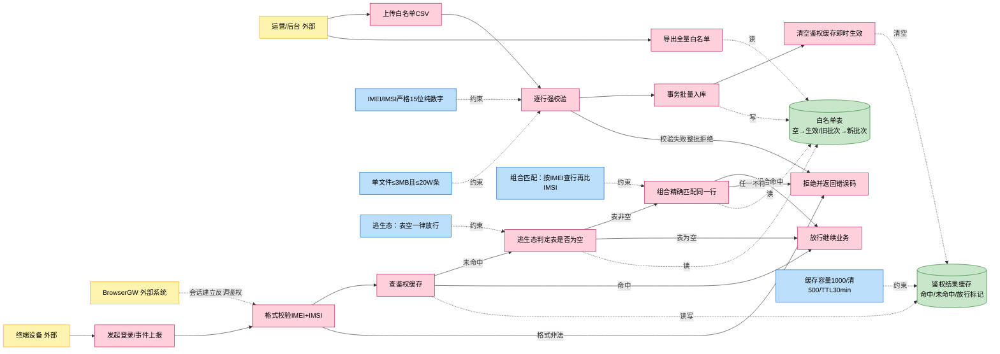
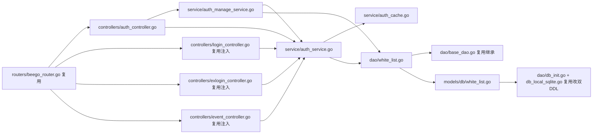
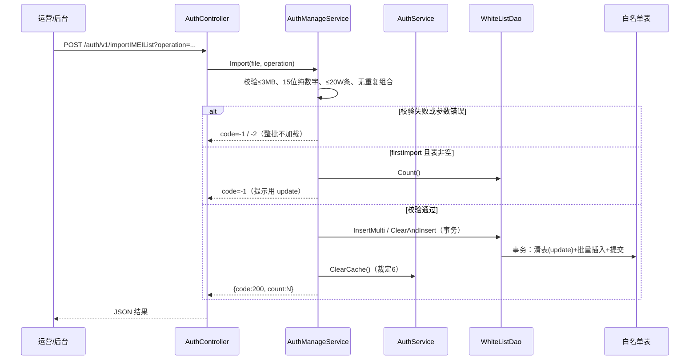
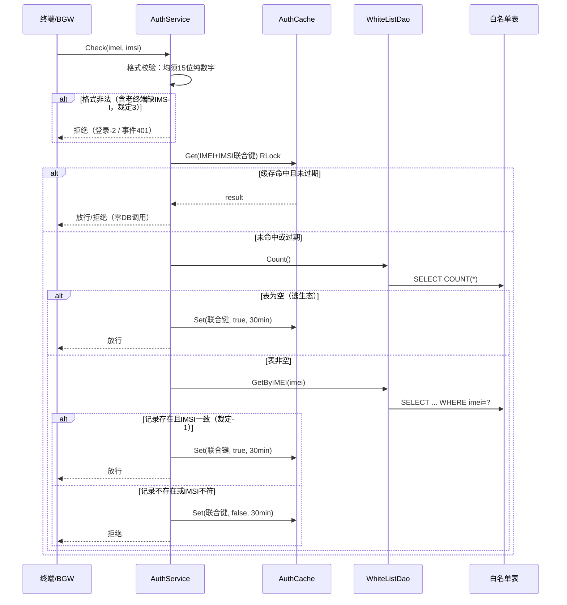

# 终端鉴权（IMEI+IMSI 白名单）

> 功能域概述：商用准入控制——运营批量导入 IMEI+IMSI 白名单，登录与事件上报链路做联合鉴权，组合未命中即拒绝；白名单为空时逃生态全放行，避免未配置导致线上阻断。
> 接口数：3 个（在用）+ 5 个注入点　核心模块：controllers(auth), service(auth), dao, models
> 来源：docs/27.0/终端鉴权/27.0终端鉴权需求设计文档-规范版.md（下称"需求"）
> 最近更新：27.0 终端鉴权需求实现落地，2026-07-30（按代码事实对齐：导出 CSV 带表头、deviceLoginAuth 同步注入、DB 异常 fail-open）

## 1. 功能故事（多彩建模）

实现逻辑速览（1~3 句，每句 ≤30 字，业务语言，禁文件名/函数名/行号）：

运营批量导入白名单，入库成功即刻生效。终端登录或上报先查缓存，未命中再查白名单。组合命中放行、未命中拒绝，白名单为空全放行。

术语表：

| 术语 | 人话解释 | 出处 |
|---|---|---|
| IMEI | 设备身份证，15 位纯数字，精确匹配 | 需求 §8 |
| IMSI | 用户（SIM 卡）身份证，15 位纯数字，精确匹配 | 需求 §8 |
| 联合鉴权 | IMEI+IMSI 组合精确命中同一条记录才放通 | 需求 §8 + 裁定1 |
| 逃生态 | 白名单表为空时一律放行，防止未配置全量阻断 | 需求 §2.2.3 |
| firstImport | 首次导入模式，要求白名单表为空 | 需求 §2.2.1 |
| update | 覆盖更新模式，事务清表+批量插入 | 需求 §2.2.1 |
| 联合键 | 缓存 key，IMEI+IMSI 拼接 | 需求 §2.2.4 |
| BGW | BrowserGW，浏览器网关，会话建立时反调鉴权接口 | 需求 §8 + 裁定2 |
| GIDS | 本服务，云浏览器全局实例交付服务 | 需求 §8 |

## 2. 实现方案

| 模块 | 承载功能（引用文件） |
|---|---|
| controllers/auth（src/controllers/auth_controller.go） | 鉴权/导入/导出三 HTTP 入口，不做业务逻辑（需求 §2.4） |
| service/auth 鉴权（src/service/auth_service.go） | 逃生态判定+缓存查询+组合匹配决策；ClearCache（需求 §2.4 + 裁定6） |
| service/auth 管理（src/service/auth_manage_service.go） | CSV 解析+批量入库+导出生成；提交后调 ClearCache（需求 §2.4 + 裁定6） |
| service/auth 缓存（src/service/auth_cache.go） | 命中/未命中/放行结果缓存+惰性清理，不查 DB（需求 §2.4） |
| dao/white_list（src/dao/white_list.go） | Count/GetByIMEI/InsertMulti/ClearAndInsert/ListAll（需求 §2.4） |
| models/db/white_list（src/models/db/white_list.go） | 白名单实体，orm 标签+TableName+init 注册（需求 §2.4） |
| controllers login/exlogin（复用，src/controllers/login_controller.go、src/controllers/exlogin_controller.go） | gridLoginAuth/gridLoginAuthOpenBrowser 注入鉴权（需求 §3） |
| controllers event（复用，src/controllers/event_controller.go） | sendClientEvent/sendAppUseTimesEvent 注入鉴权（需求 §3） |

## 3. 接口清单

| 接口 | 路径/入口（含注册处） | 请求结构 | 响应结构 | 状态 |
|---|---|---|---|---|
| 终端联合鉴权 | POST /auth/v1/authIMEI；入口 src/controllers/auth_controller.go；注册 src/routers/beego_router.go（仅内部 server） | AuthIMEIRequest JSON {imei, imsi}（src/models/req/auth_request.go） | {code:200} 命中放行 / {code:401} 未命中（"auth rejected"）或格式非法（"format invalid"） | 在用 |
| 白名单导入 | POST /auth/v1/importIMEIList；入口/注册同上 | multipart/form-data 文件字段 file（CSV 无 header 纯数据）+ form 字段 operation=firstImport\|update | {code:200,data:条数} / -1 校验失败（表非空 msg 含 "not empty"）/ -2 参数错误 | 在用 |
| 白名单导出 | GET /auth/v1/exportIMEIList；入口/注册同上 | 无 | 200 text/csv 全量白名单，首行表头 IMEI,IMSI（27.0 实现按 TC_001 对齐带表头） | 在用 |
| GridLoginAuth（注入） | POST /app-api/devicetcp/app/login/v1/gridLoginAuth；入口 src/controllers/exlogin_controller.go、src/controllers/login_controller.go | LoginAuthRequest（src/models/req/request_entity.go，已含 imei/imsi） | 鉴权拒绝返回 code=-2（"auth rejected"） | 在用，27.0 起注入终端鉴权 |
| GridLoginAuthOpenBrowser（注入） | POST /app-api/devicetcp/app/login/v1/gridLoginAuthOpenBrowser；入口/注册同上 | LoginAuthRequest | 鉴权拒绝返回 code=-2 | 在用，27.0 起注入终端鉴权 |
| DeviceLoginAuth（注入） | POST /app-api/devicetcp/app/login/v1/deviceLoginAuth；入口/注册同上 | LoginAuthRequest | 鉴权拒绝返回 code=-2 | 在用，27.0 起注入终端鉴权（TC_005 要求，随共享 loginAuth() 一并注入） |
| SendClientEvent（注入） | POST /app-api/center/public/client/sendClientEvent；入口 src/controllers/event_controller.go | ClientEventRequest（src/models/req/event_request.go，已含 imei/imsi） | 鉴权拒绝返回 code=401（"auth rejected"） | 在用，27.0 起注入终端鉴权 |
| SendAppUseTimesEvent（注入） | POST /app-api/center/public/client/sendAppUseTimesEvent；入口/注册同上 | AppUseTimesEvent + IMEI/IMSI（src/models/req/event_request.go） | 鉴权拒绝返回 code=401 | 在用，27.0 起注入终端鉴权 |

## 4. 关键数据结构

| 结构 | 定义位置 | 关键字段（含义+约束） |
|---|---|---|
| AuthWhitelist 实体/t_white_list 表 | src/models/db/white_list.go | IMEI char(15) 设 pk；IMSI char(15) 不加 pk；CreatedAt；IMEI+IMSI 联合 UNIQUE INDEX 由 DDL 兜底（需求 §7；src/dao/db_init.go、src/dao/db_local_sqlite.go） |
| cacheEntry | src/service/auth_cache.go | result（true/false/放行标记）+ expireAt；容量 1000、超限清最旧 500、TTL 30min（需求 §2.2.4） |
| 导入 CSV | 上传文件（无 header 纯数据） | 两列 IMEI,IMSI；单文件 ≤3MB、≤20W 条；文件内重复组合整批拒绝（需求 §2.2.1 + 裁定5） |
| 导出 CSV | 响应文本（带表头） | 首行 IMEI,IMSI 表头 + 数据行（27.0 实现按 TC_001 验收对齐，src/service/auth_manage_service.go） |

## 5. 调用关系

管理链路（导入/导出）：

实现说明：

- 参数缺失或 operation 非法返回 -2（需求 §2.2.1）。
- CSV 无 header，所有行当数据逐行强校验（裁定5）。
- 任一校验失败整批不加载，保证一致性（需求 §4）。
- update 为事务清表+插入，失败整体回滚（需求 §4）。
- 事务提交成功后立即清空鉴权缓存（裁定6）。
- 导出为全量查询生成 CSV 文本，首行带 IMEI,IMSI 表头（27.0 实现按 TC_001 对齐）。

鉴权链路（authIMEI 与 4 个注入点共用）：

实现说明：

- 格式非法直接短路，不产生 DB 查询（需求 §4）。
- 缓存命中时零 DB 调用，读多写少用 RLock（需求 §2.2.4）。
- 未命中组合也缓存 false，防穿透（需求 §2.2.4）。
- 组合匹配=按 IMEI 查行再比对 IMSI（裁定1）。
- 清理在写锁内惰性完成，无独立 goroutine（需求 §2.2.4）。
- 登录链路拒绝 code=-2，事件链路拒绝 code=401（需求 §2.2.3）。
- DB 异常（Count/GetByIMEI 出错）fail-open 放行并记错误日志，避免 DB 故障阻断主流程（27.0 实现决策，src/service/auth_service.go）。

## 6. 外部文档引用

| 文档类型 | 引用文档 | 引用点 |
|---|---|---|
| 关键类（必须） | [docs/business/key-class/README.md](../key-class/README.md) | 复用 BaseController（请求解析与响应封装，src/controllers/controller.go）、BaseDao（ORM 基座，src/dao/base_dao.go）；在 LoginController（src/controllers/login_controller.go）与 EventService 入口（src/controllers/event_controller.go）注入鉴权调用 |
| 接口文档 | [spec-interface-device-login.md](../interface/spec-interface-device-login.md)、[spec-interface-client-event.md](../interface/spec-interface-client-event.md) | gridLoginAuth/gridLoginAuthOpenBrowser 与两个事件接口的既有契约，注入点确认依据 |
| 外部接口文档 | 无引用 | 本功能无出向外部调用；authIMEI 为被 BGW 反调的入向接口（裁定2） |
| 基础框架文档 | [rpc-beego-web.md](../../technical/framework-usage/rpc-beego-web.md) | Beego Web：新 Controller 按 RouteInfo 声明、注册进内部监听（src/routers/beego_router.go） |
| 基础框架文档 | [storage-beego-orm.md](../../technical/framework-usage/storage-beego-orm.md) | Beego ORM：实体三步曲+BaseInterface 继承+双 DDL（src/dao/base_dao.go） |
| 基础框架文档 | [di-singleton.md](../../technical/framework-usage/di-singleton.md) | 鉴权/管理 Service 按接口+小写实现+sync.Once 单例模式（src/service/user_service.go 模式） |
| 基础框架文档 | [concurrency-goroutine-sync.md](../../technical/framework-usage/concurrency-goroutine-sync.md) | 缓存组件 sync.RWMutex 读写锁与锁内惰性清理（需求 §2.2.4） |
| struct 结构文档 | [spec-structure-AIAction.md](../../architecture/module-structure/spec-structure-AIAction.md) | 新模块在 controllers/service/dao/models 分层中的归属依据 |
