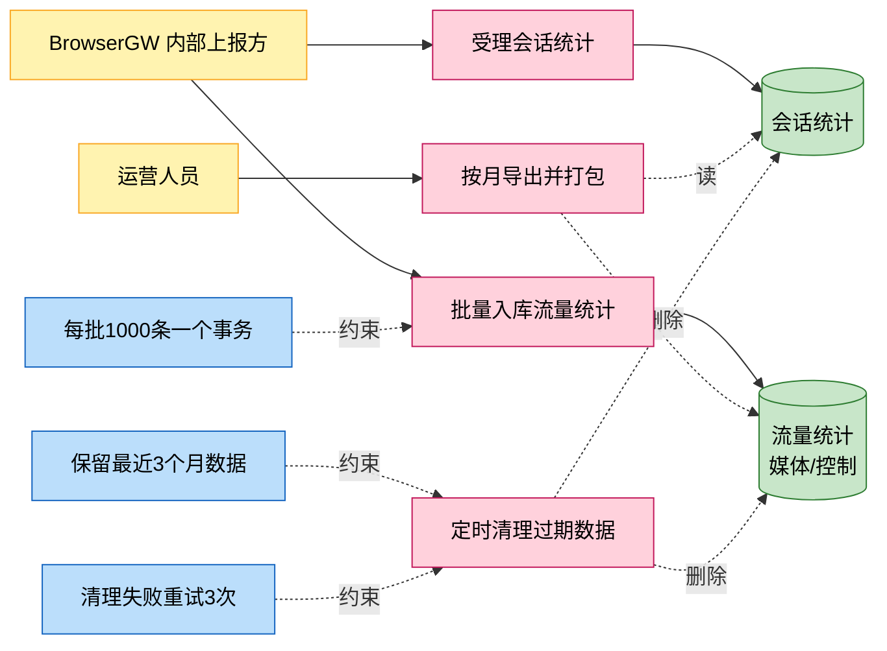
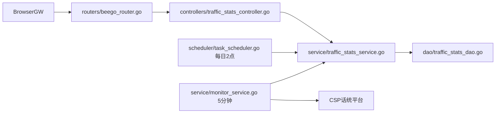
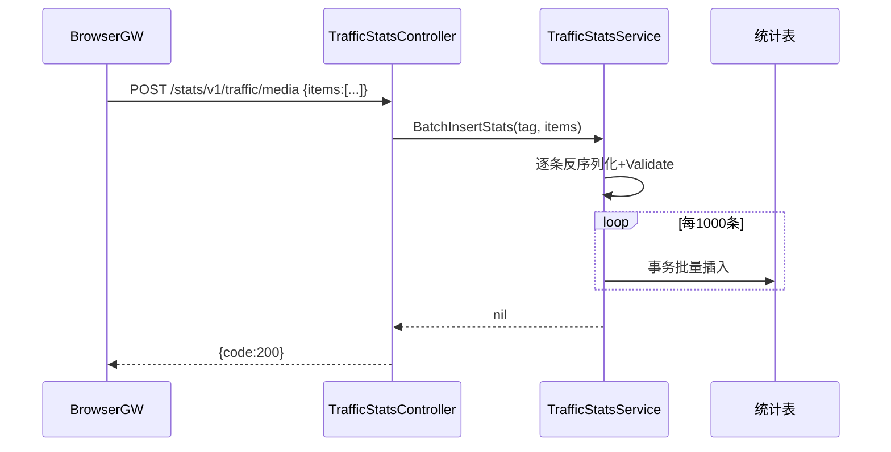

# 流量会话统计与数据治理

> 功能域概述：接收网关上報的会话与媒体/控制面流量统计并批量入库；支持按月份导出 CSV 打包下载；每日凌晨 2 点定时清理 3 个月前的历史数据；并向 CSP 话统平台定时上报运营指标。
> 接口数：4（仅内部 server 注册）+ 1 个定时任务　核心模块：controllers, service, dao, scheduler

## 1. 功能故事（多彩建模）

实现逻辑速览（1~3 句，每句 ≤30 字，业务语言，禁文件名/函数名/行号）：

会话按连接唯一标识有则更新无则插入，流量数据千条一批事务入库。按月导出三类统计打包成 zip，凌晨定时清理过期数据。

术语表：

| 术语 | 人话解释 | 出处 |
|---|---|---|
| 会话统计 | 一次用户连接的起止记录，按 tcp_unique_id 去重 | src/models/db/traffic_stats.go |
| 媒体/控制流量 | 媒体面与控制面两类连接的字节量统计 | src/models/db/traffic_stats.go |
| CSP 话统 | 华为运营指标监控平台，5 分钟粒度定时上报 | src/service/monitor_service.go |
| SQL 配置 | 话统查询语句的 YAML 外置配置文件 | src/service/traffic_stats_service.go |
| 数据清理 | 每日 2 点删除 3 个月前统计数据的定时任务 | src/scheduler/task_scheduler.go |

## 2. 实现方案

| 模块 | 承载功能（引用文件） |
|---|---|
| controllers/traffic_stats_controller.go | 四接口入口、导出 zip 打包与响应（src/controllers/traffic_stats_controller.go） |
| service/traffic_stats_service.go | 会话去重入库、千条批量事务、CSV 导出、过期清理、配置化查询（src/service/traffic_stats_service.go） |
| service/monitor_service.go | CSP 话统注册与 5 分钟指标上报（src/service/monitor_service.go） |
| scheduler/task_scheduler.go | 每日 2 点清理调度，失败重试 3 次（src/scheduler/task_scheduler.go） |
| dao/traffic_stats_dao.go | 三张统计表的 ORM 存取（src/dao/traffic_stats_dao.go） |

## 3. 接口清单

| 接口 | 路径/入口（含注册处） | 请求结构 | 响应结构 | 状态 |
|---|---|---|---|---|
| SessionStats | POST /stats/v1/session；入口 src/controllers/traffic_stats_controller.go；注册 src/routers/beego_router.go（仅内部） | db.SessionStats（src/models/db/traffic_stats.go）：{session_id,app_type,started_at,finished_at,tcp_unique_id} | BaseResponse | 在用 |
| MediaTrafficStats | POST /stats/v1/traffic/media；入口/注册同上 | MultiTableRequest（src/models/req/request_entity.go）：{items:[...]} 非空 | BaseResponse | 在用 |
| ControlTrafficStats | POST /stats/v1/traffic/control；入口/注册同上 | MultiTableRequest | BaseResponse | 在用 |
| ExportStaticData | GET /stats/v1/exportStaticData/:month；入口/注册同上 | 路径参数 month，格式 2006-01 | application/zip，内含三个 CSV | 在用 |
| （定时）CleanOldStats | 每日 02:00 触发；入口 src/scheduler/task_scheduler.go；启动 src/main.go | 无；清理 3 个月前数据 | 失败重试 3 次、间隔 10 分钟 | 在用 |
| （出向）CSP 话统上报 | CSPGoMonitorSDK 打点；入口 src/service/monitor_service.go | 按 monitor.json 指标模型，SQL 取自 sql.yaml | SDK 调用结果，失败仅记日志 | 在用 |

## 4. 关键数据结构

| 结构 | 定义位置 | 关键字段（含义+约束） |
|---|---|---|
| db.SessionStats | src/models/db/traffic_stats.go | TcpUniqueId（去重键）、SessionID、StartedAt/FinishedAt（月份过滤依据） |
| db.MediaTrafficStats / db.ControlTrafficStats | src/models/db/traffic_stats.go | SessionID、OutBytes（字节量）、AccessType、起止时间 |
| MultiTableRequest | src/models/req/request_entity.go | Items（json.RawMessage 数组，非空，逐条反序列化+校验） |
| SQLConfig | src/service/traffic_stats_service.go | Queries（查询名→SQL+参数映射，话统查询外置化） |

## 5. 调用关系

关键分支与异步环节（各一句，带证据文件）：

- 会话统计按 tcp_unique_id 存在即更新、不存在插入（src/service/traffic_stats_service.go）
- 导出按月过滤用 started_at 前缀匹配，分批 1000 条写 CSV（src/service/traffic_stats_service.go）
- 清理任务每日 2 点触发，进程退出时优雅停止（src/scheduler/task_scheduler.go、src/main.go）
- 话统查询依赖外部 sql.yaml，未加载时查询返回空（src/service/traffic_stats_service.go）
- 导出的 zip 在临时目录生成，响应后目录即删（src/controllers/traffic_stats_controller.go）

## 6. 外部文档引用

| 文档类型 | 引用文档 | 引用点 |
|---|---|---|
| 关键类（必须） | [docs/business/key-class/README.md](../key-class/README.md) | TrafficStatsService（批量入库/导出/清理核心，src/service/traffic_stats_service.go）、MonitorService（话统上报调度，src/service/monitor_service.go）、DataCleanupScheduler（定时清理，src/scheduler/task_scheduler.go）、BaseDao（批量事务基座，src/dao/traffic_stats_dao.go） |
| 接口文档 | [spec-interface-traffic-stats.md](../interface/spec-interface-traffic-stats.md)、[spec-interface-data-cleanup.md](../interface/spec-interface-data-cleanup.md) | 四个统计接口与定时清理任务的契约对照 |
| 外部接口文档 | [external-call-csp-monitor.md](../../technical/external-call/external-call-csp-monitor.md) | （出向）CSP 话统上报调用契约，与第 3 节出向行对应 |
| 基础框架文档 | [rpc-beego-web.md](../../technical/framework-usage/rpc-beego-web.md) | Beego Web：路由注册与 zip 流响应（src/routers/beego_router.go、src/controllers/traffic_stats_controller.go） |
| 基础框架文档 | [storage-beego-orm.md](../../technical/framework-usage/storage-beego-orm.md) | Beego ORM 事务批量插入（src/service/traffic_stats_service.go） |
| 基础框架文档 | [schedule-ticker.md](../../technical/framework-usage/schedule-ticker.md) | 定时清理调度与 5 分钟 ticker（src/scheduler/task_scheduler.go、src/service/monitor_service.go） |
| 基础框架文档 | [metrics-csp-monitor.md](../../technical/framework-usage/metrics-csp-monitor.md) | CSP 话统 SDK 注册与上报（src/service/monitor_service.go） |
| struct 结构文档 | [spec-structure-AIAction.md](../../architecture/module-structure/spec-structure-AIAction.md) | 本功能在 controllers/service/dao/scheduler 分层中的位置 |
