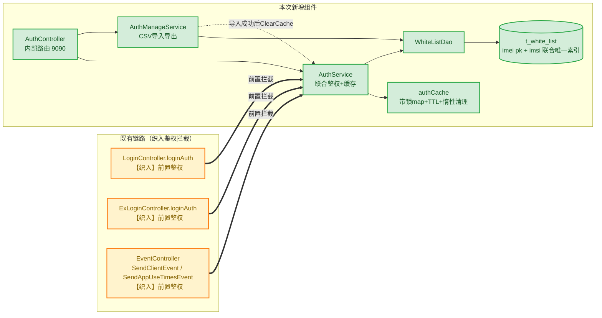

# 27.0 终端鉴权 需求代码检查报告

---

## 一、架构变更检查

### 1.1 本需求引入的架构变更

> 图例：🟩 绿色 = 本次新增组件；🟧 橙色 = 既有组件织入鉴权拦截（加粗实线为织入边）；`t_white_list` 为新增数据表。

| 维度 | 变更 | 评估 |
| --- | --- | --- |
| 分层架构 | 新增完整 Controller→Service→DAO→Model 链路，严格对齐既有四层 | ✅ 无架构破坏 |
| 对外接口 | 新增 3 个内部接口：`POST /auth/v1/authIMEI`、`POST /auth/v1/importIMEIList`、`GET /auth/v1/exportIMEIList`，仅内部路由 | ✅ 已沉淀至 `docs/interface/spec-interface-terminal-auth.md` |
| 数据表 | 新增 `t_white_list`，GaussDB/SQLite 双 DDL 同步 | ✅ 双写一致 |
| 关键数据结构 | 新增 `authCache`（自定义带锁 map 缓存，容量 1000/TTL 30min/惰性清理 500） | ✅ 已沉淀至 `docs/data-structure/spec-data-structure-custom-container.md` |
| 既有代码织入方式 | 鉴权以**代码注入**方式织入 3 个既有 Controller 的 4 个端点，而非 Beego Filter | ⚠️ 每个未来新端点需手动加 `Check`，存在漏织入风险；且 login/exlogin 两处重复注入。建议后续演进为统一 Filter（按路径前缀 + 白名单豁免 login 自身） |
| Service 横向依赖 | `AuthManageService` 依赖 `AuthService`（导入成功后 `ClearCache`） | ⚠️ 出现首个 Service→Service 依赖，当前为单向、无环，可接受；需防止未来形成循环依赖 |
| 可用性策略 | 引入逃生态（表空放行）+ DB 异常 fail-open 策略 | ⚠️ 架构决策：可用性优先于安全性。`checkFromStore` 有注释与错误日志，决策显式，可接受；需运维知悉 DB 故障期间鉴权形同放行 |
| 并发模型 | `authCache` 读写锁保护、无独立 goroutine、清理在写锁内完成 | ✅ 无 configCenter.configs 式无锁裸 map 隐患（见 `docs/data-structure/README.md` 全局风险） |

### 1.2 架构资产同步状态

| 资产 | 路径 | 状态 |
| --- | --- | --- |
| 接口文档 | `docs/interface/spec-interface-terminal-auth.md` | ✅ 已含 3 个新接口 |
| feature 文档 | `docs/story/feature-terminal-auth.md` | ✅ 已存在 |
| 数据结构文档 | `docs/data-structure/spec-data-structure-custom-container.md` | ✅ 已含 authCache |
| 关键类清单 | `docs/key-class/README.md` | ❌ **缺口**：缺 `AuthController`、`AuthService`、`AuthManageService`、`WhiteListDao`、`authCache` 5 个新关键类，需补齐 |
| 包结构文档 | `docs/structure/` | 无新增包，无需变更 |

**后续代码架构判断以 `docs/` 下资产为准**；本次检查发现的 key-class 缺口应在下次资产刷新（spec-asset-refresh）时补齐。

---

## 二、Clean Code 逐项检查结果

### 2.1 合规项（无问题）

| # | 规范 | 结论 | 说明 |
| --- | --- | --- | --- |
| 1 | 命名意图 | ✅ | 命名完整揭示意图：`record`、`expiringItem`、`isAllowed` 等，无拼音/单字母/模糊缩写 |
| 2 | 布尔命名前缀 | ✅ | `Check` 返回 `(isPass, isFormatValid)`，`cacheEntry.isAllowed`，布尔均带语义前缀 |
| 3 | 函数规模 ≤50 行 | ✅ | 最长函数 `Import` 32 行、`parseWhiteListCSV` 31 行，均在限内 |
| 4 | 圈复杂度 ≤10 | ✅ | 最高 `Import` ≈8，其余 ≤7 |
| 5/6 | 文件规模 ≤2000/4000 行 | ✅ | 最大新增文件 `auth_service_test.go` 181 行 |
| 8 | 变量声明即初始化 | ✅ | 全部 `:=` 或 `var` 零值初始化，无声明/赋值分离 |
| 9 | 注释只解释 Why | ✅ | `fail-open 避免阻断主流程`、`调用方须持有写锁`、`login 链路格式错误与未命中统一返回 -2，忽略 formatValid` 等均为设计约束说明；无注释掉的废弃代码 |
| 10 | 返回值禁止忽略 | ✅ | error 全部显式检查；刻意忽略 `formatValid` 处均有注释说明取舍，测试中用 `_, _ =` 显式忽略 |
| 11 | 异常仅用于致命错误 | ✅ | Go error 处理，无 panic、无 error 当流程控制 |
| 12 | 禁止递归 | ✅ | 无递归 |
| 13 | 禁止魔法数字 | ✅ | 字面量均已常量化：`authCacheCapacity/authCacheCleanCount/authCacheTTL`、`importMaxFileSize/importMaxRecords`、`csvFieldCount`、`timeLayoutSecond` |
| 14 | 空值检查距离 ≤3 行 | ✅ | 所有 err/指针解引用前均在 1 行内完成校验 |
| 16 | 函数参数 ≤5 | ✅ | 最多 2 个（`Check(imei, imsi)`、`Import(reader, operation)`） |
| 17 | 嵌套深度 ≤4 | ✅ | 最深 3 层（`ClearAndInsert` 事务闭包内） |
| 18 | 禁止 goto 上跳 | ✅ | 无 goto |
| 19 | 缓冲区边界校验 | ✅ | 文件大小 `importMaxFileSize`、记录数 `importMaxRecords` 上限校验；`cleanLocked` 删除循环 `i < authCacheCleanCount && i < len(entries)` 显式双边界；CSV 列数由 `FieldsPerRecord=csvFieldCount` 库级保证 |
| 21 | 逻辑抽象层级（SLAP） | ✅ | `Import`/`Export` 底层细节已抽取为 `readWithSizeLimit`、`writeCSVRow`、`parseWhiteListCSV`，主流程单一抽象层级 |
| 22 | DRY | ✅ | event 链路鉴权拦截收敛至 `rejectIfAuthFailed`；login/exlogin 存量重复见 2.2 |
| 23 | 迪米特法则 ≤2 层链 | ✅ | 最长链 `c.Request().FormFile(...)` 为 2 层 |
| 24 | 禁止布尔参数切换行为 | ✅（新增代码） | 新增代码无布尔参数；`loginAuth(preOpenBrowser bool)` 为存量问题，见 2.2 |

### 2.2 提示 / 豁免说明项

| # | 规范 | 位置 | 说明 | 判定 |
| --- | --- | --- | --- | --- |
| 7 | 缩进 4 空格 | 全部 .go 文件 | Go 官方 `gofmt` 强制 tab，与规范"空格"冲突；仓库存量全部 tab | **豁免**：遵循 gofmt 与仓库惯例 |
| 20 | 单一职责（模块级） | `src/controllers/auth_controller.go:15` | `AuthController` 同时承载"终端鉴权"与"白名单导入导出"两个修改原因 | **提示**：可拆 `AuthController` + `AuthManageController`；当前 3 端点规模小，可接受 |
| 25/26 | CQS / 副作用隔离 | `auth_service.go:59-70` | `Check` 作为查询函数内部写缓存（read-through 缓存） | **豁免**：缓存读穿是业界标准模式，注释已说明；`Import` 成功后 `ClearCache` 跨服务副作用为显式业务需求（缓存立即生效），有注释 |
| 27 | 测试命名 should..._When... | 全部 `TestXxx` | Go testing 强制 `Test` 前缀，与规范格式冲突；存量测试均为 `TestXxx` | **豁免**：遵循 Go 惯例与仓库风格；折中可采用 `TestCheck_ShouldReject_WhenFormatInvalid` 形式，本次不做强制 |
| 22 | DRY（存量延续） | `login_controller.go` vs `exlogin_controller.go` | 两个 `loginAuth` 整体重复为存量架构（内外网 Controller 分离），本 commit 在两处同步注入相同鉴权块，延续但未新增重复 | **提示**：后续可考虑提取共享 `loginAuthHelper`，本次不在范围内 |

### 2.3 修改文件专项检查

| 文件 | 变更 | 结论 |
| --- | --- | --- |
| `controllers/filter_test.go` | `:=` 改 `=`（53/79 行） | ✅ 修复 "no new variables on left side of :=" 编译错误，正确 |
| `dao/db_init.go` / `dao/db_local_sqlite.go` | 新增 `t_white_list` DDL + 联合唯一索引 | ✅ 双方言同步新增，字段/索引一致；`imei char(15)` 与正则 `^[0-9]{15}$` 吻合；复合唯一索引兜底方案与注释一致 |
| `routers/beego_router.go` | 内部路由注册 `AuthController` | ✅ 仅注册到 `RegisterInternalRouter`（127.0.0.1:9090），与设计"仅运维内网可达"一致，未泄露到外部路由 |
| `models/db/white_list.go` | 实体 `orm:"pk;column(imei)"` + `TableName()` + `init()` 注册 | ✅ 符合 AGENTS.md 实体注册基线；IMSI 不加 pk 符合坑#6 |
| `models/req/auth_request.go` | `Validate()` 非空校验 | ✅ 完整揭示意图；注：当前 `AuthIMEI` 端点未调用 `Validate()`（由 `Check` 内正则兜底），无功能问题 |
| `service/auth_service.go` | 接口 + 小写实现 + `sync.Once` 单例 + `var _ AuthService = ...` 编译期断言 | ✅ 全部符合 AGENTS.md Go 代码质量基线 |

---

## 三、结论与验证

### 结论

**通过**。初检发现的 3 项建议修复 + 3 项补充修复（布尔命名、魔法数字、DRY、SLAP、模糊缩写、忽略返回值说明）已全部闭环，当前代码符合 `tt.md` 27 条规范（豁免项均有明确判定依据）；架构上严格对齐既有四层分层与 AGENTS.md Go 质量基线，无架构破坏。

### 验证结果

| 验证项 | 结果 |
| --- | --- |
| `go build -o gids .` | ✅ 编译通过 |
| `go vet`（service/controllers/models/db 本次改动包） | ✅ 干净；`dao`、`models/req` 两处报错为存量问题（`base_dao_test.go` convey 未定义、`request_entity.go:119` non-constant format string），与本需求无关 |
| `go test ./service/... ./controllers/...` | ✅ 全部 ok |
| testsuit E2E（LOCAL_MODE，127.0.0.1:9090） | ✅ TC_SBG_Func_GIDS_Auth_001~005 全部 SUCCESS，32 个看护点全 PASS（导入导出/联合鉴权正异常/逃生态/登录链路/事件链路/缓存命中与清理） |
