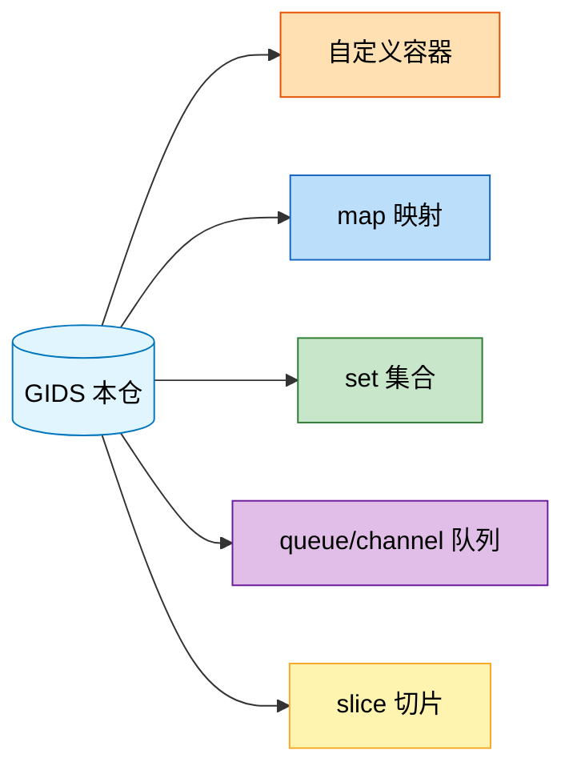

# 关键数据结构总览

| 元信息 | 值 |
|--------|-----|
| 代码仓 | GIDS（GlobalInstanceDeliverService） |
| 分析基准 | ready/27.0-终端鉴权 分支 (2026-07-31) |
| 更新时间 | 2026-07-31 |
| Skill | spec-data-structure-analyze |
| 主要语言 | Go（module GIDS，go 1.25） |

> 面向人类阅读。范围：仓内承载关键业务状态/流程、自定义实现、高被引用、或有特殊并发语义的数据结构，源码在 `src/`（142 个 .go 文件，无 vendor）。不含一次性局部变量与生成代码。

## 1. 数据结构全景

一张 mermaid 图：本仓为中心节点，指向各数据结构类型；类型节点按类型配色。

统计：共 **5** 个类型，**14** 个关键数据结构实例（custom-container 4 / map 2 / set 2 / queue 4 / slice 2）。

## 2. 类型索引

| 类型 | 实例数 | 核心用途 | 子文档 |
|---|---|---|---|
| custom-container | 4 | 鉴权缓存/配置缓存/告警抑制计数/网关实例表 | [spec-data-structure-custom-container.md](spec-data-structure-custom-container.md) |
| map | 2 | 监控指标索引（嵌套 map）/指标函数注册表 | [spec-data-structure-map.md](spec-data-structure-map.md) |
| set | 2 | 白名单导入去重/TLS 弱算法集合 | [spec-data-structure-set.md](spec-data-structure-set.md) |
| queue | 4 | 告警事件队列/插件加载进度/停止信号/证书重启信号 | [spec-data-structure-queue.md](spec-data-structure-queue.md) |
| slice | 2 | CSE 链路端点/全局告警 ID 列表 | [spec-data-structure-slice.md](spec-data-structure-slice.md) |

> 未归类实例：无（探测到的 14 个实例全部归入上述类型）

自检：扫描 14 个实例，已记录 14 个，未归类 0 个（见上表），差集已清零（2026-07-31）

## 3. 全局风险与注意点

跨类型的共性风险，每条带 `文件:行号` 证据：

- **配置缓存无锁并发读写**：`src/service/config_center_service.go:31`（`configs map[string]string`），`Refresh()`（:49-61）在独立 goroutine 内整体替换 map，而 `GetConfig()`（:64-67）并发裸读同一 map——Go map 并发读写会 `fatal error: concurrent map read and map write`，是现存并发隐患。新增配置缓存须套读写锁或改 sync.Map。
- **告警抑制 map 访问边界**：`src/service/alarm_service.go:49`（`alarms map[string]int64`）由 `handleEvent` 单 goroutine 消费 `alarmEventChanel` 时读写，只要 `sendAlarm`/`clearAlarm` 仅在该 goroutine 内调用即安全；若未来从其它 goroutine 直接调 `sendAlarm` 须加锁，当前无锁。
- **全局单例承载可变状态**：`var cseService`（`src/common/cse/cse.go:66`）、`var configCenter`（`src/service/config_center_service.go:89`）、`var alarmService`（`src/service/alarm_service.go:53`）均为包级单例，内部 map 在多 goroutine 访问，修改其内部数据结构时须沿用既有并发模型，禁止裸暴露。
