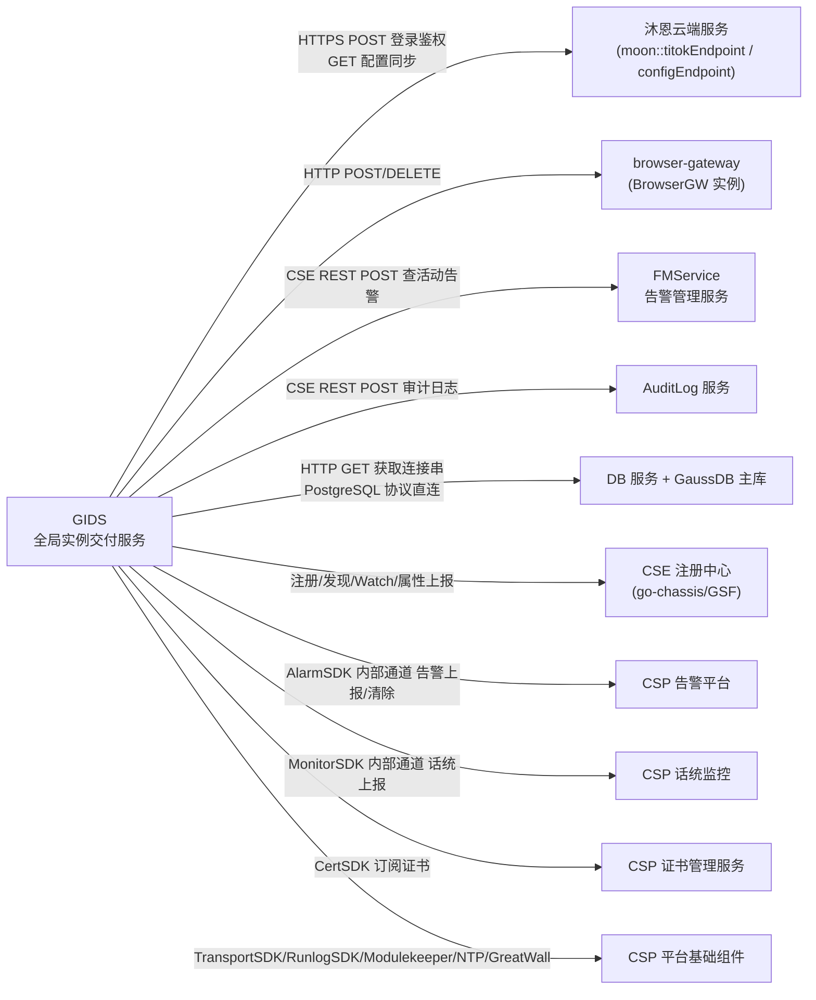

# GIDS 外部调用（出站接口）清单

| 元信息 | 值 |
|--------|-----|
| 代码仓 | AIAction (GIDS / GlobalInstanceDeliverService) |
| 分析基准 | personal/houle/test3 分支 (2026-07-29) |
| 更新时间 | 2026-07-29 |
| Skill | spec-external-call-analyze |
| 主要语言 | Go |
| 出站协议 | HTTP / HTTPS / CSE REST（go-chassis cse://）/ 平台 SDK 内部通道 / GaussDB（PostgreSQL 协议） |

## 外部服务全景

## 服务清单

| 服务名 | 协议 | 接口数 | 主要业务域 | 归属判定依据 |
|--------|------|--------|------------|--------------|
| 沐恩云端服务（Muen） | HTTP/HTTPS | 2 | 终端登录鉴权、浏览器配置同步 | 配置 key `moon::titokEndpoint` / `moon::configEndpoint`，代码注释「沐恩」 |
| browser-gateway（BrowserGW） | HTTP | 3 | 预开浏览器、插件加载、用户缓存删除 | CSE Watch 服务名 `browser-gateway` |
| FMService | CSE REST | 1 | 活动告警查询（升级后告警清理） | 显式微服务名 `FMService`（cse://FMService/...） |
| AuditLog 服务 | CSE REST | 2 | 操作日志/安全日志审计上报 | 显式微服务名 `cse://AuditLog/...` |
| DB 服务 + GaussDB | HTTP + PostgreSQL 协议 | 2 | 数据库连接信息获取、业务数据持久化 | 配置 `gaussdb::servicename`、环境变量 `DB_SERVICE_NAME`，驱动 `gaussdb_1` |
| CSE 注册中心 | GSF/go-chassis SDK | 4 | 服务注册、实例发现、Watch browser-gateway、实例属性上报 | `Go-chassis-extend/api/GSF` 包 |
| CSP 告警平台 | AlarmSDK_GO SDK | 2 | 告警上报/清除（如 300010 配置同步失败告警） | `AlarmSDK_GO/api/alarmapi` 包 |
| CSP 话统监控 | CSPGoMonitorSDK SDK | 4 | 运营指标打点上报（在线人数、流量等） | `CSPGoMonitorSDK/api/monitor` 包 |
| CSP 证书管理服务 | CSPGSOMF CertSDK | 4 | 外部/服务端证书订阅与更新 | `CSPGSOMF/CertSDK/api` 包 |
| CSP 平台基础组件 | Transport/Runlog/Modulekeeper/NTP/GreatWall SDK | 5 | 进程保活、运行日志、传输通道、时钟同步、过载流控 | `CSPGSOMF`、`CSPNTP_SDK_GO`、`greatwall-sdk-go` 包 |

## 附注

### 预留死代码（客户端封装存在但无业务调用方）

- `src/common/storage/redis/`：Redis 客户端封装（go-redis/v9），提供 Init/Instance/Get/Set/HGetAll 等接口，但全仓业务代码无任何调用方（`service/browser_service.go`、`service/plugin_service.go` 中日志提及 redis 仅为历史遗留文案，实际走 ORM/DB）。配置项 `redis::endpoint` 存在但不会被使用。
- `src/common/storage/oss/`：MinIO（S3 兼容）客户端封装，提供 Put/Get/Remove/MakeBucket 等接口，但全仓业务代码无调用方（`service/file_service.go` 实际将文件内容直接落 DB 表 `t_file`，日志中的"OSS"为遗留文案）。`src/common/conf/config.go` 中的 minio 默认配置（minioadmin/minioadmin）不会被使用。

### 配置声明 vs 实际调用差异

- `beego.AppConfig` 中的 `moon::httpsTitokEndpoint` / `moon::httpsConfigEndpoint` / `moon::enableHttps` 为 HTTPS 通道开关，仅在配置中心或本地配置开启时生效，默认走 HTTP。
- `DB_SERVICE_NAME` / `DB_NAME` 环境变量优先于 `gaussdb::servicename` / `gaussdb::gaussdbdbname` 配置。
- `LOCAL_MODE=true` 时跳过 GaussDB/CSE 全部出站依赖，使用嵌入式 SQLite（`src/data/gids.db`），生产链路不受影响。
- greatwall 过载控制（`controllers/filter.go`）为 SDK 内部出站调用（向流控组件请求配额），业务侧仅调用 `overloadcontroller.Process`，具体下游待人工确认。
