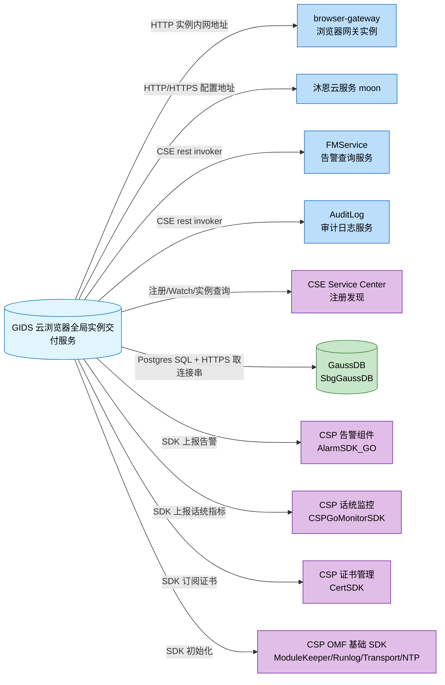

# 出站调用总览

| 元信息 | 值 |
|--------|-----|
| 代码仓 | AIAction（GlobalInstanceDeliverService，go module: GIDS） |
| 分析基准 | main 分支 (2026-07-30) |
| 更新时间 | 2026-07-30 |
| Skill | spec-external-call-analyze |
| 主要语言 | Go |
| 出站协议 | HTTP/HTTPS（go-chassis CSE rest invoker + 自封装 `common/https` builder）/ GaussDB SQL（Postgres 协议）/ 平台 SDK（告警、话统、证书、OMF 基础组件） |

> 面向人类阅读。范围：本仓调用外部服务的出站接口（HTTP 客户端 / 注册发现 / 外部存储 / 平台 SDK），不含本仓对外提供的接口（入站方向见 docs/interface/）。

## 1. 外部服务全景

## 2. 外部服务清单

| 服务名 | 协议 | 接口数 | 主要业务域 | 归属判定依据 | 子文档 |
|--------|------|--------|-----------|--------------|--------|
| browser-gateway | HTTP | 3 | 浏览器实例预开、插件加载、用户数据缓存删除 | CSE watch 的微服务名 `browser-gateway`（common/cse/cse.go）+ URL 前缀 `/browsergw/` | [external-call-browser-gateway.md](external-call-browser-gateway.md) |
| 沐恩云服务（moon） | HTTP/HTTPS | 2 | 终端登录云侧鉴权、浏览器配置同步 | 配置 key `moon::titokEndpoint` / `moon::configEndpoint`；代码注释“沐恩提供的ca证书” | [external-call-muen-cloud.md](external-call-muen-cloud.md) |
| FMService | HTTP（CSE rest invoker） | 1 | 查询活动告警 | 显式微服务名 `FMService`（service/alarm_service.go） | [external-call-fmservice.md](external-call-fmservice.md) |
| AuditLog | HTTP（CSE rest invoker） | 2 | 操作/安全审计日志上报 | 显式 CSE URL `cse://AuditLog/...`（common/logger/auditlog.go） | [external-call-auditlog.md](external-call-auditlog.md) |
| CSE Service Center | HTTPS（go-chassis registry） | 4 | 服务注册、Watch browser-gateway、查询微服务实例、上报实例属性 | chassis.yaml `cse.service.registry.address` | [external-call-cse-servicecenter.md](external-call-cse-servicecenter.md) |
| GaussDB（SbgGaussDB） | Postgres SQL + HTTPS | 2 | 持久化存储（建表/CRUD/统计查询）、连接串获取 | 配置 `gaussdb::servicename=SbgGaussDB`、驱动 `DRPostgres` | [external-call-gaussdb.md](external-call-gaussdb.md) |
| CSP 告警组件（AlarmSDK_GO） | 平台 SDK | 1 | 告警上报与清除 | 包名 `AlarmSDK_GO/api/alarmapi`（service/alarm_service.go） | [external-call-csp-alarm.md](external-call-csp-alarm.md) |
| CSP 话统监控（CSPGoMonitorSDK） | 平台 SDK | 4 | 话统模型注册与指标上报 | 包名 `CSPGoMonitorSDK/api/monitor`（service/monitor_service.go） | [external-call-csp-monitor.md](external-call-csp-monitor.md) |
| CSP 证书管理（CertSDK） | 平台 SDK | 2 | 证书场景订阅与证书更新回调 | 包名 `CSPGSOMF/CertSDK/api/certapi`（common/cert/cert.go） | [external-call-csp-cert.md](external-call-csp-cert.md) |
| CSP OMF 基础 SDK | 平台 SDK | 4 | 进程保活上报、运行日志、传输、NTP 时间同步 | 包名 modulekeeperapi / runlogapi / transportapi / CSPNTP_SDK_GO（main.go） | [external-call-csp-omf-sdk.md](external-call-csp-omf-sdk.md) |

## 3. 附注

### 3.1 预留死代码（客户端封装存在但无业务调用方）

- **MinIO OSS 客户端**（`common/storage/oss/minio.go`）：封装了 MakeBucket / PutObject / GetObject / RemoveObject，配置项 `[oss] endpoint` 已存在（src/conf/app.conf），但全仓业务代码无任何调用方，实际文件存储走 DB（`t_file` 表，service/file_service.go）。
- **Redis 客户端**（`common/storage/redis/redis.go`）：封装了 Get/Set/Delete 等，配置项 `[redis] endpoint` 已存在，但全仓业务代码无任何调用方，实际缓存与持久化均走 GaussDB/SQLite。

### 3.2 配置声明 vs 实际调用差异（chassis.yaml references）

`src/conf/chassis.yaml` 的 `references` 声明了 9 个下游微服务依赖，代码中有实际调用的仅 3 个：

| references 声明 | 代码中是否有实际调用 | 说明 |
|----------------|---------------------|------|
| FMService | 是 | 经 `OSHttpsGetRequestByCSE` 查询活动告警 |
| AuditLog | 是 | 经 `gsfapi.NewCspRestInvoker` 上报审计日志 |
| ModuleKeeper | 间接 | 通过 ModulekeeperSDK 包初始化，无 CSE rest 调用 |
| GaussDB | 间接 | 通过 `GetAllMicroServiceInstanceInfo(SbgGaussDB)` 发现实例后走 SQL 直连 |
| OM_MGR | 否 | 待确认（仅声明） |
| OpsAgent | 否 | 待确认（仅声明） |
| PaaSBroker | 否 | 待确认（仅声明） |
| CSPAOD | 否 | 待确认（仅声明） |
| Privilege | 否 | 待确认（仅声明） |

### 3.3 本地训战模式说明

`LOCAL_MODE=true` 时不连 GaussDB（改用嵌入式 SQLite，dao/db_local_sqlite.go），CSE / 沐恩 / 平台 SDK 等桩代码为空实现（src/stubs/），出站调用实际不发出。
