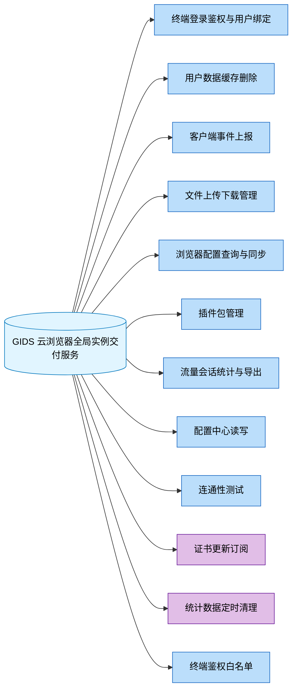

# 对外接口总览

| 元信息 | 值 |
|--------|-----|
| 代码仓 | AIAction（GlobalInstanceDeliverService，go module: GIDS） |
| 分析基准 | main 分支 (2026-07-30) |
| 更新时间 | 2026-07-30 |
| Skill | spec-interface-analyze |
| 主要语言 | Go |
| Web 框架 | Beego v2（github.com/beego/beego/v2/server/web） |
| API 契约 | 无 |

> 面向人类阅读。范围：本仓对外提供的接口（HTTP 路由 / 消息订阅 handler / 定时任务入口），不含本仓调用别人的接口。

## 1. 接口全景

统计：共 **12** 个功能域，**36** 个对外接口（HTTP 32 / RPC 0 / 消息订阅 3 / 定时任务 1）。

## 2. 功能域索引

| 功能域 | 接口数 | 核心模块 | 子文档 |
|---|---|---|---|
| 终端登录鉴权与用户绑定 | 6 | controllers/exlogin, controllers/login | [spec-interface-device-login.md](spec-interface-device-login.md) |
| 用户数据缓存删除 | 1 | controllers/cache | [spec-interface-cache-clean.md](spec-interface-cache-clean.md) |
| 客户端事件上报 | 2 | controllers/event | [spec-interface-client-event.md](spec-interface-client-event.md) |
| 文件上传下载管理 | 6 | controllers/exfile, controllers/file | [spec-interface-file-transfer.md](spec-interface-file-transfer.md) |
| 浏览器配置查询与同步 | 2 | controllers/management | [spec-interface-browser-config.md](spec-interface-browser-config.md) |
| 插件包管理 | 5 | controllers/plugin | [spec-interface-plugin-mgmt.md](spec-interface-plugin-mgmt.md) |
| 流量会话统计与导出 | 4 | controllers/traffic_stats | [spec-interface-traffic-stats.md](spec-interface-traffic-stats.md) |
| 配置中心读写 | 2 | controllers/config_center | [spec-interface-config-center.md](spec-interface-config-center.md) |
| 连通性测试 | 1（仅测试使用） | controllers/test | [spec-interface-test-echo.md](spec-interface-test-echo.md) |
| 证书更新订阅 | 3（异步） | common/cert | [spec-interface-cert-subscribe.md](spec-interface-cert-subscribe.md) |
| 统计数据定时清理 | 1（定时任务） | scheduler | [spec-interface-data-cleanup.md](spec-interface-data-cleanup.md) |
| 终端鉴权（IMEI+IMSI 白名单） | 3（仅内部 server） | controllers/auth | [spec-interface-terminal-auth.md](spec-interface-terminal-auth.md) |

> 未归类接口：无。注：main.go 中的 `service.StartRefreshConfigTask()`、`monitorService.InitMonitorSchedule()`、`service.CleanAllActiveAlarm()` 为进程内部后台循环（配置缓存刷新/运营指标上报/告警清理），不接收外部请求、不属于对外服务能力，未计入接口统计（src/main.go:72、src/main.go:91、src/main.go:93）。

自检：扫描 36 个接口，已记录 36 个，未归类 0 个，差集已清零（2026-07-30；含 27.0 终端鉴权需求新增 3 接口）

## 3. 全局风险与注意点

- **全局限流过滤器**：routers/beego_router.go:19、routers/beego_router.go:30（OverLoadFilter 以 `BeforeRouter` 挂在全部路由上，被拒时返回 HTTP 429 + `Retry-After: 3`，实现见 src/controllers/filter.go:30）
- **双 server 架构**：routers/beego_router.go:17-39（externalServer HTTPS + innerServer HTTP 各自注册 controller；login/cache/event/file 的 `/app-api/...` 路径在内外双暴露，src/main.go:153-208）
- **外部 server 双协议**：src/main.go:178-188（环境变量 `ENABLE_HTTP=true` 时外部 server 额外起 HTTP 端口 40050，与 HTTPS 40051 承载同一组外部路由）
- **统一响应壳**：src/controllers/controller.go:6-9、src/controllers/controller.go:112（除文件流下载外，所有接口响应均为 `resp.BaseResponse{code,msg}` 壳；`Failed` 返回 HTTP 400，业务失败码在 body `code` 字段，调用方需同时看 HTTP 状态与 body code）
- **登录双实现**：controllers/exlogin_controller.go 与 controllers/login_controller.go 对同一组登录路径注册了两套实现，外部走 HTTPS 版、内部走 HTTP 版，逻辑需保持同步修改（routers/beego_router.go:20、routers/beego_router.go:34）
