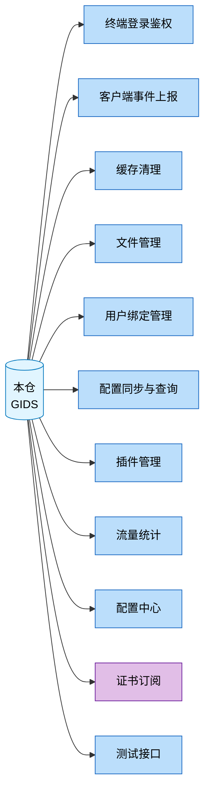

# 对外接口总览

| 元信息 | 值 |
|--------|-----|
| 代码仓 | GIDS（GlobalInstanceDeliverService） |
| 分析基准 | personal/houle/test3 分支 (2026-07-29) |
| 更新时间 | 2026-07-29 |
| Skill | spec-interface-analyze |
| 主要语言 | Go |
| Web 框架 | Beego v2（github.com/beego/beego/v2） |
| API 契约 | 无（无 proto/thrift/OpenAPI 契约文件，全部 HTTP 路由经自封装 RouteMapping 注册） |

> 面向人类阅读。范围：本仓对外提供的接口（HTTP 路由 + 消息订阅异步入口），不含本仓调用别人的接口。
> 双 server 架构：externalServer（HTTPS，对外）注册 RegisterExternalRouter；innerServer（HTTP，对内）注册 RegisterInternalRouter。路由经自封装 `registerController` 遍历各 controller 的 `RouteInfo().RouteMapping` 动态注册（routers/beego_router.go）。

## 1. 接口全景

本仓（GIDS）为中心节点，指向各功能域；功能域节点按业务功能命名。

统计：共 **11** 个功能域，**29** 个唯一 HTTP 接口（按 方法+路径 去重；其中 8 个在外部/内部双 server 重复注册，注册条目共 37：外部 9 / 内部 28）+ **3** 个证书订阅异步入口。

## 2. 功能域索引

| 功能域 | 接口数 | 核心模块 | 子文档 |
|---|---|---|---|
| 终端登录鉴权 | 3（双实现） | controllers/exlogin, controllers/login | [spec-interface-login.md](spec-interface-login.md) |
| 客户端事件上报 | 2（双实现） | controllers/event | [spec-interface-event.md](spec-interface-event.md) |
| 缓存清理 | 1（双实现） | controllers/cache | [spec-interface-cache.md](spec-interface-cache.md) |
| 文件管理 | 6（2 双实现 + 4 仅内部） | controllers/exfile, controllers/file | [spec-interface-file-mgmt.md](spec-interface-file-mgmt.md) |
| 用户绑定管理 | 3（仅内部） | controllers/login | [spec-interface-user-bind.md](spec-interface-user-bind.md) |
| 配置同步与查询 | 2（仅内部） | controllers/management | [spec-interface-config-sync.md](spec-interface-config-sync.md) |
| 插件管理 | 5（仅内部） | controllers/plugin | [spec-interface-plugin.md](spec-interface-plugin.md) |
| 流量统计 | 4（仅内部） | controllers/traffic_stats | [spec-interface-traffic-stats.md](spec-interface-traffic-stats.md) |
| 配置中心 | 2（仅内部） | controllers/config_center | [spec-interface-config-center.md](spec-interface-config-center.md) |
| 证书订阅 | 3（异步） | common/cert | [spec-interface-cert.md](spec-interface-cert.md) |
| 测试接口 | 1（仅外部，仅测试） | controllers/test | [spec-interface-test.md](spec-interface-test.md) |

> 未归类接口：无（IDL/契约类扫描 0 处——本仓无 proto/thrift/OpenAPI 契约文件）。

自检：扫描 37 个 HTTP 注册条目 + 3 个订阅入口，已记录 29 个唯一 HTTP 接口（8 个双实现已在子文档注明）+ 3 个订阅，未归类 0 个，差集已清零（2026-07-29）

## 3. 全局风险与注意点

跨功能域的共性风险，每条带 `文件:行号` 证据：

- **路由经自封装动态注册**：routers/beego_router.go:41-46（`registerController` 遍历 `RouteInfo().RouteMapping` 注册，grep `beego.Router` 命中不到，新增接口易遗漏文档化）
- **双 server 架构同接口双暴露**：routers/beego_router.go:17/28（externalServer HTTPS + innerServer HTTP，登录/缓存/事件/文件上传下载共 8 个接口在两侧重复注册，鉴权策略不一致成攻击面）
- **全局限流过滤器**：routers/beego_router.go:19/30（`OverLoadFilter` 对 "*" 全局挂载，controllers/filter.go:30，所有接口共用同一限流策略，无法按接口差异化限流）
- **无统一鉴权中间件**：routers/beego_router.go:17-39（RegisterExternalRouter/RegisterInternalRouter 仅挂 OverLoadFilter，未见鉴权 filter，鉴权逻辑散在各 controller handler 内）
- **路由参数大小写不一致**：controllers/login_controller.go:33-34（`:sessionID` 与 `:sessionId` 同 controller 内大小写不一致，Beego 路由参数匹配可能受影响）
- **测试接口暴露在生产 externalServer**：routers/beego_router.go:24（TestController 注册在外部 HTTPS server，生产可访问）
