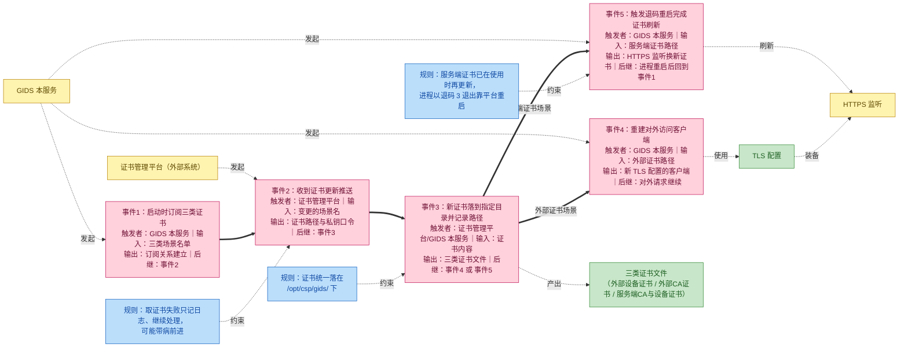
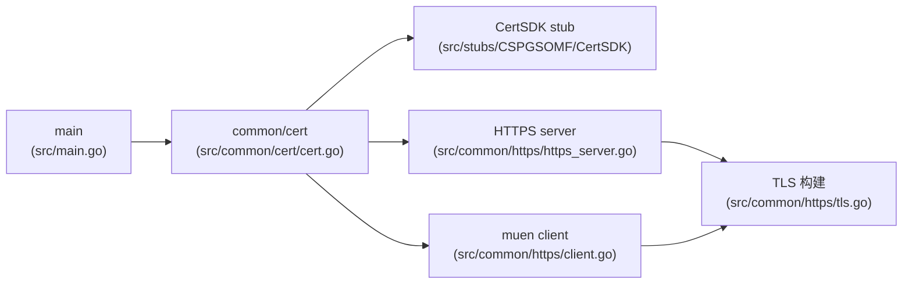
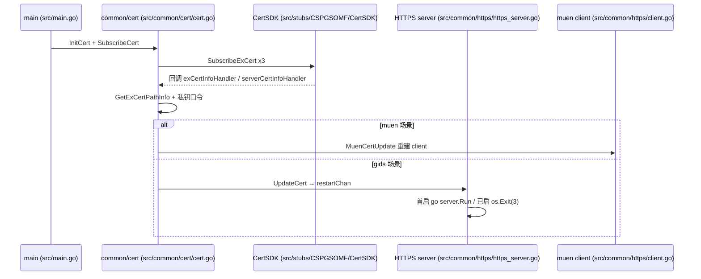

# 证书订阅

> 功能域概述：通过 CSP CertSDK 订阅外部/服务端证书场景变更，SDK 回调驱动 muen 对外客户端重建与外部 HTTPS 服务证书加载/重启。
> 接口数：1 个订阅入口（3 个证书场景）　核心模块：common/cert、common/https、stubs/CSPGSOMF/CertSDK

## 1. 功能故事（多彩建模）

实现逻辑速览：启动时向证书平台订阅三类证书。更新推送到达后落到指定目录并即时生效。服务端证书换新靠进程退码重启完成。

| 术语 | 人话解释 | 出处 |
|---|---|---|
| muen（gids-muen） | 本服务访问外部互联系统时用的设备证书订阅，更新后重建对外客户端 | src/common/cert/cert.go；src/common/https/client.go |
| muenCa（gids-muenCa） | 校验外部系统身份用的外部 CA 根证书订阅，与 muen 共用同一处理逻辑 | src/common/cert/cert.go |
| 订阅场景 | 向证书平台登记"我关心哪几类证书"的名字，平台变更时按名推送 | src/common/cert/cert.go；src/stubs/CSPGSOMF/CertSDK/api/base/base.go |
| 退码重启 | 服务端证书换新不靠热加载，而是进程以退出码 3 自杀、靠平台拉起重载证书 | src/common/https/https_server.go |
| 证书落盘根路径 | 所有订阅证书统一存放的目录 /opt/csp/gids/ | src/common/cert/cert.go |
| 私钥口令 | 解开加密私钥文件所需的密码，随订阅回调取回、只存内存 | src/common/cert/cert.go；src/common/https/tls.go |
| 换包重启残留清理 | 升级重启后先退订旧订阅再重新订阅，避免重复推送 | src/common/cert/cert.go |
| 证书管理平台 | 推送证书变更的外部系统，其具体身份与推送协议代码中未体现（SDK 在本仓为 mock） | src/go.mod |

## 2. 模块划分

| 模块 | 承载功能（引用文件） |
|---|---|
| main | 启动编排：server.Run 后调 `InitCert` + `SubscribeCert(externalServer)`，失败 Fatal（src/main.go） |
| common/cert | 场景注册、旧订阅清理、3 笔订阅与两类回调 handler（src/common/cert/cert.go） |
| stubs/CSPGSOMF/CertSDK | `CSPExCertManager` 接口与 mock 实现；mock/真实 SDK 经 go.mod `replace CSPGSOMF => ./stubs/CSPGSOMF` 切换，生产替换指向真实 SDK，业务代码零改动（src/stubs/CSPGSOMF/CertSDK；src/go.mod） |
| common/https server | 证书事件监听、首次启动/退码重启状态机（src/common/https/https_server.go） |
| common/https client | muen 对外客户端按新证书整体重建（src/common/https/client.go） |
| common/https tls | `CertInfo` 载体与 `tls.Config` 构建、私钥解密（src/common/https/tls.go） |

## 3. 接口清单

| 订阅场景 | 类型/入口 | 回调入参结构 | 产出 | 状态 |
|---|---|---|---|---|
| "gids-muen"（`sbg_external_device_certificate` 外部设备证书） | 消息订阅 / `SubscribeExCert`（src/common/cert/cert.go） | `[]*base.CspExCertInfo, int` → `exCertInfoHandler`（src/common/cert/cert.go） | 重建 muen client（src/common/https/client.go） | 在用 |
| "gids-muenCa"（`sbg_external_ca_certificate` 外部CA证书） | 消息订阅 / `SubscribeExCert`（src/common/cert/cert.go） | 同上，共用 handler（src/common/cert/cert.go） | 同上（写入包级 `newCertInfo`） | 在用 |
| "gids"（`sbg_server_ca_certificate` + `sbg_server_device_certificate` 服务端CA/设备证书） | 消息订阅 / `SubscribeExCert`（src/common/cert/cert.go） | 同上 → `serverCertInfoHandler`（src/common/cert/cert.go） | `server.UpdateCert` 热更新/重启（src/common/https/https_server.go） | 在用 |

## 4. 关键数据结构

| 结构 | 定义位置 | 关键字段（含义+约束） |
|---|---|---|
| CspExSceneInfo | src/stubs/CSPGSOMF/CertSDK/api/base/base.go | `SceneName` 场景唯一名（handler 分支键）；`SceneType` 1=CA、2=设备证书（src/common/cert/cert.go）；`Feature` 固定 0 |
| CspExCertInfo | src/stubs/CSPGSOMF/CertSDK/api/base/base.go | 仅 `SceneName`，须再调 `GetExCertPathInfo` 反查路径（src/common/cert/cert.go） |
| CspExCertPathInfo | src/stubs/CSPGSOMF/CertSDK/api/base/base.go | `ExCaFilePath` CA 路径；`ExDeviceFilePath` 设备证书路径；`ExPrivateKeyFilePath` 私钥路径 |
| CertInfo | src/common/https/tls.go | `KeyFile`/`CertFile`/`CaFile` 路径；`KeyPwd` 私钥口令 []byte（来自 `GetExCertPrivateKeyPwd`，src/common/cert/cert.go）；server/client 共用 |
| BeegoHttpsServer | src/common/https/https_server.go | `restartChan chan CertInfo`（缓冲 1）；`isServerReady` 区分首启与重启 |

## 5. 调用关系

- 三订阅落盘路径均为 `/opt/csp/gids/`，订阅前反向 `UnsubscribeExCert` 清理换包残留（src/common/cert/cert.go）。
- server 侧"热更新"实为退码重启：证书齐且已运行则 `os.Exit(restartExitCode=3)`（src/common/https/https_server.go）。
- 初始加载无本地证书：muen client 空证书初始化（src/common/https/client.go）、HTTPS 端口待首次回调才监听（src/common/https/https_server.go）。

## 6. 框架引用

| 基础框架 | 框架文档 | 本功能中的用途（引用文件） |
|---|---|---|
| Beego v2（web/server） | ../framework-usage/rpc-beego-web.md | 构建外部 HTTPS 服务、挂载 TLS 配置、证书齐后启动/退码重启（src/common/https/https_server.go） |
| go-chassis lager | ../framework-usage/log-lager-auditlog-event.md | 订阅注册、回调处理、重启决策全程经 common/logger（包装 lager）记日志（src/common/logger/logger.go；src/common/cert/cert.go；src/common/https/https_server.go） |

## 7. AI 编码指南

- 新场景须同步改构造、分支、清理三处（src/common/cert/cert.go）
- 证书更新仅走UpdateCert→restartChan（src/common/https/https_server.go）
- 回调禁重IO，monitorCertificate串行消费（src/common/https/https_server.go）
- 本地测试直接注入 CertInfo，勿等回调（src/stubs/CSPGSOMF/CertSDK/api/certapi/certapi.go；src/go.mod）
