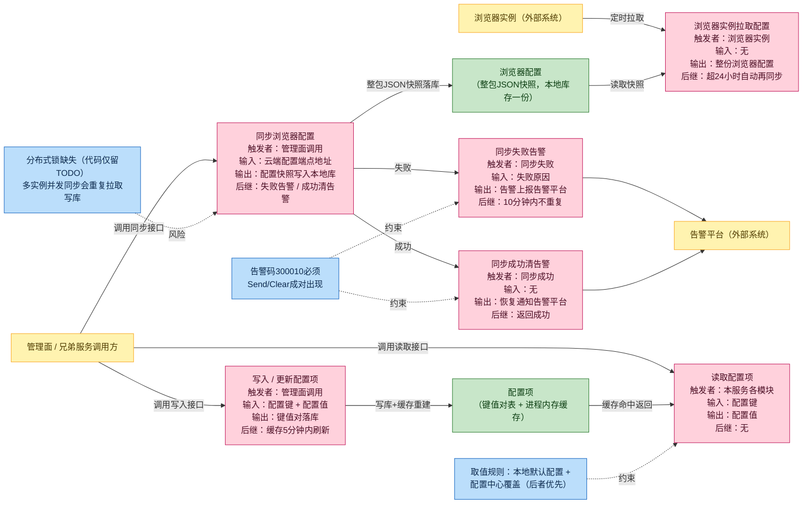
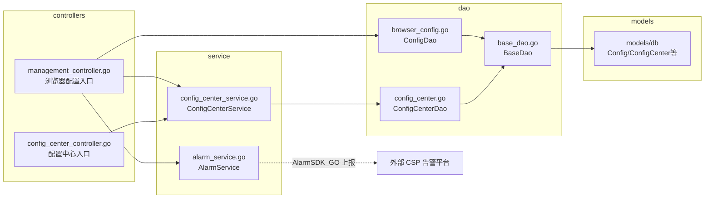
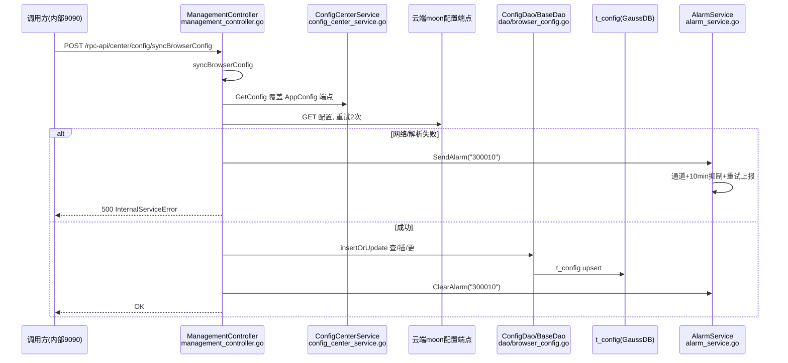

# 配置管理

> 功能域概述：含两类配置——「浏览器配置」（t_config 表，type=moon 整包 JSON 快照，从云端拉取缓存供下发）与「通用配置中心」（t_config_center 表 key-value，供内部模块读写运行时参数，带 5 分钟内存缓存）。
> 接口数：4（外部 0 / 内部 4）　核心模块：controllers, service, dao

## 1. 功能故事（多彩建模）

实现逻辑速览：从云端拉取整包配置存入本地库，浏览器实例自行拉取。同步失败上报告警，成功即恢复。配置项按默认加覆盖读取，写后五分钟内生效。

注：同步仅把云端配置拉入本地库，浏览器实例靠自己定时拉取获得配置；「服务主动逐实例下发」在代码中未体现。

### 术语表

| 术语 | 人话解释 | 出处 |
|---|---|---|
| moon | 云端浏览器配置来源系统的代号，也是浏览器配置的类型标识 | src/controllers/management_controller.go |
| 浏览器配置 | 一整包 JSON，含路由 APP、浏览器音视频参数、URL 三类配置 | src/controllers/management_controller.go |
| 配置中心 | 本服务自管的键值对仓库，存运行时开关与参数 | src/service/config_center_service.go |
| t_config / t_config_center | 两类配置各自的数据库表 | src/models/db/browser_config.go，src/models/db/config_center.go |
| 默认 + 覆盖 | 先读本地配置文件默认值，再用配置中心的值覆盖 | src/controllers/management_controller.go |
| 告警码 300010 | 配置同步失败的专属告警编号，失败上报、成功恢复 | src/service/alarm_service.go，src/controllers/management_controller.go |
| 告警抑制 | 同一告警 10 分钟内不重复上报 | src/service/alarm_service.go |
| 惰性同步 | 拉取配置时若本地无记录或超 24 小时，先顺手同步一次 | src/controllers/management_controller.go |
| 内存缓存刷新 | 配置中心每 5 分钟把全量键值对重建进进程内存 | src/service/config_center_service.go |
| 沐恩 HTTPS 客户端 | 访问 HTTPS 配置端点时使用的带沐恩 CA 证书的 HTTP 客户端 | src/controllers/management_controller.go，src/common/https/client.go |
| 分布式锁 TODO | 作者留注：多实例部署需加分布式锁，目前未实现 | src/controllers/management_controller.go |

## 2. 模块划分

| 模块/包 | 承载功能（引用文件） |
|---|---|
| controllers.ManagementController | 浏览器配置 HTTP 入口：路由注册与 ListConfig、SyncBrowserConfig 处理器（src/controllers/management_controller.go） |
| controllers.ConfigCenterController | 配置中心键值对 HTTP 入口：路由注册与 GetFromDB、InsertOrUpdate 处理器（src/controllers/config_center_controller.go） |
| service.configCenterServiceImpl | 配置中心读写 + 内存缓存 + 5 分钟定时刷新；包级单例唯一实现，NewConfigCenterService() 固定返回，无多实现选择（src/service/config_center_service.go） |
| service.alarmServiceImpl | 配置同步失败告警上报/恢复（异步通道 + 10 分钟抑制 + 重试）；包级单例唯一实现，NewAlarmService() 固定返回，无多实现选择（src/service/alarm_service.go） |
| dao.ConfigDao / ConfigCenterDao | 两张配置表的 DAO 封装，复用 BaseDao（src/dao/browser_config.go，src/dao/config_center.go，src/dao/base_dao.go） |
| models/db | 表实体与配置 JSON 结构（src/models/db/browser_config.go，src/models/db/config_center.go） |

## 3. 接口清单

| 接口 | 路径/入口（含注册处） | 请求结构 | 响应结构 | 状态 |
|---|---|---|---|---|
| SyncBrowserConfig | POST /rpc-api/center/config/syncBrowserConfig；路由与入口 src/controllers/management_controller.go，内部注册 src/routers/beego_router.go | 无请求体 | resp.BaseResponse（OK / InternalServiceError） | 在用 |
| ListConfig | GET /config/v1；路由与入口 src/controllers/management_controller.go，内部注册 src/routers/beego_router.go | 无请求体 | BrowserConfig（src/controllers/management_controller.go） | 在用 |
| InsertOrUpdate | POST /configCenter/v1/；路由与入口 src/controllers/config_center_controller.go，内部注册 src/routers/beego_router.go | db.ConfigCenter（Key 必填） | resp.BaseResponse（OK(nil) / ClientFailed） | 在用 |
| GetFromDB | POST /configCenter/v1/get；路由与入口 src/controllers/config_center_controller.go，内部注册 src/routers/beego_router.go | db.ConfigCenter（Key 必填） | db.ConfigCenter | 在用 |

## 4. 关键数据结构

| 结构 | 定义位置 | 关键字段（含义+约束） |
|---|---|---|
| db.Config | src/models/db/browser_config.go | ID 自增主键；Type 配置类型（仅 "moon"）；Content 整包 JSON（text）；CreatedAt/UpdatedAt 时间字符串（time.DateTime） |
| BrowserConfig | src/controllers/management_controller.go | RouteAPPConfigList / ChromeConfigList / URLConfigs 三段配置，均 omitempty；Content 与 moon 响应 data 的反序列化目标 |
| db.RouterAPPConfig | src/models/db/browser_config.go | Manufacturer/Model/Type/Mode/ExtendModel 等，纯 JSON 不落表 |
| db.ChromeConfig | src/models/db/browser_config.go | AppFrameRate/VideoFrameRate/AppBitRate/SampleRate/Resolution/FFCode 等音视频参数 |
| db.URLConfig | src/models/db/browser_config.go | NodeIdent/APPType/URL/UserAgent + IsVideoType 等类型开关 |
| db.ConfigCenter | src/models/db/config_center.go | Key 键（控制器校验非空，src/controllers/config_center_controller.go）；Value 值；Describe 描述；Enable 使能；ID 自增主键（json:"-"）；Validate() 恒 nil；直接复用为 HTTP 请求体 |
| resp.DataResponse | src/models/resp/response_entity.go | Data interface{}，moon 云端响应包装 |
| service.AlarmEvent | src/service/alarm_service.go | AlarmID（同步告警固定 "300010"）；EventMessage；Type=GenerateAlarm/ClearAlarm |

## 5. 调用关系

- 惰性同步旁路：ListConfig 先经 updateConfigIfNeed 判断（无记录/时间解析失败/超 24h）内联触发 syncBrowserConfig，失败仅记日志不告警（src/controllers/management_controller.go）。
- InsertOrUpdate 链路：controller 校验 Key → service.InsertOrUpdateConfig 查/插/更 t_config_center（src/controllers/config_center_controller.go → src/service/config_center_service.go），缓存由 5 分钟协程重建（src/service/config_center_service.go）。
- 分布式锁仅 TODO 注释、无实现，多实例并发触发会重复拉取写库（src/controllers/management_controller.go）。

## 6. 框架引用

| 基础框架 | 框架文档 | 本功能中的用途（引用文件） |
|---|---|---|
| Beego Web（路由/Controller） | ../framework-usage/rpc-beego-web.md | 内部路由注册与 4 个 HTTP 接口入口（src/routers/beego_router.go，src/controllers/management_controller.go，src/controllers/config_center_controller.go） |
| Beego ORM | ../framework-usage/storage-beego-orm.md | 浏览器配置/配置中心落库与事务（Get/Insert/Update/DoTxWithCtx）（src/dao/base_dao.go，src/dao/browser_config.go，src/dao/config_center.go） |
| CSP 监控告警 | ../framework-usage/metrics-csp-monitor-alarm.md | 同步失败告警 SendAlarm/ClearAlarm（告警码 300010，10 分钟抑制重试）（src/service/alarm_service.go，src/controllers/management_controller.go） |
| AppConf + 配置中心 | ../framework-usage/config-appconf-flagutil-configcenter.md | moon 端点取值：AppConfig 默认值 + GetConfig 覆盖（src/controllers/management_controller.go，src/service/config_center_service.go） |
| Lager 业务日志 | ../framework-usage/log-lager-auditlog-event.md | 同步失败、告警事件等业务日志记录（src/controllers/management_controller.go，src/service/alarm_service.go） |

## 7. AI 编码指南

- 读配置走GetConfig，AppConfig默认后覆盖（src/controllers/management_controller.go）。
- 写入最长 5 分钟生效，实时读走 GetFromDB（src/service/config_center_service.go）。
- 同步告警 300010 须 Send/Clear 成对（src/controllers/management_controller.go）。
- updateConfigIfNeed 失败勿告警只记日志（src/controllers/management_controller.go）。
- 多实例并发写前先补锁与真事务（src/controllers/management_controller.go，src/service/config_center_service.go）。
