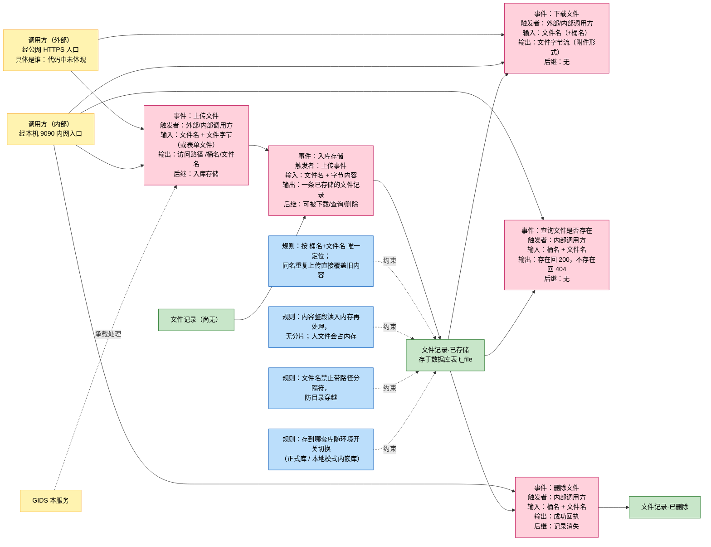
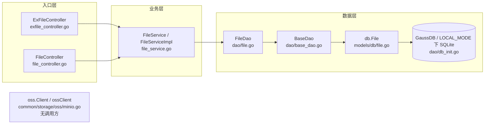
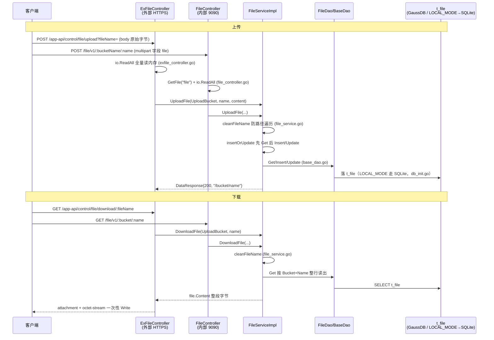

# 文件管理

> 功能域概述：提供文件上传、下载、存在性查询与删除能力；实际存储为关系数据库 `t_file`（bytea 整存整取），minio 封装存在但未被使用。
> 接口数：8（外部 2 / 内部 6，其中 2 条内部路由与外部同路径重复注册）　核心模块：controllers（ExFileController/FileController）、service（FileServiceImpl）、dao（FileDao + BaseDao）

## 1. 功能故事（多彩建模）

实现逻辑速览：文件整段读入内存后写入数据库表。同桶同名再传即覆盖旧内容。下载时整段取出、以附件返回。

### 术语表

| 术语 | 人话解释 | 出处 |
| --- | --- | --- |
| bucket（桶） | 文件的逻辑分组名，本域上传时写死为 `upload-bucket`，并非真正的对象存储桶 | src/common/constants/base.go；src/controllers/file_controller.go |
| t_file | 存文件的数据库表，一行 = 一个文件（元信息 + 全部字节内容） | src/models/db/file.go |
| bytea 整存 | 文件内容作为一个二进制大字段整体存进数据库行，读写都整段进行，不支持分片 | src/models/db/file.go；src/service/file_service.go |
| OSS | 日志报错文案里的叫法，容易误导；文件实际并未走对象存储，minio 封装全仓无人调用 | src/service/file_service.go；src/common/storage/oss/minio.go |
| LOCAL_MODE | 环境开关：置 true 时数据库换成本机内嵌 SQLite，文件随之落到本地库，代码路径不变 | src/dao/db_init.go |
| cleanFileName | 文件名清洗：去掉路径跳转并拒绝含 `/`、`\` 的名字，防目录穿越 | src/service/file_service.go |
| multipart 表单上传 | 内部上传接口的另一种收文件方式：从表单字段 `file` 取文件 | src/controllers/file_controller.go |
| 外部/内部双入口 | 同一套上传下载逻辑注册了两遍：公网 HTTPS 一份、本机 9090 内网一份，代码重复 | src/controllers/exfile_controller.go；src/controllers/file_controller.go |

## 2. 模块划分

| 模块 | 承载功能（文件） |
| --- | --- |
| ExFileController | 外部 HTTPS 上传/下载入口与路由注册（src/controllers/exfile_controller.go） |
| FileController | 内部 127.0.0.1:9090 入口，同路径 2 接口 + bucket 维度 4 接口（src/controllers/file_controller.go） |
| FileServiceImpl | 文件名清洗防路径遍历 cleanFileName、先查后写 insertOrUpdate、上传/下载/删除/存在性四大业务方法（src/service/file_service.go） |
| FileDao / BaseDao | 实体绑定 NewFileDao、Exist 原生 SQL 计数、通用 ORM 增删改查（src/dao/file.go、src/dao/base_dao.go） |
| models/db.File | `t_file` 表结构与 ByteArrayField 自定义字段类型（src/models/db/file.go） |
| common/storage/oss | minio Client 接口与 ossClient 实现，全仓无 import、未被文件域调用（src/common/storage/oss/minio.go） |

## 3. 接口清单

| 接口 | 路径/入口（含注册处） | 请求结构 | 响应结构 | 状态 |
| --- | --- | --- | --- | --- |
| 上传文件（外部） | POST /app-api/control/file/upload；注册 src/routers/beego_router.go；入口 src/controllers/exfile_controller.go | query `fileName` + body 原始字节 | DataResponse{Code:200, Data:"/{bucket}/{name}"}（响应结构 src/models/resp/response_entity.go） | 在用 |
| 下载文件（外部） | GET /app-api/control/file/download/:fileName；注册 src/routers/beego_router.go；入口 src/controllers/exfile_controller.go | path `:fileName` | 二进制流，头 Content-Disposition: attachment + application/octet-stream；失败 BaseResponse | 在用 |
| 上传文件（内部，同路径） | POST /app-api/control/file/upload；注册 src/routers/beego_router.go；入口 src/controllers/file_controller.go | query `fileName` + body 原始字节 | 同外部 DataResponse | 在用（与外部重复实现） |
| 下载文件（内部，同路径） | GET /app-api/control/file/download/:fileName；注册 src/routers/beego_router.go；入口 src/controllers/file_controller.go | path `:fileName` | 同外部二进制流 | 在用（与外部重复实现） |
| 按 bucket 上传 | POST /file/v1/:bucketName/:name；注册 src/routers/beego_router.go；入口 src/controllers/file_controller.go | path bucket/name 固定为 upload-bucket + multipart 表单字段 `file` | DataResponse{Code:200, Data:"/{bucket}/{name}"} | 在用（内部） |
| 按 bucket 下载 | GET /file/v1/:bucket/:name；注册 src/routers/beego_router.go；入口 src/controllers/file_controller.go | path bucket/name | 二进制流 + attachment 头 | 在用（内部） |
| 存在性查询 | GET /file/v1/:bucket/:name/exist；注册 src/routers/beego_router.go；入口 src/controllers/file_controller.go | path bucket/name | 存在 200 空 body，否则 404（BaseController.NotFound，src/controllers/controller.go） | 在用（内部） |
| 删除文件 | DELETE /file/v1/:bucketName/:fileName；注册 src/routers/beego_router.go；入口 src/controllers/file_controller.go | path bucket/fileName | DataResponse{Code:200} | 在用（内部） |

## 4. 关键数据结构

| 结构 | 定义位置 | 关键字段（含义+约束） |
| --- | --- | --- |
| db.File | src/models/db/file.go | ID 自增主键；Bucket 桶名（上传固定 `upload-bucket`，src/common/constants/base.go）；Name 文件名（经 cleanFileName 清洗，禁含 `/`、`\`，src/service/file_service.go）；Content 文件字节 bytea；Size 字节数；CreatedAt 字符串时间 |
| db.ByteArrayField | src/models/db/file.go | []byte 自定义 ORM 字段：SetRaw 支持 []byte/string，FieldType 报 TypeTextField |
| resp.BaseResponse | src/models/resp/base.go | Code：200 成功 / -1 内部错 / -2 参数错（src/common/constants/retcode/retcode.go） |
| resp.DataResponse | src/models/resp/response_entity.go | Data：上传成功返回 `/{bucket}/{name}`（src/service/file_service.go） |
| oss.PutObject / GetObjectOptions | src/common/storage/oss/minio.go | BucketName、FileName、File io.Reader、Size（当前未被文件域调用） |

说明：文件域无 req 请求结构体，入参全部来自 query/path 参数或原始 body/multipart 表单。

## 5. 调用关系

关键分支：

- 全程同步、无队列/异步；唯一环境分支为 `LOCAL_MODE=true` 时改用嵌入式 SQLite（src/dao/db_init.go）。
- Exist 走唯一原生 SQL count（src/dao/file.go），存在返 200 空、否则 404（src/controllers/file_controller.go）。
- multipart 上传 `header == nil` 分支直接返 500（src/controllers/file_controller.go）；删除按 Bucket+Name 删行（src/service/file_service.go）。
- FileService 仅唯一实现 FileServiceImpl、由 NewFileService 直接构造，无多实现选择机制（src/service/file_service.go）；oss.Client 为包级单例 Init/Instance，但全仓无调用方，不存在「本地 vs minio」后端选择逻辑（src/common/storage/oss/minio.go）。

## 6. 框架引用

| 基础框架 | 框架文档 | 本功能中的用途（引用文件） |
| --- | --- | --- |
| Beego Web（路由/Controller） | ../framework-usage/rpc-beego-web.md | 注册外部/内部两套 HTTP 监听路由，承载上传、下载、存在性查询、删除共 8 个接口入口（src/routers/beego_router.go、src/controllers/exfile_controller.go、src/controllers/file_controller.go） |
| Beego ORM | ../framework-usage/storage-beego-orm.md | 文件记录以 ORM 模型落 `t_file` 表，提供增删改查与存在性计数（src/models/db/file.go、src/dao/base_dao.go、src/dao/file.go、src/dao/db_init.go） |
| lager 业务日志 | ../framework-usage/log-lager-auditlog-event.md | 上传/下载/删除失败的错误日志与文件信息日志输出（src/service/file_service.go、src/dao/base_dao.go、src/common/logger/logger.go） |
| Beego AppConfig 配置读取 | ../framework-usage/config-appconf-flagutil-configcenter.md | 文件落库所用 GaussDB 连接参数（库名/账号/端口/密码）从应用配置读取（src/dao/db_init.go） |

## 7. AI 编码指南

- 存储只走 FileDao/t_file，勿引 oss。（src/service/file_service.go；oss 无 import 方）
- 入库文件名必须过 cleanFileName 防路径遍历。（src/service/file_service.go）
- 改上传/下载需同步内外两份重复 Controller。（src/controllers/exfile_controller.go、src/controllers/file_controller.go）
- 链路为整读整写非流式，引流式须评估 bytea 整存模型。（src/controllers/exfile_controller.go、src/models/db/file.go）
- LOCAL_MODE 仅切换 DB 类型，代码路径不变。（src/dao/db_init.go）
