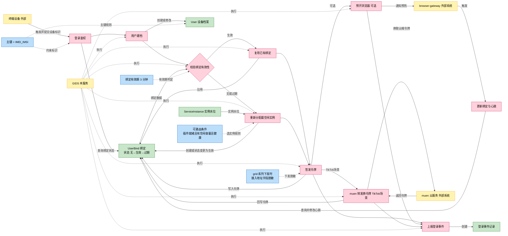
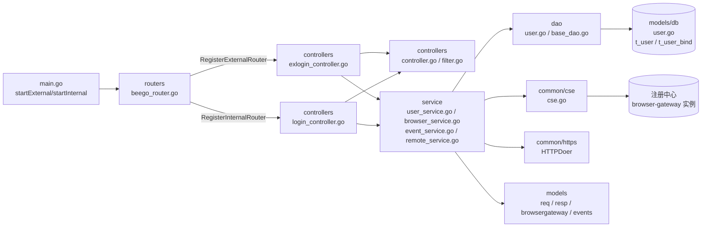
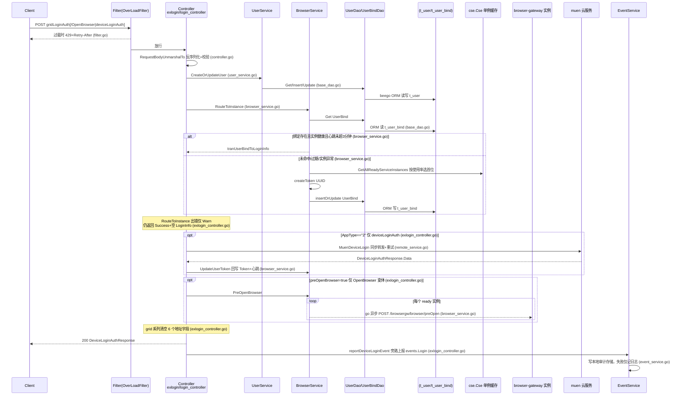

# 登录鉴权

> 功能域概述：处理终端登录鉴权，为用户（IMEI_IMSI）分配/复用健康 browser-gateway 实例，签发 Token 与接入地址（LoginInfo），维护 UserBind 绑定并上报登录事件。
> 接口数：6（外部 3 / 内部 6，3 个登录接口内外同名重复注册）　核心模块：controllers、service、dao、common/cse

## 1. 功能故事（多彩建模）

实现逻辑速览：登录先建档，再按绑定有效性复用或重分实例。令牌为 UUID，grid 场景下发前脱敏地址。TikTok 场景转发云端换令牌，全程上报登录事件。

业务背景说明：为什么拆分外部/内部双监听、grid 系列为何要脱敏下发地址，**代码中未体现**（实现可见，设计意图无注释或文档佐证）。

### 术语表

| 术语 | 人话解释 | 出处 |
| --- | --- | --- |
| IMEI/IMSI | 设备本身和手机卡的两串身份号码，登录请求必带，用来认出"哪台设备的哪个用户" | src/models/req/request_entity.go |
| IMEI_IMSI | 把上面两串号码用下划线拼起来，作为用户档案和绑定关系的唯一主键 | src/service/browser_service.go |
| UserBind | "用户该连哪个浏览器实例"的绑定小账本，记着实例地址和访问令牌 | src/models/db/user.go |
| BrowserGW / browser-gateway | 真正运行云浏览器的后端实例集群，GIDS 负责把用户分派到其中一台 | src/service/browser_service.go |
| muen | TikTok 场景的云端上级服务，设备登录要转发过去换一枚云端令牌 | src/service/remote_service.go |
| Token | 登录成功后签发的访问令牌（UUID 串），客户端凭它接入浏览器实例 | src/service/browser_service.go |
| 预开浏览器 | 登录时提前通知各浏览器实例把浏览器进程热起来，缩短首开等待 | src/service/browser_service.go |
| 心跳 | 绑定记录上的"最近活跃时间"，超过 3 分钟不刷新就视为绑定过期 | src/service/browser_service.go |
| gridLoginAuth | 网格场景登录接口，特点是返回时下发的接入地址字段被清空脱敏 | src/controllers/exlogin_controller.go |
| CSE/注册中心 | 微服务注册中心，browser-gateway 实例的上下线与水位变化从这里监听同步 | src/common/cse/cse.go |

## 2. 模块划分

| 模块 | 承载功能（引用文件） |
| --- | --- |
| routers | 双监听路由注册与限流过滤器挂载（src/routers/beego_router.go） |
| controllers | 登录/绑定 HTTP 入口、请求解析校验、统一响应、限流（src/controllers/exlogin_controller.go、src/controllers/login_controller.go、src/controllers/controller.go、src/controllers/filter.go） |
| service | 用户建档、实例路由、Token 更新、预开浏览器、事件上报、muen 转发（src/service/user_service.go、src/service/browser_service.go、src/service/event_service.go、src/service/remote_service.go）；各 service 均为接口+唯一实现、经构造函数注入，cse 为包级单例、EventService 工厂经 sync.Once 初始化一次 |
| dao | User/UserBind 实体的 beego ORM 读写（src/dao/user.go、src/dao/base_dao.go） |
| common/cse | browser-gateway 实例发现与本地缓存（单例 sync.Map）（src/common/cse/cse.go） |
| models | 请求/响应/实体/实例/事件数据结构（src/models/req/request_entity.go、src/models/resp/response_entity.go、src/models/db/user.go、src/models/browsergateway/service_instance.go、src/models/events/base.go） |

## 3. 接口清单

| 接口 | 路径/入口（含注册处） | 请求结构 | 响应结构 | 状态 |
| --- | --- | --- | --- | --- |
| GridLoginAuth（外部） | POST /app-api/devicetcp/app/login/v1/gridLoginAuth；注册 src/routers/beego_router.go，入口 src/controllers/exlogin_controller.go | req.LoginAuthRequest（src/models/req/request_entity.go） | resp.DeviceLoginAuthResponse（src/models/resp/response_entity.go），6 个地址字段被清空（src/controllers/exlogin_controller.go） | 灰度中 |
| GridLoginAuthOpenBrowser（外部） | POST /app-api/devicetcp/app/login/v1/gridLoginAuthOpenBrowser；注册 src/routers/beego_router.go，入口 src/controllers/exlogin_controller.go | req.LoginAuthRequest | resp.DeviceLoginAuthResponse，同样清空地址字段（src/controllers/exlogin_controller.go） | 在用（含异步预开） |
| DeviceLoginAuth（外部） | POST /app-api/devicetcp/app/login/v1/deviceLoginAuth；注册 src/routers/beego_router.go，入口 src/controllers/exlogin_controller.go | req.LoginAuthRequest | resp.DeviceLoginAuthResponse，保留接入地址仅清 NodeIntranetWayURL（src/controllers/exlogin_controller.go） | 在用（AppType=="2" 走 muen） |
| GridLoginAuth（内部） | 同路径；注册 src/routers/beego_router.go，入口 src/controllers/login_controller.go | req.LoginAuthRequest | resp.DeviceLoginAuthResponse，实现与外部逐行相同 | 在用 |
| GridLoginAuthOpenBrowser（内部） | 同路径；注册 src/routers/beego_router.go，入口 src/controllers/login_controller.go | req.LoginAuthRequest | resp.DeviceLoginAuthResponse，同外部实现 | 在用 |
| DeviceLoginAuth（内部） | 同路径；注册 src/routers/beego_router.go，入口 src/controllers/login_controller.go | req.LoginAuthRequest | resp.DeviceLoginAuthResponse，同外部实现 | 在用 |
| GetUserBind | GET /user-bind/v1/:sessionID；注册 src/routers/beego_router.go，入口 src/controllers/login_controller.go | 路径参数 sessionID | db.UserBind（src/models/db/user.go），ErrNoRows 返回 404（src/controllers/login_controller.go） | 在用 |
| ExpiredUserBind | PUT /user-bind/v1/:sessionId；注册 src/routers/beego_router.go，入口 src/controllers/login_controller.go（参数名大小写与 GET 不一致） | 路径参数 sessionId | resp.BaseResponse 默认成功（src/controllers/login_controller.go） | 在用 |
| UpdateUserBind | POST /user-bind/v1/update；注册 src/routers/beego_router.go，入口 src/controllers/login_controller.go | req.UpdateUserBindRequest（src/models/req/request_entity.go，SessionID 必填） | resp.BaseResponse 默认成功（src/controllers/login_controller.go） | 在用 |

## 4. 关键数据结构

| 结构 | 定义位置 | 关键字段（含义+约束） |
| --- | --- | --- |
| req.LoginAuthRequest | src/models/req/request_entity.go | 内嵌 UserIdentity{IMSI,IMEI}，拼成 IMEI_IMSI 主键（src/service/browser_service.go）；AppType=="2" 触发 TikTok 分支（src/common/constants/base.go）；Validate() 为空实现 |
| req.UpdateUserBindRequest | src/models/req/request_entity.go | SessionID 必填，对应 UserBind.Key；endpoint 字段空串则不覆盖（src/service/user_service.go） |
| resp.LoginInfo | src/models/resp/response_entity.go | 内嵌 AuthInfo+AssignInfo；Token 为 UUID（src/service/browser_service.go）；ExpiresTime/TimeAxis 恒为 time.Now()；ShortAddr 等来自 conf.Instance().Node（src/common/conf/config.go） |
| resp.DeviceLoginAuthResponse | src/models/resp/response_entity.go | BaseResponse{Code,Message}+Data LoginInfo；grid 系列返回前清空 6 个地址字段（src/controllers/exlogin_controller.go） |
| db.User | src/models/db/user.go | 表 t_user；Key 主键；设备指纹字段；CreatedAt/UpdatedAt 为字符串 |
| db.UserBind | src/models/db/user.go | 表 t_user_bind；Key=IMEI_IMSI；BrowserCap 不持久化 orm:"-"；Heartbeats 映射 updated_at，过期窗口 3 分钟（src/service/browser_service.go） |
| browsergateway.ServiceInstance | src/models/browsergateway/service_instance.go | Cap/Used 容量水位，按使用率升序排序；可路由条件 PluginStatus==Complete && Cap>0 && IsHealthy（src/service/browser_service.go、src/models/db/plugin_info.go） |
| browsergateway.InitBrowserRequest | src/models/browsergateway/req.go | 由 LoginAuthRequest 字段平移（src/service/browser_service.go），POST 到实例 /browsergw/browser/preOpen |

## 5. 调用关系

关键分支补充：

- 外部/内部路由差异仅在监听与注册处（src/routers/beego_router.go），三个登录 Handler 实现逐行相同；内部监听绑定 FABRIC_ETH 本机 IP+`httpport`（默认 9090），外部 HTTPS 默认 40051（src/main.go）。
- 异步环节仅预开浏览器：`go instancePreOpenBrowser` 不等待结果（src/service/browser_service.go）。
- 内部 user-bind 三接口（GET/PUT/POST update）供 browser-gateway 回调维护绑定与心跳（src/controllers/login_controller.go；src/service/user_service.go）。

## 6. 框架引用

| 基础框架 | 框架文档 | 本功能中的用途（引用文件） |
| --- | --- | --- |
| Beego Web（路由/Controller） | [rpc-beego-web.md](../framework-usage/rpc-beego-web.md) | 双监听路由注册、RouteMapping 映射、Controller 入口与过滤器（src/routers/beego_router.go、src/controllers/exlogin_controller.go、src/controllers/login_controller.go、src/controllers/filter.go） |
| beego ORM | [storage-beego-orm.md](../framework-usage/storage-beego-orm.md) | t_user/t_user_bind 两表的 Get/Insert/Update 读写（src/dao/base_dao.go、src/dao/user.go） |
| CSE/GSF 服务发现 | [resilience-cse-gsf.md](../framework-usage/resilience-cse-gsf.md) | 监听注册中心同步 browser-gateway 实例及水位，供登录路由选实例（src/common/cse/cse.go、src/service/browser_service.go） |
| HTTP Client Builder | [rpc-http-client-builder.md](../framework-usage/rpc-http-client-builder.md) | 链式 HTTPDoer 调 browser-gateway preOpen 接口、转发 muen 云端登录（src/service/browser_service.go、src/service/remote_service.go） |
| 日志/审计事件 | [log-lager-auditlog-event.md](../framework-usage/log-lager-auditlog-event.md) | 全链路业务日志与登录事件本地审计上报（src/service/event_service.go、src/controllers/exlogin_controller.go） |
| UUID 工具 | [base-uuid-utils.md](../framework-usage/base-uuid-utils.md) | 登录令牌 Token 生成为 UUID 串（src/service/browser_service.go） |
| 配置（appconf/配置中心） | [config-appconf-flagutil-configcenter.md](../framework-usage/config-appconf-flagutil-configcenter.md) | 节点对外地址 conf.Instance().Node 注入 LoginInfo；muen 地址与 HTTPS 开关走配置中心（src/common/conf/config.go、src/service/remote_service.go） |

## 7. AI 编码指南

- 新登录接口须双Controller同步登记路由（src/controllers/exlogin_controller.go、src/controllers/login_controller.go）
- 登录Handler须复用loginAuth统一流程（src/controllers/exlogin_controller.go、src/controllers/controller.go）
- UserBind 主键保持 `IMEI_IMSI` 格式（src/service/browser_service.go、src/service/user_service.go）
- 绑定有效期改动只限defaultHeartbeats（src/service/browser_service.go）
- 新service遵循接口+Impl+断言，全局态单例化（src/service/user_service.go、src/common/cse/cse.go、src/service/event_service.go）
