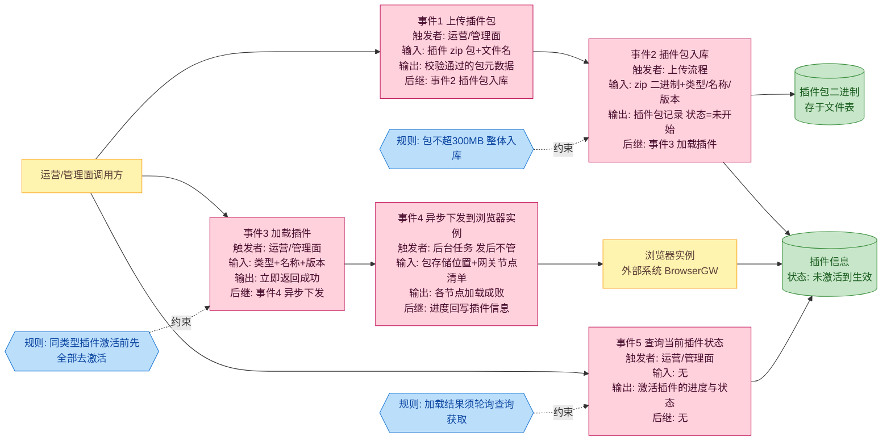
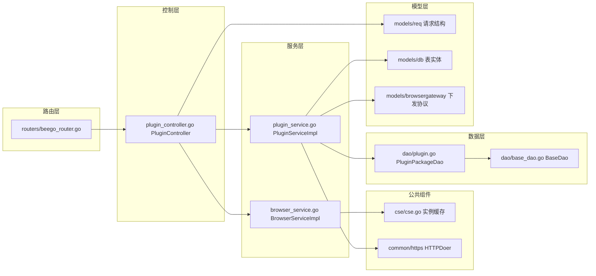
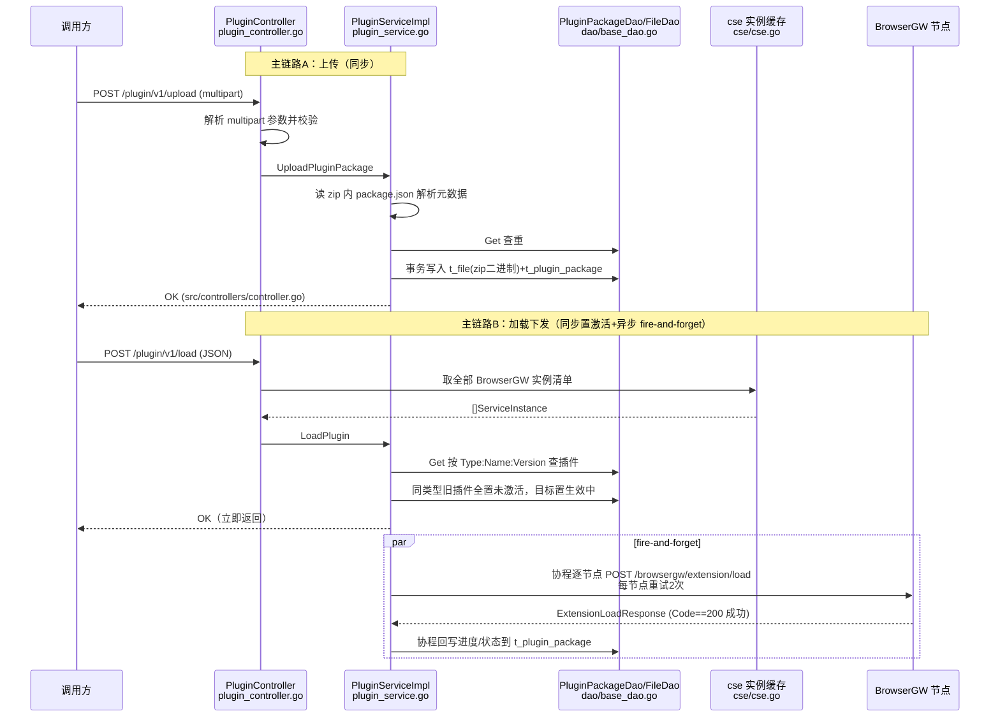

# 插件管理

> 功能域概述：负责 Chrome 扩展插件包（zip）的上传、删除、查询，并将激活插件异步下发加载到全部 BrowserGW 节点、记录下发进度。
> 接口数：5（外部 0 / 内部 5）　核心模块：PluginController, PluginService, PluginPackageDao

## 1. 功能故事（多彩建模）

实现逻辑速览：插件包整包存库。加载先切换激活状态，后台异步下发。加载成败需查询接口轮询获取。

### 术语表

| 术语 | 人话解释 | 出处 |
|---|---|---|
| 插件包 | Chrome 浏览器扩展的 zip 压缩包，整个文件直接存数据库 | src/service/plugin_service.go |
| package.json（扩展描述文件） | zip 内的说明书，写明插件的类型、名称、版本 | src/service/plugin_service.go；src/common/constants/base.go |
| BrowserGW（浏览器网关） | 承载浏览器实例的网关节点，负责接收并执行插件加载指令 | src/service/plugin_service.go |
| 激活插件 | 当前生效的插件；同类型同一时刻只保留一个生效，激活新版前旧版全部去激活 | src/service/plugin_service.go |
| fire-and-forget（发后不管） | 加载接口立即返回成功，真正的下发在后台进行，结果不在接口响应里 | src/service/plugin_service.go |
| 下发进度 | 按加载成功的网关节点比例算出的 0-100 进度，全部成功才算完成 | src/service/plugin_service.go |
| 实例清单 | 从注册中心缓存拿到的全部网关节点地址，下发的目标列表 | src/common/cse/cse.go |
| 桶（Bucket） | 存插件包的逻辑分区，固定叫 "extension" | src/common/constants/base.go |
| 运营/管理面调用方 | 发起上传/加载/查询的人或上游系统；代码中未体现（接口为内部路由，无鉴权与角色信息） | src/controllers/plugin_controller.go |

## 2. 模块划分

| 模块/包 | 承载功能（引用文件） |
|---|---|
| controllers.PluginController | 5 个内部路由入口：multipart/JSON 参数解析、调用 service、错误码转换（src/controllers/plugin_controller.go） |
| service.PluginServiceImpl | 业务核心：读 zip 元数据、落库、激活切换、异步下发、进度回写；接口 PluginService 仅此一个实现，由 NewPluginService 直接注入 Controller（src/service/plugin_service.go、src/controllers/plugin_controller.go） |
| service.BrowserServiceImpl | 提供 BrowserGW 实例清单，同样单实现直接注入（src/service/browser_service.go） |
| common/cse | watch 注册中心维护实例缓存，供实例清单查询（src/common/cse/cse.go） |
| common/https | HTTP 客户端抽象（HTTPDoer 单例注入，无多实现选择机制），跨服务调用 BrowserGW（src/common/https、src/service/plugin_service.go） |
| dao.PluginPackageDao / BaseDao | t_plugin_package 表 ORM 封装与事务（src/dao/plugin.go、src/dao/base_dao.go） |
| models | 请求/表实体/browsergateway 下发协议结构（src/models/req/plugin_entity.go、src/models/db/plugin_info.go、src/models/browsergateway/req.go） |

## 3. 接口清单

| 接口 | 路径/入口（含注册处） | 请求结构 | 响应结构 | 状态 |
|---|---|---|---|---|
| 上传插件包 | POST /plugin/v1/upload（multipart），注册与入口均在 src/controllers/plugin_controller.go | multipart：filename + file（src/models/req/plugin_entity.go） | 通用 BaseResponse（src/controllers/controller.go） | 在用 |
| 删除插件包 | POST /plugin/v1/delete（JSON），注册与入口均在 src/controllers/plugin_controller.go | req.PluginPackageReq（Name/Type/Version 必填，src/models/req/plugin_entity.go） | BaseResponse | 在用 |
| 查询全部插件包 | POST /plugin/v1/getAll，注册与入口均在 src/controllers/plugin_controller.go | 空 body | []*db.PluginPackage（src/controllers/plugin_controller.go） | 在用 |
| 加载（激活）插件 | POST /plugin/v1/load（JSON），注册与入口均在 src/controllers/plugin_controller.go | req.PluginPackageReq（src/models/req/plugin_entity.go） | BaseResponse（异步下发，结果不在响应中） | 在用 |
| 查询当前激活插件 | POST /plugin/v1/current，注册与入口均在 src/controllers/plugin_controller.go | 空 body | []*db.PluginPackage（src/controllers/plugin_controller.go） | 在用 |

## 4. 关键数据结构

| 结构 | 定义位置 | 关键字段（含义+约束） |
|---|---|---|
| req.UploadPluginPackageReq | src/models/req/plugin_entity.go | Filename 可缺省（取 header.Filename）；File multipart 流；Size 必非 0 且 ≤300MB（src/common/constants/base.go） |
| req.PluginPackageReq | src/models/req/plugin_entity.go | Name/Type/Version 均必填；GetKey 拼 `Type:Name:Version` 主键 |
| db.PluginPackage | src/models/db/plugin_info.go | Field 主键列 `key`（由 GetField 生成）；Type 须为 "ChromeExtend"（src/common/constants/base.go）；Status ∈ NotStart/Doing/Complete/Failed；IfActive 激活标记；Progress 0-100；PackageBucket 固定 "extension"（src/common/constants/base.go） |
| db.File | src/models/db/file.go | Bucket+Name 定位；Content 为 bytea 存 zip 二进制（t_file 表） |
| browsergateway.ServiceInstance | src/models/browsergateway/service_instance.go | BrowserInnerEndpoint 下发目标地址；IsHealthy 健康标记（load 路径未过滤） |
| browsergateway.ExtensionLoadRequest / ExtensionLoadResponse | src/models/browsergateway/req.go、src/models/browsergateway/resp.go | 请求带 BucketName、ExtensionFilePath、Name/Version/Type；响应 Code==200 视为该节点成功 |

## 5. 调用关系

关键分支：
1. 上传仅支持 ".zip" 后缀且元数据 Type 硬编码须为 "ChromeExtend"，其余直接拒绝（src/service/plugin_service.go）。
2. LoadPlugin 中置激活失败仅记日志并 `return nil`，接口仍返回成功（src/service/plugin_service.go）。
3. 下发循环按成功数计算进度，达 100 置 Complete 否则 Failed，结束后 close channel 触发回写退出（src/service/plugin_service.go）。

## 6. 框架引用

| 基础框架 | 框架文档 | 本功能中的用途（引用文件） |
|---|---|---|
| Beego Web（路由/Controller） | ../framework-usage/rpc-beego-web.md | 承载 5 个插件接口：RouteMapping 注册路由、Controller 解析 multipart/JSON 并返回统一响应（src/controllers/plugin_controller.go、src/routers/beego_router.go） |
| Beego ORM（数据落库） | ../framework-usage/storage-beego-orm.md | 插件包二进制与插件信息经 ORM 落库 t_file/t_plugin_package，上传/删除/激活切换均在事务中执行（src/dao/base_dao.go、src/dao/plugin.go） |
| HTTP Client Builder | ../framework-usage/rpc-http-client-builder.md | 构建 HTTP 客户端，向各 BrowserGW 节点 POST /browsergw/extension/load 下发插件加载（src/common/https/builder.go、src/service/plugin_service.go） |
| Goroutine 并发 | ../framework-usage/concurrency-goroutine.md | go 协程实现 fire-and-forget 异步下发与进度回写，channel 传递进度（src/service/plugin_service.go） |
| Lager 日志 | ../framework-usage/log-lager-auditlog-event.md | 全链路业务日志（Infof/Errorf/Warnf），记录上传、激活切换、逐节点下发成败（src/service/plugin_service.go、src/controllers/plugin_controller.go） |

## 7. AI 编码指南

- 新接口用 `RequestBodyUnmarshalTo` 校验（src/controllers/plugin_controller.go；src/controllers/controller.go）
- LoadPlugin 异步下发，轮询 current 查结果（src/service/plugin_service.go；src/controllers/plugin_controller.go）
- 插件包存 t_file bytea，300MB 整体读内存（src/service/plugin_service.go）
- 新增插件类型须改后缀分发、Type 校验、去激活 SQL（src/service/plugin_service.go）
- 查询直接返回 db 实体，resp 结构未用（src/models/resp/plugin_entity.go；src/controllers/plugin_controller.go）
