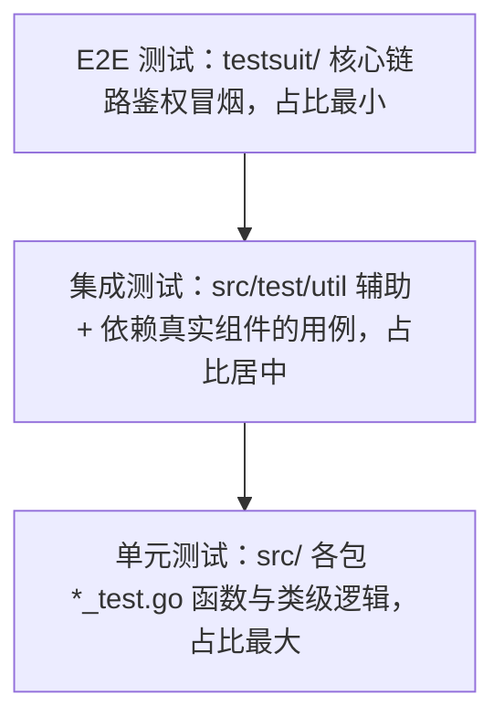

# DT 规范（开发者测试规范）

| 元信息 | 值 |
|--------|-----|
| 分支 | new_skill_test 分支 (2026-08-11) |
| 更新日期 | 2026-08-11 |
| Skill | qual-dt-guidelines-analyze |
| 运行模式 | 起草模式 |
| 文档状态 | 起草待评审 |

## 一、测试现状盘点

### 1.1 测试文件分布

| 测试层级 | 测试文件数 | 分布目录 | 命名模式 | 代表性文件（证据，不带行号） |
|---|---|---|---|---|
| 单元测试 | 21 | `src/service/`、`src/dao/`、`src/controllers/`、`src/common/`（https/cse/event/storage/oss）、`src/models/req/`、`src/db/driver/`、`src/utils/`（flagutil/monitorutil） | `*_test.go` | `src/service/browser_service_test.go`、`src/dao/base_dao_test.go`、`src/controllers/login_controller_test.go`、`src/common/https/builder_test.go`、`src/db/driver/driver_test.go` |
| 集成测试 | 1（辅助工具目录） | `src/test/util/` | `utils.go`（非 `_test.go`，为测试辅助代码） | `src/test/util/utils.go` |
| E2E 测试 | 5 | `testsuit/` | `TC_SBG_Func_GIDS_*.py`（pytest 风格脚本，驱动 127.0.0.1:9090 真实服务） | `testsuit/TC_SBG_Func_GIDS_Auth_001.py`、`testsuit/TC_SBG_Func_GIDS_Auth_002.py`、`testsuit/TC_SBG_Func_GIDS_Auth_005.py` |

补充说明：

- Go 单测中 `src/dao/base_dao_test.go`、`src/controllers/filter_test.go` 当前**编译失败**（goconvey 用法错误 / 语法错误，见 1.3 备注），实际可运行单测为 19 个文件。
- `src/common/storage/oss/minio_test.go` 可编译但运行失败（依赖真实 MinIO Endpoint，属集成性质用例混在单测层）。
- E2E 用例清单见 `testsuit/testsuitcase.md`（白名单管理 / IMEI+IMSI 联合鉴权 / 登录链路鉴权 / 事件上报鉴权 4 个功能域）。

### 1.2 测试框架与工具

| 类别 | 选型 | 证据（文件路径） |
|---|---|---|
| 测试框架 | go testing（Go 单测）；Python 脚本直驱 HTTP（E2E，testsuit） | `src/go.mod`、`testsuit/TC_SBG_Func_GIDS_Auth_001.py` |
| Mock 工具 | gomockit（`code.huawei.com/paaslite/dev-tool/gomockit`，replace 到本地 stub `src/stubs/`）；goconvey 被 `src/dao/base_dao_test.go` 引用 | `src/go.mod`、`src/dao/base_dao_test.go` |
| 断言库 | testify（stretchr/testify v1.8.4，replace 到 v1.8.2）；goconvey 的 `convey.So` | `src/go.mod`、`src/dao/base_dao_test.go` |
| 覆盖率工具 | go cover（`go test -cover` / `-coverprofile` + `go tool cover`） | 实测命令（见 1.3） |

### 1.3 当前覆盖率

- 获取方式：`LOCAL_MODE=true go test -coverprofile ./service/... ./common/cse/... ./common/event/... ./common/https/... ./db/driver/... ./utils/...` + `go tool cover -func`
- 数据日期：2026-08-11
- 实测结果：可编译且可运行包的合计行覆盖率 **20.6%**（分支覆盖率未测量，go cover 不支持分支统计）
- 分模块覆盖率（同为 2026-08-11 实测）：
  - `db/driver` 93.1%、`utils/monitorutil` 91.7%、`utils/flagutil` 81.1%（工具层覆盖好）
  - `common/cse` 51.5%、`common/https` 34.6%
  - `service` 10.9%、`common/event` 9.2%（核心业务层覆盖低）
  - `common/cert`、`common/conf`、`common/storage`、`common/storage/redis`、`models/db`、`models/browsergateway`、`models/events`、`models/monitor`、`utils/fileutil`、`utils/response` 0.0%（有测试运行但无覆盖或无测试文件）
- 备注：`dao`、`controllers`、`common/logger`、`models/req` 四个包的测试**编译失败未能计入**（`dao/base_dao_test.go` 误用 `convey.It` 嵌套、`controllers/filter_test.go` 语法错误、`models/req/request_entity.go` non-constant format string），整体真实覆盖率低于 20.6%；`common/storage/oss` 11.1% 但用例运行失败（依赖真实 MinIO）。

### 1.4 CI 测试关卡

| CI 配置文件 | 测试阶段 | 是否阻断合并 | 已有覆盖率门槛 | 证据（文件路径） |
|---|---|---|---|---|
| 未识别 CI 配置 | — | — | — | 仓内无 `.github/workflows/`、`.gitlab-ci.yml`、`Jenkinsfile`、`.circleci/`；`build/build.sh` 仅含编译打包、无测试与覆盖率步骤 |

## 二、测试金字塔与覆盖基线

> 本章为约定性内容，从第一章现状归纳起草，**起草待评审**。

现状形态：可运行单测 19 个文件 / 集成辅助 1 个目录 / E2E 5 个脚本，数量上呈正金字塔；但核心层（service 10.9%、event 9.2%）覆盖率低、dao/controllers 测试编译失败，**单测层质量与覆盖厚度不足**，金字塔基座空心化。纠偏方向：优先修复编译失败的 4 个测试包，再补齐 service / dao / controllers 核心链路的单测覆盖。

| 层级 | 定位 | 覆盖范围要求 | 占比基线 |
|---|---|---|---|
| 单元测试 | 进程内单函数/单类，不依赖真实 DB/MinIO/外部服务 | 新增 Go 代码（service/dao/controllers/common/utils）必须具备； LOCAL_MODE SQLite 可用于 dao 层 | ≥ 70%（目标值，分阶段达成；现状文件数占比约 76%） |
| 集成测试 | 跨模块/外部依赖交互（DB 链路、存储客户端） | dao 层 CRUD、storage 客户端连通性须覆盖；依赖真实外部组件的用例应归入本层而非单测 | 15%~25% |
| E2E 测试 | 全系统核心链路（testsuit 驱动真实 9090 服务） | 对外接口核心业务流程冒烟（鉴权、白名单、登录、事件上报） | ≤ 10%（现状文件数占比约 20%，维持不再扩大） |

## 三、用例设计方法要求

> 本章为约定性内容，**起草待评审**。

### 3.1 等价类划分（必选）

每个公开接口/函数的入参至少划分有效等价类与无效等价类各 1 条用例。现状参照：`testsuit/testsuitcase.md` 中 IMEI/IMSI 命中/未命中/缺失/非法格式的组合用例（TC_SBG_Func_GIDS_Auth_002 系列）即为有效/无效等价类划分的范例，Go 单测应对齐此口径。

### 3.2 边界值分析（必选）

数值/长度/时间类入参必须覆盖边界点（最小值、最大值、临界 ±1、空值）。现状参照：IMEI/IMSI 15 位长度校验（14 位/16 位/含字母拒绝）为长度边界范例，见 `testsuit/testsuitcase.md` TC_SBG_Func_GIDS_Auth_001_006/001_007；数值与时间边界可参照 `src/utils/monitorutil/time_util_test.go`。

### 3.3 用例命名与组织

- Go 单测：与被测文件同目录，命名 `*_test.go`，测试函数 `TestXxx(t *testing.T)`，断言优先 testify；goconvey 在存量 `src/dao/base_dao_test.go` 中存在但当前编译失败，统一方向为 **testify 为主，不新增 goconvey 依赖**。
- E2E：落 `testsuit/`，命名 `TC_SBG_Func_GIDS_{功能域}_{序号}.py`，用例清单同步登记 `testsuit/testsuitcase.md`（用例 ID 规则 `TC_SBG_Func_GIDS_{功能域}_{文件序号}_{用例序号}`）。
- 一个被测单元对应一个测试文件，多个场景组织为多个 `TestXxx` 函数或子用例。

## 四、自测报告要求

> 本章为约定性内容，**起草待评审**。

- 触发时机：新功能 / bugfix 的 MR 必须附自测报告。
- 必含内容：测试范围（改了什么）、用例清单（测了什么，含等价类/边界值覆盖说明）、覆盖率结论（新增代码覆盖率实测值，命令 `LOCAL_MODE=true go test -cover`）、E2E 结果（涉及对外接口变更时附对应 `testsuit/TC_*.py` 执行结论）、遗留风险。
- 呈现形式：默认建议 MR 描述内附；testsuit 存在时 E2E 脚本执行输出截图或日志一并附上。

## 五、新增代码覆盖率门禁（红线）

> 本章为红线约定；门禁线取值为**建议值，待团队确认**，确认前门禁不生效。

- 门禁线：新增代码行覆盖率 ≥ **60%（建议值，待团队确认）**
  - 建议依据：当前可测包整体覆盖率实测 20.6%、核心 service 层仅 10.9%（见 1.3），整体门禁不具可操作性；对**新增代码**从严要求，60% 为可起步的底线值，随存量覆盖率提升逐步上调。
- 测量口径：
  - 基准分支：主干分支（当前开发分支 `new_skill_test`，合入目标以团队分支模型为准），新增代码 = MR diff 命中的行
  - 统计方式：diff coverage（新增行的行覆盖率），工具：`go test -coverprofile` + diff 过滤（如 diff-cover）
  - 排除项：生成代码、`src/stubs/`（第三方 stub）、vendor/、`src/data/`（SQLite 数据文件）
- 拦截语义：MR 新增代码覆盖率低于门禁线时 CI 判定 **BLOCK**，禁止合入（当前仓内无 CI 配置，需先补 CI 关卡方可生效）。
- 豁免路径：紧急修复可由模块负责人评审豁免，MR 描述中注明豁免原因与补测计划；其余情形暂无豁免。

## 附注

- 空转测试：`src/dao/base_dao_test.go`、`src/controllers/filter_test.go`（编译失败，长期未运行）；`src/common/storage/oss/minio_test.go`（运行必失败，依赖真实 MinIO，应移入集成层或加环境开关）。
- 零测试模块：`src/routers/`、`src/scheduler/`、`src/common/constants/`、`src/models/resp/`、`src/models/db/`（实体层有 DDL 兜底但无单测）、`src/service/` 内多个服务无对应 `_test.go`（如鉴权相关服务依赖 E2E 覆盖）。
- 多套框架并存：单测层 testify 与 goconvey 并存（goconvey 仅在 `src/dao/base_dao_test.go` 且编译失败），统一建议为 testify；gomockit 为本地 stub（`src/stubs/`），需确认其能力边界是否满足新增 Mock 需求。
