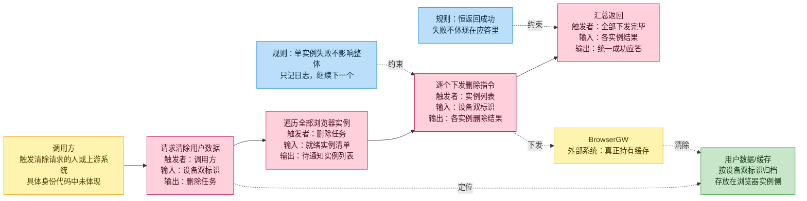
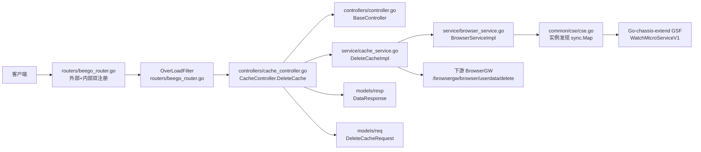
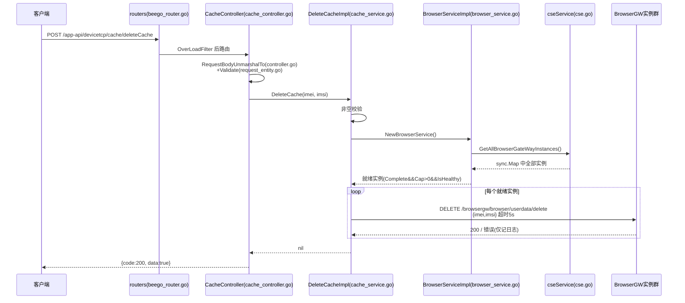

# 缓存管理

> 功能域概述：根据终端 IMEI/IMSI，向所有就绪 BrowserGW 实例广播删除用户页面缓存；本服务仅做转发编排，不直接操作缓存存储。
> 接口数：1（外部+内部同注册）　核心模块：controllers、service、common/cse

## 1. 功能故事（多彩建模）

**实现逻辑速览**：收到请求后筛出全部健康实例。逐台下发删除指令，互不等候。单台失败只记日志，统一答复成功。

### 术语表

| 术语 | 人话解释 | 出处 |
| --- | --- | --- |
| BrowserGW | 浏览器网关，真正干活的远端实例，用户缓存存在它那边 | src/service/cache_service.go |
| userdata | 用户数据，按设备双标识定位、存于浏览器实例侧的页面缓存 | src/service/cache_service.go |
| IMEI/IMSI | 设备号与卡号双标识，两个一起才能锁定一个用户 | src/models/req/request_entity.go |
| 就绪实例 | 插件装完、容量有余、健康在线的实例才会被通知 | src/service/browser_service.go |
| 实例清单来源 | 来自注册中心服务发现的内存快照，不查数据库 | src/common/cse/cse.go |
| 触发背景 | 为何清除（注销/合规/运维）代码中未体现 | src/controllers/cache_controller.go |

## 2. 模块划分

| 模块 | 承载功能（引用文件） |
| --- | --- |
| routers | 外部/内部双注册 CacheController 并挂限流过滤器（src/routers/beego_router.go）；内部监听启动（src/main.go） |
| controllers/cache_controller.go | 路由表声明与 DeleteCache 入口、失败审计日志、响应封装（src/controllers/cache_controller.go） |
| controllers/controller.go | BaseController：body 解析+Validate、OK/Failed 响应写出（src/controllers/controller.go） |
| service/cache_service.go | 删除编排与 HTTP DELETE 构造：校验、取就绪实例、逐实例调 BrowserGW（src/service/cache_service.go） |
| service/browser_service.go | NewBrowserService 组装、就绪实例过滤（src/service/browser_service.go） |
| common/cse/cse.go | 单例实例缓存 sync.Map、watch 注册中心变更、实例枚举（src/common/cse/cse.go） |
| models | 请求/响应/实例结构（src/models/req/request_entity.go、src/models/resp/response_entity.go、src/models/browsergateway/service_instance.go） |

## 3. 接口清单

| 接口 | 路径/入口（含注册处） | 请求结构 | 响应结构 | 状态 |
| --- | --- | --- | --- | --- |
| DeleteCache | POST `/app-api/devicetcp/cache/deleteCache`；入口 src/controllers/cache_controller.go；注册 src/routers/beego_router.go（外部+内部） | DeleteCacheRequest（src/models/req/request_entity.go）：`{imei, imsi}`，均必填 | DataResponse（src/models/resp/response_entity.go）：`{code, msg, data:true}`；失败 `code=-1/-2`（src/common/constants/retcode/retcode.go） | 在用 |
| （出向）BrowserGW 删除用户数据 | DELETE `http://{BrowserInnerEndpoint}/browsergw/browser/userdata/delete`（src/service/cache_service.go） | JSON `{imei, imsi}`；超时 5s（src/service/cache_service.go） | 仅接受 HTTP 200（src/service/cache_service.go） | 在用 |

## 4. 关键数据结构

| 结构 | 定义位置 | 关键字段（含义+约束） |
| --- | --- | --- |
| DeleteCacheRequest | src/models/req/request_entity.go | `IMEI`（json `imei`，必填，`Validate` 非空校验）；`IMSI`（json `imsi`，同约束） |
| BaseResponse | src/models/resp/base.go | `Code`（200/-1/-2，src/common/constants/retcode/retcode.go）；`Message`（json `msg`） |
| DataResponse | src/models/resp/response_entity.go | 内嵌 BaseResponse；`Data` 本接口固定 `true`（src/controllers/cache_controller.go） |
| ServiceInstance | src/models/browsergateway/service_instance.go | `BrowserInnerEndpoint`（下游调用目标）；`Cap>0`/`PluginStatus==Complete`/`IsHealthy` 为就绪过滤条件（src/service/browser_service.go） |

## 5. 调用关系

- 解析/校验失败返回 `code=-2`，HTTP 状态恒 400（src/controllers/cache_controller.go；src/controllers/controller.go）。
- 无就绪实例返回错误并记审计日志（src/service/cache_service.go；src/controllers/cache_controller.go）。
- 单实例失败不中断、不上抛，整体仍报成功（src/service/cache_service.go）；本链路不删 redis key、不清 DB 绑定（UserBindDao 仅组装注入，src/service/browser_service.go）。
- redis 客户端无多实现，包级单例经 `Init(RedisConfig)` 注入、测试用 `InitForTest` 重置；当前启动流程未接线，`Instance()` 返回 nil（src/common/storage/redis/redis.go；src/main.go）。

## 6. 框架引用

| 基础框架 | 框架文档 | 本功能中的用途（引用文件） |
| --- | --- | --- |
| Beego Web（路由/Controller） | [rpc-beego-web.md](../framework-usage/rpc-beego-web.md) | 外部/内部双路由注册、Controller 请求解析与响应封装（src/routers/beego_router.go、src/controllers/cache_controller.go、src/controllers/controller.go） |
| Lager 业务日志/审计日志 | [log-lager-auditlog-event.md](../framework-usage/log-lager-auditlog-event.md) | 失败审计日志 AuditsLog 与错误日志 Errorf（src/controllers/cache_controller.go、src/service/cache_service.go） |

## 7. AI 编码指南

- 编排须聚合失败并同步错误分支（src/service/cache_service.go；src/controllers/cache_controller.go）
- 本链路勿用 redis，Init 未接线（src/main.go；src/common/storage/redis/redis.go）
- 路由改动只动 RouteInfo()，两侧监听同步生效（src/controllers/cache_controller.go；src/routers/beego_router.go）
- 仅内部开放须移出外部路由注册（src/routers/beego_router.go）
- 下游调用沿用 5s 超时与 200 判定约定（src/service/cache_service.go）
- 响应 JSON 字段名为 code/msg/data，非 message（src/models/resp/base.go）
