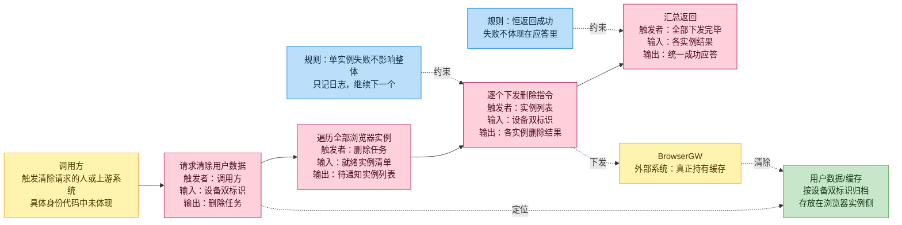
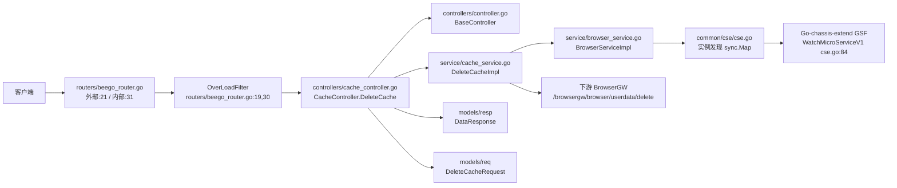
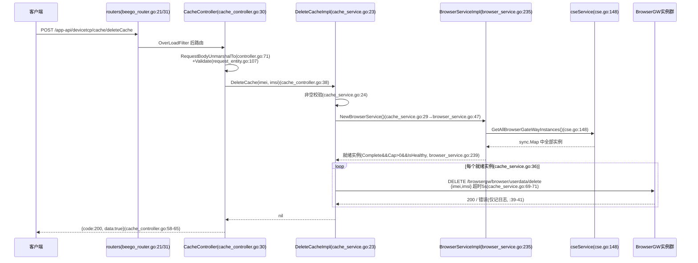

# 缓存管理

> 功能域概述：根据终端 IMEI/IMSI，向所有就绪 BrowserGW 实例广播删除用户页面缓存；本服务仅做转发编排，不直接操作缓存存储。
> 接口数：1（外部+内部同注册）　核心模块：controllers、service、common/cse

## 1. 功能故事（多彩建模）

### 术语表

| 术语 | 人话解释 | 出处 |
| --- | --- | --- |
| BrowserGW | 浏览器网关，真正干活的远端实例，用户缓存存在它那边 | src/service/cache_service.go:38 |
| userdata | 用户数据，按设备双标识定位、存于对象存储的页面缓存 | src/service/cache_service.go:69 |
| IMEI/IMSI | 设备号与卡号双标识，两个一起才能锁定一个用户 | src/models/req/request_entity.go:102-105 |
| 就绪实例 | 插件装完、容量有余、健康在线的实例才会被通知 | src/service/browser_service.go:239 |
| 实例清单来源 | 来自注册中心服务发现的内存快照，不查数据库 | src/common/cse/cse.go:148-158 |
| 触发背景 | 为何清除（注销/合规/运维）代码中未体现 | src/controllers/cache_controller.go:30 |

## 2. 模块划分

| 模块 | 承载功能（文件:行号） |
| --- | --- |
| routers | 外部/内部双注册 CacheController 并挂限流过滤器（src/routers/beego_router.go:19-21、:30-31）；内部监听启动 src/main.go:153-169 |
| controllers/cache_controller.go | 路由表声明与 DeleteCache 入口、失败审计日志、响应封装（src/controllers/cache_controller.go:18-66） |
| controllers/controller.go | BaseController：body 解析+Validate（src/controllers/controller.go:71-90）；OK/Failed 响应写出（:92-118） |
| service/cache_service.go | 删除编排：校验、取就绪实例、逐实例调 BrowserGW（src/service/cache_service.go:23-45）；HTTP DELETE 构造（:48-95） |
| service/browser_service.go | NewBrowserService 组装（src/service/browser_service.go:47-53）；就绪实例过滤（:235-244） |
| common/cse/cse.go | 单例实例缓存 sync.Map（src/common/cse/cse.go:66-70）；watch 注册中心变更（:84、:100-145）；实例枚举（:148-158） |
| models | 请求/响应/实例结构（src/models/req/request_entity.go:102-122；src/models/resp/response_entity.go:6-9；src/models/browsergateway/service_instance.go:9-25） |

## 3. 接口清单

| 接口 | 路径/入口（含注册处） | 请求结构 | 响应结构 | 状态 |
| --- | --- | --- | --- | --- |
| DeleteCache | POST `/app-api/devicetcp/cache/deleteCache`；入口 src/controllers/cache_controller.go:21、:30；注册 src/routers/beego_router.go:21（外部）、:31（内部） | DeleteCacheRequest（src/models/req/request_entity.go:102-105）：`{imei, imsi}`，均必填 | DataResponse（src/models/resp/response_entity.go:6-9）：`{code, message, data:true}`；失败 `code=-1/-2`（src/common/constants/retcode/retcode.go:7-9） | 在用 |
| （出向）BrowserGW 删除用户数据 | DELETE `http://{BrowserInnerEndpoint}/browsergw/browser/userdata/delete`（src/service/cache_service.go:69-71） | JSON `{imei, imsi}`（src/service/cache_service.go:54-60）；超时 5s（:18、:50） | 仅接受 HTTP 200（src/service/cache_service.go:90-92） | 在用 |

### 语言级内部接口

| 接口 | 定义位置 | 实现 | 选择机制 |
| --- | --- | --- | --- |
| redis.Client | src/common/storage/redis/redis.go:67-85 | 唯一实现 innerClient，包装 go-redis/v9（src/common/storage/redis/redis.go:87-105） | 无多实现；包级单例经 `Init(RedisConfig)` 注入（:24-42），`Instance()` 取用（:51-53），测试用 `InitForTest` 重置（:44-48）；当前 main 未调 Init（src/main.go:46-98） |
| redis.Object / HFieldObject | src/common/storage/redis/redis.go:56-60、:61-64 | 由业务 model 实现 GetKey/GetField+二进制编解码 | 作为 Client 方法入参约束，编译期绑定 |

## 4. 关键数据结构

| 结构 | 定义位置 | 关键字段（含义+约束） |
| --- | --- | --- |
| DeleteCacheRequest | src/models/req/request_entity.go:102-105 | `IMEI`（json `imei`，必填，`Validate` 非空校验 :110-112）；`IMSI`（json `imsi`，同约束 :114-116） |
| BaseResponse | src/models/resp/base.go:6-9 | `Code`（200/-1/-2，src/common/constants/retcode/retcode.go:7-9）；`Message` |
| DataResponse | src/models/resp/response_entity.go:6-9 | 内嵌 BaseResponse；`Data` 本接口固定 `true`（src/controllers/cache_controller.go:58-64） |
| ServiceInstance | src/models/browsergateway/service_instance.go:9-21 | `BrowserInnerEndpoint`（下游调用目标，:10）；`Cap>0`/`PluginStatus==Complete`/`IsHealthy` 为就绪过滤条件（src/service/browser_service.go:239） |

## 5. 调用关系

- 解析/校验失败返回 `code=-2`，HTTP 状态恒 400（src/controllers/cache_controller.go:33-36；src/controllers/controller.go:112-113）。
- 无就绪实例返回错误并记审计日志（src/service/cache_service.go:32-34；src/controllers/cache_controller.go:40-55）。
- 单实例失败不中断、不上抛，整体仍报成功（src/service/cache_service.go:39-44）；本链路不删 redis key、不清 DB 绑定（UserBindDao 仅组装注入，src/service/browser_service.go:49）。

## 6. AI 编码指南

- 编排须聚合失败并同步错误分支（src/service/cache_service.go:39-44；src/controllers/cache_controller.go:39-55）
- 本链路勿用 redis，Init 未接线（src/main.go:46-98；src/common/storage/redis/redis.go:51-53）
- 路由改动只动 RouteInfo()，两侧监听同步生效（src/controllers/cache_controller.go:18-24；src/routers/beego_router.go:21、:31）
- 仅内部开放须移出外部路由注册（src/routers/beego_router.go:17-22）
- 下游调用沿用 5s 超时与 200 判定约定（src/service/cache_service.go:18、:50、:90-92）
