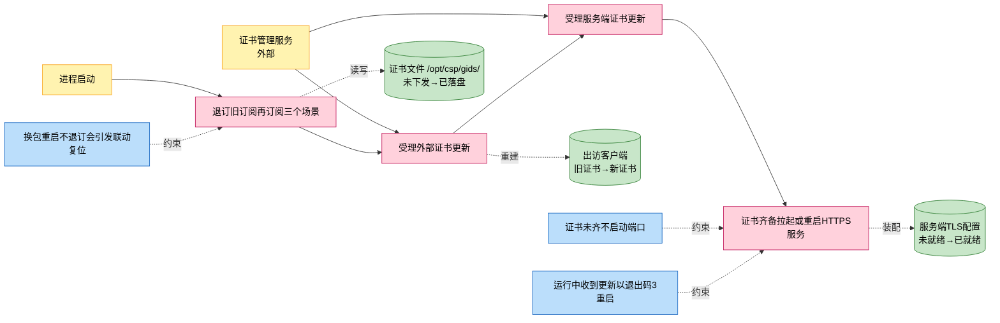
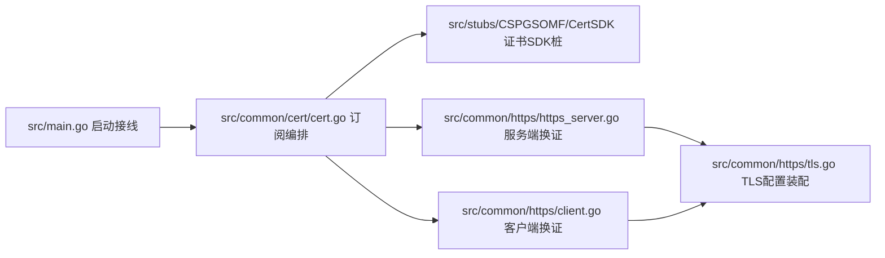
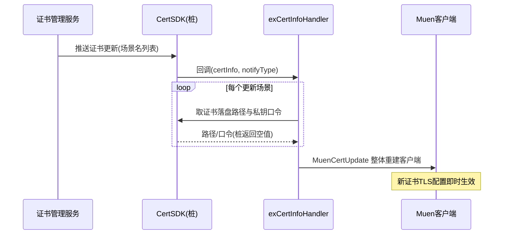
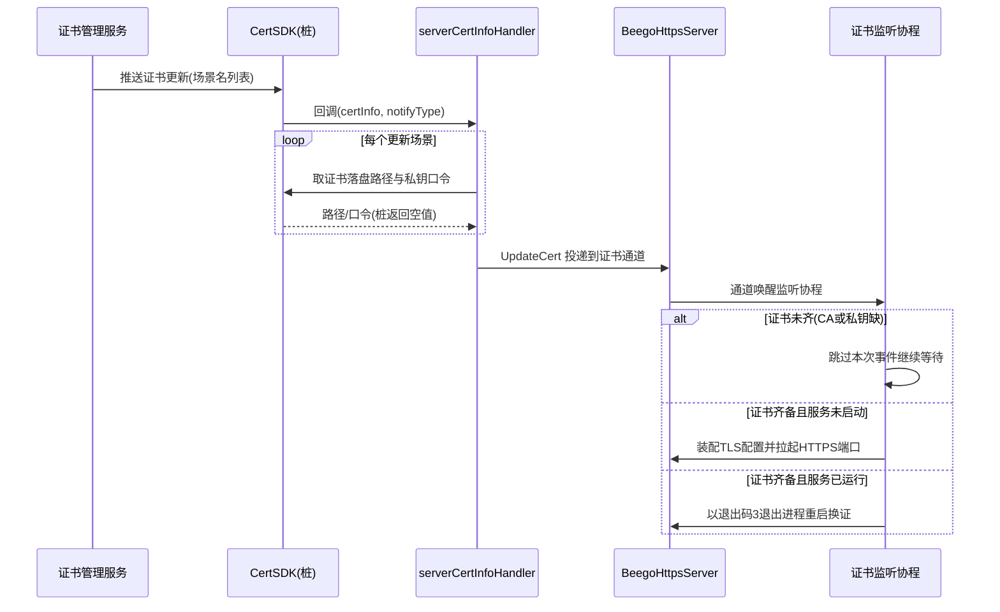

# 证书订阅

> 功能域概述：订阅证书管理服务下发的证书更新事件，动态刷新对外 HTTPS 服务端证书与出访外部系统（沐恩）的客户端证书，保证 TLS 通信证书始终有效。
> 接口数：3（消息订阅入口 3，无 HTTP 对外接口）　核心模块：common/cert, common/https, stubs/CSPGSOMF/CertSDK

## 1. 功能故事（多彩建模）

实现逻辑速览（每句 ≤30 字）：

启动时先退订旧订阅，再按三个身份订阅证书场景。
外部证书更新到达后，整体重建出访客户端。
服务端证书到齐后拉起端口，已在运行则重启进程换证。

术语表：

| 术语 | 人话解释 | 出处 |
|---|---|---|
| 沐恩（Muen） | 外部对接系统，出访它时使用订阅下发的"外部证书"建 HTTPS 客户端 | src/common/https/client.go |
| 场景（Scene） | 证书管理服务按用途划分的证书类别，每类一个场景名 | src/common/cert/cert.go |
| CA 证书 | 校验对方身份的根证书，SceneType=1 | src/common/cert/cert.go |
| 设备证书 | 本进程自身的证书与私钥（含私钥口令），SceneType=2 | src/common/cert/cert.go |
| SBG | 云浏览器业务域前缀，四个场景名均以 sbg_ 开头；业务含义代码中未体现 | src/common/cert/cert.go |
| gids-muen / gids-muenCa / gids | 本进程向证书管理服务订阅时使用的三个应用身份，分别对应外部设备证书、外部 CA 证书、服务端证书 | src/common/cert/cert.go |
| CertSDK（CSPGSOMF） | 证书管理服务的客户端 SDK；仓内 src/stubs 下为桩代码，所有方法返回空值，真实推送通道代码中未体现 | src/stubs/CSPGSOMF/CertSDK/api/certapi/certapi.go |
| 退出码 3 | 运行中收到服务端证书更新后进程以此码退出，依赖外部守护拉起重装证书 | src/common/https/https_server.go |

## 2. 模块划分

| 模块 | 承载功能（引用文件） |
|---|---|
| src/main.go | 启动外部 HTTPS 服务后调用 cert.InitCert 与 cert.SubscribeCert 完成接线，失败则进程退出（src/main.go） |
| src/common/cert/cert.go | 初始化 SDK、定义四个证书场景、先退订旧订阅再按三个身份订阅、分发外部/服务端证书更新（src/common/cert/cert.go） |
| src/stubs/CSPGSOMF/CertSDK | 证书 SDK 契约接口与桩实现：订阅/退订/取证书路径/取私钥口令，桩方法全部返回空值（src/stubs/CSPGSOMF/CertSDK/api/base/base.go、src/stubs/CSPGSOMF/CertSDK/api/certapi/certapi.go） |
| src/common/https/https_server.go | 缓存服务端证书，证书齐备后装配 TLS 拉起端口；运行中收到更新以退出码 3 重启（src/common/https/https_server.go） |
| src/common/https/client.go | 外部证书更新时整体重建出访沐恩的 HTTPS 客户端（src/common/https/client.go） |
| src/common/https/tls.go | 读证书文件、解密私钥、装配服务端/客户端 TLS 配置（src/common/https/tls.go） |

## 3. 接口清单

本功能为消息/事件订阅类入口，无 HTTP 对外接口：

| 接口 | 路径/入口（含注册处） | 请求结构 | 响应结构 | 状态 |
|---|---|---|---|---|
| 订阅外部设备证书 | 订阅入口 cert.SubscribeCert（src/common/cert/cert.go）；身份 gids-muen，场景 sbg_external_device_certificate；启动接线 src/main.go | 回调入参 []*CspExCertInfo + notifyType（src/stubs/CSPGSOMF/CertSDK/api/base/base.go） | 回调返回 error；证书落盘路径 /opt/csp/gids/，无同步响应 | 在用 |
| 订阅外部 CA 证书 | 订阅入口 cert.SubscribeCert（src/common/cert/cert.go）；身份 gids-muenCa，场景 sbg_external_ca_certificate；启动接线 src/main.go | 回调入参 []*CspExCertInfo + notifyType（src/stubs/CSPGSOMF/CertSDK/api/base/base.go） | 回调返回 error；证书落盘路径 /opt/csp/gids/，无同步响应 | 在用 |
| 订阅服务端证书 | 订阅入口 cert.SubscribeCert（src/common/cert/cert.go）；身份 gids，场景 sbg_server_ca_certificate + sbg_server_device_certificate；启动接线 src/main.go | 回调入参 []*CspExCertInfo + notifyType（src/stubs/CSPGSOMF/CertSDK/api/base/base.go） | 回调返回 error；证书落盘路径 /opt/csp/gids/，无同步响应 | 在用 |

## 4. 关键数据结构

| 结构 | 定义位置 | 关键字段（含义+约束） |
|---|---|---|
| CspExSceneInfo | src/stubs/CSPGSOMF/CertSDK/api/base/base.go | SceneName（场景唯一标识，订阅与回调按它分发）；SceneType（1=CA 证书，2=设备证书）；SceneDescCN/EN（中英文描述，仅声明用） |
| CspExCertInfo | src/stubs/CSPGSOMF/CertSDK/api/base/base.go | SceneName（本次更新涉及的场景名，回调内 switch 分发的唯一依据） |
| CspExCertPathInfo | src/stubs/CSPGSOMF/CertSDK/api/base/base.go | ExCaFilePath（CA 证书落盘路径）；ExDeviceFilePath（设备证书路径）；ExPrivateKeyFilePath（私钥路径） |
| CertInfo | src/common/https/tls.go | CertFile/KeyFile/CaFile（证书、私钥、CA 文件路径）；KeyPwd（私钥口令，非空时先解密私钥） |
| CSPExCertManager | src/stubs/CSPGSOMF/CertSDK/api/base/base.go | 接口：SubscribeExCert/UnsubscribeExCert/GetExCertPathInfo/GetExCertPrivateKeyPwd；仓内实现为返回空值的桩 |

## 5. 调用关系

链路一：外部证书更新（出访客户端换证）：

链路二：服务端证书更新（对外端口换证）：

关键分支与异步环节（各一句，带证据文件）：

- 订阅前先对三个身份退订旧订阅，防换包重启时客户端更新引发服务端联动复位（src/common/cert/cert.go）
- 取路径/口令失败只记日志不中断，未知场景名只记日志忽略（src/common/cert/cert.go）
- 证书更新经通道异步交给监听协程处理，回调本身不阻塞（src/common/https/https_server.go）
- 服务端证书更新不热替换，运行中一律退出码 3 重启进程（src/common/https/https_server.go）
- 外部证书采用整体重建客户端生效，不做连接级复用（src/common/https/client.go）
- CertSDK 为桩实现，真实推送触发条件与重试机制代码中未体现（src/stubs/CSPGSOMF/CertSDK/api/certapi/certapi.go）

## 6. 框架引用

| 基础框架 | 框架文档 | 本功能中的用途（引用文件） |
|---|---|---|
| Beego Web（HttpServer 封装） | [rpc-beego-web.md](../framework-usage/rpc-beego-web.md) | 对外 HTTPS 服务端承载与证书齐备后的端口拉起（src/common/https/https_server.go、src/main.go） |
| lager 日志 | [log-lager-auditlog-event.md](../framework-usage/log-lager-auditlog-event.md) | 订阅、回调、换证全过程运行日志与失败告警（src/common/cert/cert.go、src/common/https/https_server.go） |
| goroutine 与 channel 并发 | [concurrency-goroutine.md](../framework-usage/concurrency-goroutine.md) | 证书监听协程与证书通道异步换证（src/common/https/https_server.go） |
| HTTP Client 构建 | [rpc-http-client-builder.md](../framework-usage/rpc-http-client-builder.md) | 外部证书更新时重建出访沐恩的 HTTPS 客户端（src/common/https/client.go） |

## 7. AI 编码指南

- 新增证书场景须同步加入退订清单防联动复位（src/common/cert/cert.go）
- 订阅任一步失败进程直接 Fatal，勿吞错（src/common/cert/cert.go、src/main.go）
- 服务端换证靠退出码3重启，勿改热替换（src/common/https/https_server.go）
- 外部证书整体重建客户端，勿做增量改配置（src/common/https/client.go）
- CertSDK 是桩代码，真机行为以真实 SDK 为准（src/stubs/CSPGSOMF/CertSDK/api/certapi/certapi.go）
