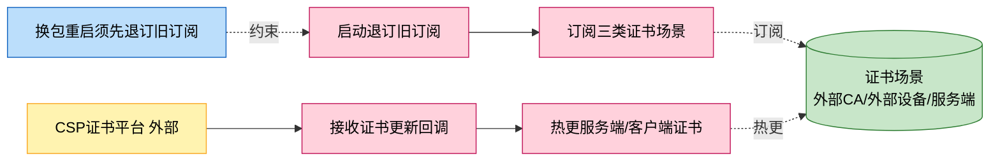
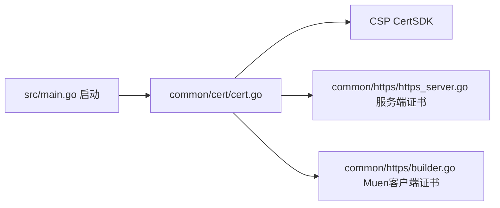
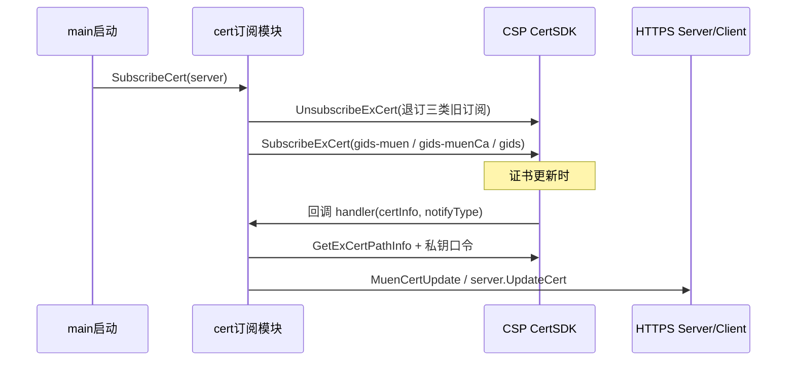

# 证书更新订阅

> 功能域概述：通过 CSP 证书 SDK 订阅云浏览器外部与服务端证书场景，证书更新回调时热更新对外 HTTPS 服务端证书与云端（Muen）客户端证书，无需重启。
> 接口数：3 个证书场景订阅（启动时注册）　核心模块：common/cert, common/https

## 1. 功能故事（多彩建模）

实现逻辑速览（1~3 句，每句 ≤30 字，业务语言，禁文件名/函数名/行号）：

启动先退订旧订阅再订阅三类证书场景。证书更新回调取回证书路径与私钥口令，分别热更服务端与云端客户端证书。

术语表：

| 术语 | 人话解释 | 出处 |
|---|---|---|
| 证书场景 | 一类证书的命名集合：外部 CA、外部设备、服务端 CA、服务端设备 | src/common/cert/cert.go |
| gids-muen / gids-muenCa | 云端（Muen）方向的客户端证书订阅名 | src/common/cert/cert.go |
| 热更新 | 不重启进程直接替换 HTTPS server 或 HTTP client 的证书 | src/common/cert/cert.go、src/common/https/https_server.go |
| CertSDK | CSP 平台证书管理 SDK，提供订阅与证书路径查询 | src/common/cert/cert.go |

## 2. 模块划分

| 模块 | 承载功能（引用文件） |
|---|---|
| common/cert/cert.go | 场景定义、退订旧订阅、三类订阅注册、更新回调处理（src/common/cert/cert.go） |
| common/https/https_server.go | 服务端证书热更新 UpdateCert（src/common/https/https_server.go） |
| common/https | Muen 客户端证书热更新 MuenCertUpdate（src/common/https/builder.go、src/common/https/tls.go） |
| src/main.go | 外部 HTTPS server 起来后调用订阅入口（src/main.go） |

## 3. 接口清单

| 接口 | 路径/入口（含注册处） | 请求结构 | 响应结构 | 状态 |
|---|---|---|---|---|
| 订阅 gids-muen（外部设备证书） | 入口 src/common/cert/cert.go SubscribeCert；注册于启动 src/main.go | CspExSceneInfo：sbg_external_device_certificate | 回调 exCertInfoHandler 更新 Muen 客户端证书 | 在用 |
| 订阅 gids-muenCa（外部 CA 证书） | 同上 | CspExSceneInfo：sbg_external_ca_certificate | 回调 exCertInfoHandler 更新 Muen 客户端 CA | 在用 |
| 订阅 gids（服务端证书） | 同上 | CspExSceneInfo：sbg_server_ca_certificate + sbg_server_device_certificate | 回调 serverCertInfoHandler 热更 HTTPS server 证书 | 在用 |

## 4. 关键数据结构

| 结构 | 定义位置 | 关键字段（含义+约束） |
|---|---|---|
| CspExSceneInfo | stubs 外 CSPGSOMF/CertSDK（调用点 src/common/cert/cert.go） | SceneName（场景唯一名）、SceneType（1=CA/2=设备） |
| https.CertInfo | src/common/https（使用点 src/common/cert/cert.go） | CaFile/CertFile/KeyFile/KeyPwd（证书与私钥路径及口令） |

## 5. 调用关系

关键分支与异步环节（各一句，带证据文件）：

- 换包重启不会自动清旧订阅，订阅前必须先显式退订（src/common/cert/cert.go）
- 取证书路径或口令失败只记日志，不中断其他场景处理（src/common/cert/cert.go）
- 未知场景名跳过不处理（src/common/cert/cert.go）
- 订阅失败会导致进程 Fatalf 退出（src/main.go）

## 6. AI 编码指南

- 新证书场景先定义 SceneInfo 再登记退订清单（src/common/cert/cert.go）
- 订阅顺序固定：先 InitCertScene 退订再逐个订阅（src/common/cert/cert.go）
- 回调内禁止中断流程，单场景失败只记日志（src/common/cert/cert.go）

## 7. 外部文档引用

| 文档类型 | 引用文档 | 引用点 |
|---|---|---|
| 关键类（必须） | [docs/key-class/README.md](../key-class/README.md) | 本功能链路未命中关键类清单中的类（订阅逻辑在 common/cert 包级函数）；关联载体为 https server/client 证书热更（src/common/cert/cert.go） |
| 接口文档 | [spec-interface-cert-subscribe.md](../interface/spec-interface-cert-subscribe.md) | 三类证书订阅的契约对照 |
| 外部接口文档 | [external-call-csp-cert.md](../external-call/external-call-csp-cert.md) | （出向）CSP CertSDK 订阅调用契约，与第 3 节订阅行对应 |
| 基础框架文档 | [base-csp-gsf.md](../framework-usage/base-csp-gsf.md) | CSP 平台套件：CertSDK 初始化与订阅（src/common/cert/cert.go） |
| struct 结构文档 | [spec-structure-AIAction.md](../structure/spec-structure-AIAction.md) | 本功能在 common/cert 与 common/https 中的位置 |
