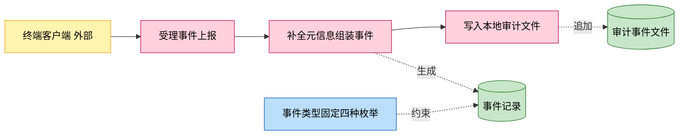
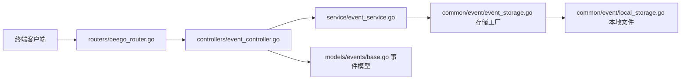
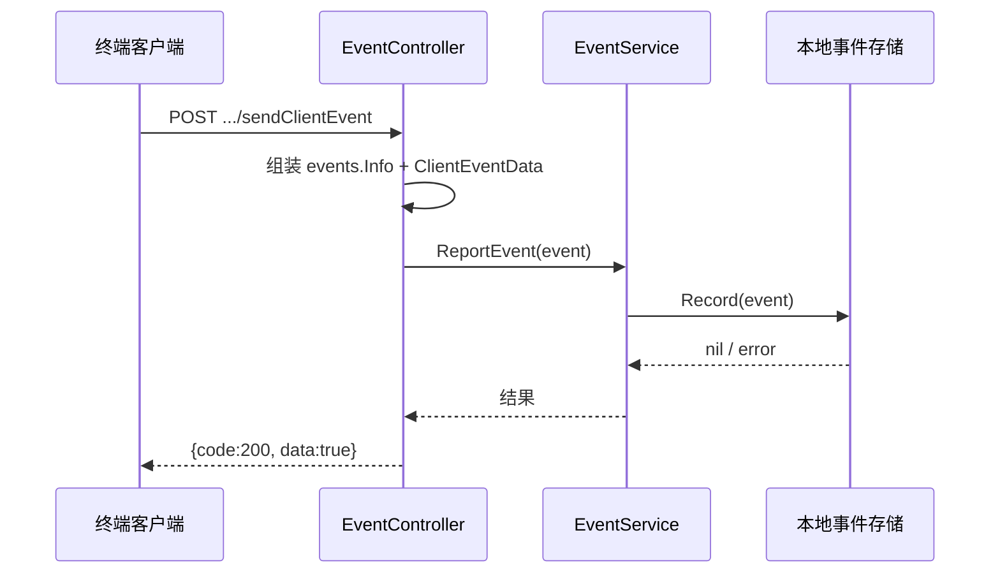

# 客户端事件上报

> 功能域概述：接收终端客户端上报的异常事件与应用使用时长事件，统一封装为带元信息的事件记录，落入本地审计事件文件。
> 接口数：2（内外双 server 同注册）　核心模块：controllers, service, common/event, models/events

## 1. 功能故事（多彩建模）

实现逻辑速览（1~3 句，每句 ≤30 字，业务语言，禁文件名/函数名/行号）：

客户端上报异常或使用时长，服务端补全时间、服务名等元信息。组装成标准事件记录写入本地审计文件。

术语表：

| 术语 | 人话解释 | 出处 |
|---|---|---|
| 事件（Event） | 带类型、时间、服务名、负载的标准埋点记录 | src/models/events/base.go |
| localAuditComponent | 默认事件存储，把事件 JSON 追加到本地文件 | src/service/event_service.go、src/common/event/local_storage.go |
| HSMan/HSType | 终端厂商/机型字段，上报报文中的简写 | src/models/req/event_request.go |
| AppUseTimes | 应用使用时长埋点事件类型 | src/models/events/base.go |

## 2. 模块划分

| 模块 | 承载功能（引用文件） |
|---|---|
| controllers/event_controller.go | 两个上报接口入口、请求到事件数据的映射（src/controllers/event_controller.go） |
| service/event_service.go | 事件存储工厂初始化与统一上报入口（src/service/event_service.go） |
| common/event/event_storage.go | 存储工厂注册与获取（src/common/event/event_storage.go） |
| common/event/local_storage.go | 本地文件异步写入实现（src/common/event/local_storage.go） |
| models/events/base.go | 事件类型枚举、元信息组装、JSON 序列化（src/models/events/base.go） |

## 3. 接口清单

| 接口 | 路径/入口（含注册处） | 请求结构 | 响应结构 | 状态 |
|---|---|---|---|---|
| SendClientEvent | POST /app-api/center/public/client/sendClientEvent；入口 src/controllers/event_controller.go；注册 src/routers/beego_router.go（内外双 server 均注册） | ClientEventRequest（src/models/req/event_request.go）：{hsman,hstype,appType,imei,imsi,type} | DataResponse（src/models/resp/response_entity.go）：{code,msg,data:true} | 在用，27.0 起注入终端鉴权（[feature-terminal-auth](feature-terminal-auth.md)） |
| SendAppUseTimesEvent | POST /app-api/center/public/client/sendAppUseTimesEvent；入口/注册同上 | AppUseTimesEvent（src/models/req/event_request.go）：{useTimes,appId,playMode,scwidth 等} | DataResponse：{code,msg,data:true} | 在用，27.0 起注入终端鉴权 |

## 4. 关键数据结构

| 结构 | 定义位置 | 关键字段（含义+约束） |
|---|---|---|
| events.Info | src/models/events/base.go | EventDesc（类型+描述+触发者，四种枚举）、Service（组件名）、EventTime、Object（cloud-browser）、EventData |
| ClientEventRequest | src/models/req/event_request.go | HSMan/HSType/AppType/IMEI/IMSI/Type，Validate 恒过 |
| AppUseTimesEvent | src/models/req/event_request.go | UseTimes/AppId/PlayMode/SCWidth/SCHeight 等，Validate 恒过 |

## 5. 调用关系

关键分支与异步环节（各一句，带证据文件）：

- 存储工厂用 sync.Once 初始化，默认实现为本地审计文件（src/service/event_service.go）
- 事件落盘为异步写入，接口不等待文件落盘完成（src/common/event/local_storage.go）
- 上报失败返回 code=-2（src/controllers/event_controller.go）

## 6. AI 编码指南

- 新事件类型先加事件枚举与类型映射表（src/models/events/base.go）
- 上报必须走统一入口，勿绕过直接写存储（src/service/event_service.go）
- 请求结构 Validate 当前恒过，勿依赖其拦截非法参数（src/models/req/event_request.go）

## 7. 外部文档引用

| 文档类型 | 引用文档 | 引用点 |
|---|---|---|
| 关键类（必须） | [docs/key-class/README.md](../key-class/README.md) | EventService（事件上报统一入口，src/service/event_service.go） |
| 接口文档 | [spec-interface-client-event.md](../interface/spec-interface-client-event.md) | 两个上报接口的契约对照 |
| 外部接口文档 | 无引用 | 本功能无出向外部调用，事件落本地文件（src/common/event/local_storage.go），接口清单无（出向）行 |
| 基础框架文档 | [rpc-beego-web.md](../framework-usage/rpc-beego-web.md) | Beego Web：路由注册与请求处理（src/routers/beego_router.go、src/controllers/event_controller.go） |
| 基础框架文档 | [di-singleton.md](../framework-usage/di-singleton.md) | 存储工厂 sync.Once 单例初始化（src/service/event_service.go） |
| struct 结构文档 | [spec-structure-AIAction.md](../structure/spec-structure-AIAction.md) | 本功能在 controllers/service/common/models 分层中的位置 |
