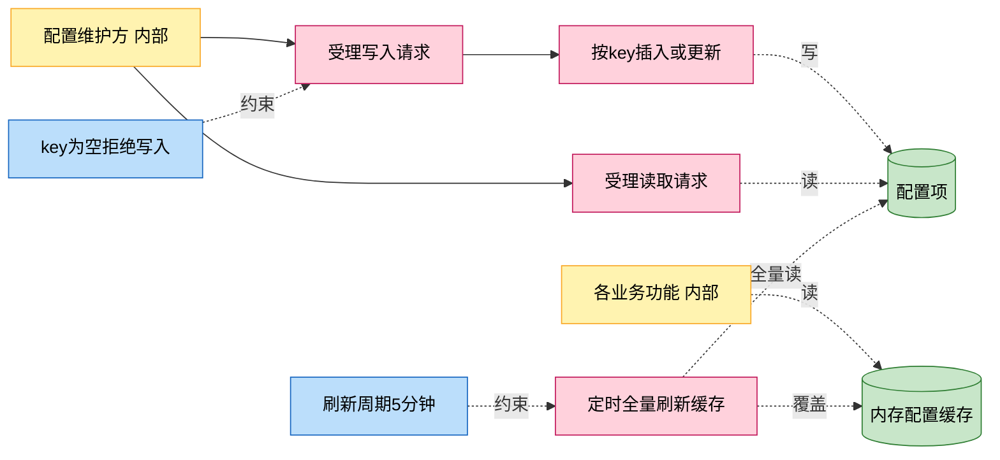
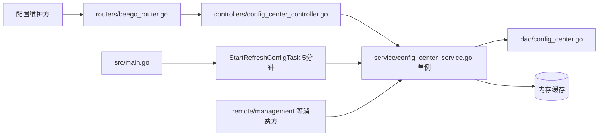
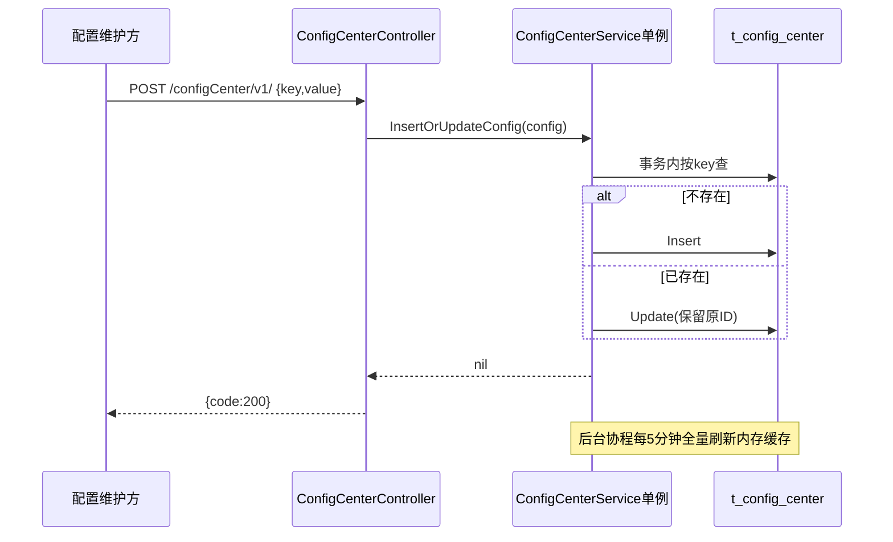

# 配置中心读写

> 功能域概述：提供通用 KV 动态配置的写入与读取，写库的同时由后台协程每 5 分钟全量刷新内存缓存，供各功能读取动态配置（如云端端点地址）。
> 接口数：2（仅内部 server 注册）　核心模块：controllers, service, dao

## 1. 功能故事（多彩建模）

实现逻辑速览（1~3 句，每句 ≤30 字，业务语言，禁文件名/函数名/行号）：

写入按 key 有则更新无则插入，读取既可直查库也可走内存缓存。后台每五分钟把全量配置刷进缓存。

术语表：

| 术语 | 人话解释 | 出处 |
|---|---|---|
| 配置中心 | DB 表 t_config_center 承载的动态 KV 配置 | src/models/db/config_center.go |
| 配置缓存 | 服务内的 map 缓存，5 分钟全量刷新一次 | src/service/config_center_service.go |
| moon:: 配置项 | 云端端点类配置键前缀，被登录转发与配置同步消费 | src/service/remote_service.go |

## 2. 模块划分

| 模块 | 承载功能（引用文件） |
|---|---|
| controllers/config_center_controller.go | 读写两接口入口、key 非空校验（src/controllers/config_center_controller.go） |
| service/config_center_service.go | 单例实现、写入事务、缓存刷新与定时任务（src/service/config_center_service.go） |
| dao/config_center.go | ConfigCenter 实体 ORM 存取（src/dao/config_center.go） |
| src/main.go | 启动时拉起缓存刷新后台协程（src/main.go） |

## 3. 接口清单

| 接口 | 路径/入口（含注册处） | 请求结构 | 响应结构 | 状态 |
|---|---|---|---|---|
| InsertOrUpdate | POST /configCenter/v1/；入口 src/controllers/config_center_controller.go；注册 src/routers/beego_router.go（仅内部） | db.ConfigCenter（src/models/db/config_center.go）：{key,value,describe,enable}，key 必填 | BaseResponse | 在用 |
| GetFromDB | POST /configCenter/v1/get；入口/注册同上 | db.ConfigCenter：{key} 必填 | db.ConfigCenter 全字段（查不到返回空结构体） | 在用 |

## 4. 关键数据结构

| 结构 | 定义位置 | 关键字段（含义+约束） |
|---|---|---|
| db.ConfigCenter | src/models/db/config_center.go | ID（自增 pk）、Key（业务键，非空约束在 controller）、Value、Describe、Enable、UpdatedAt |

## 5. 调用关系

关键分支与异步环节（各一句，带证据文件）：

- 服务为包级单例，init 即建好，NewConfigCenterService 直接返回（src/service/config_center_service.go）
- 缓存刷新协程随进程启动，读缓存与查库是两条读取路径（src/service/config_center_service.go、src/main.go）
- GetFromDB 查不到不报错，返回空结构体加 false（调用方需看第二返回值，controller 层忽略）（src/service/config_center_service.go、src/controllers/config_center_controller.go）
- 写入后缓存最长 5 分钟才可见（src/service/config_center_service.go）

## 6. AI 编码指南

- 消费方读配置用 GetConfig 缓存而非直查库（src/service/config_center_service.go）
- 写入必须走事务保持 insert/update 原子（src/service/config_center_service.go）
- 读取顺序约定：配置中心>环境变量>静态配置（src/service/remote_service.go）

## 7. 外部文档引用

| 文档类型 | 引用文档 | 引用点 |
|---|---|---|
| 关键类（必须） | [docs/key-class/README.md](../key-class/README.md) | ConfigCenterService（配置单例缓存与定时刷新，src/service/config_center_service.go） |
| 接口文档 | [spec-interface-config-center.md](../interface/spec-interface-config-center.md) | 两个配置中心接口的契约对照 |
| 外部接口文档 | 无引用 | 本功能无出向外部调用，仅读写本地 DB（src/dao/config_center.go），接口清单无（出向）行 |
| 基础框架文档 | [rpc-beego-web.md](../framework-usage/rpc-beego-web.md) | Beego Web：路由注册与请求处理（src/routers/beego_router.go、src/controllers/config_center_controller.go） |
| 基础框架文档 | [storage-beego-orm.md](../framework-usage/storage-beego-orm.md) | Beego ORM 事务写入（src/service/config_center_service.go） |
| 基础框架文档 | [schedule-ticker.md](../framework-usage/schedule-ticker.md) | 5 分钟 ticker 刷新协程（src/service/config_center_service.go） |
| 基础框架文档 | [di-singleton.md](../framework-usage/di-singleton.md) | 包级单例模式（src/service/config_center_service.go） |
| struct 结构文档 | [spec-structure-AIAction.md](../structure/spec-structure-AIAction.md) | 本功能在 controllers/service/dao 分层中的位置 |
