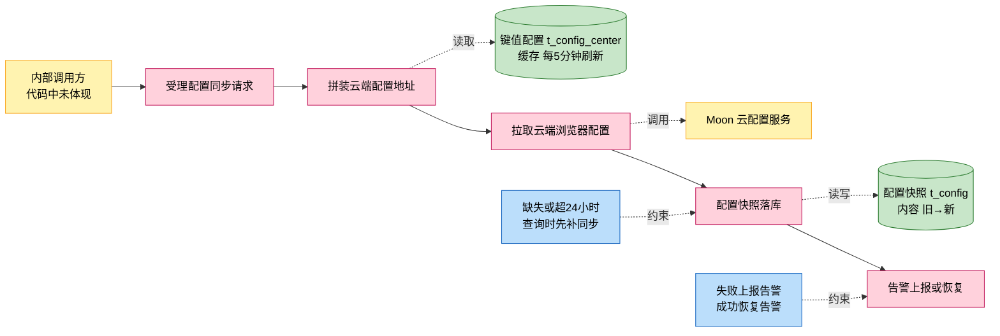
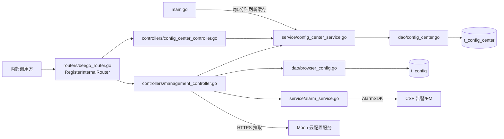
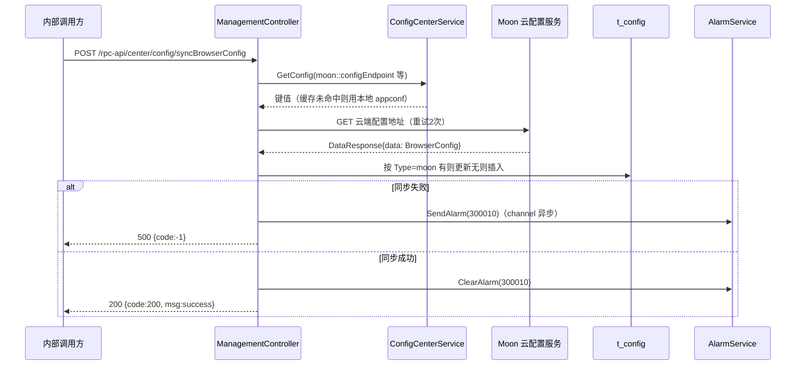
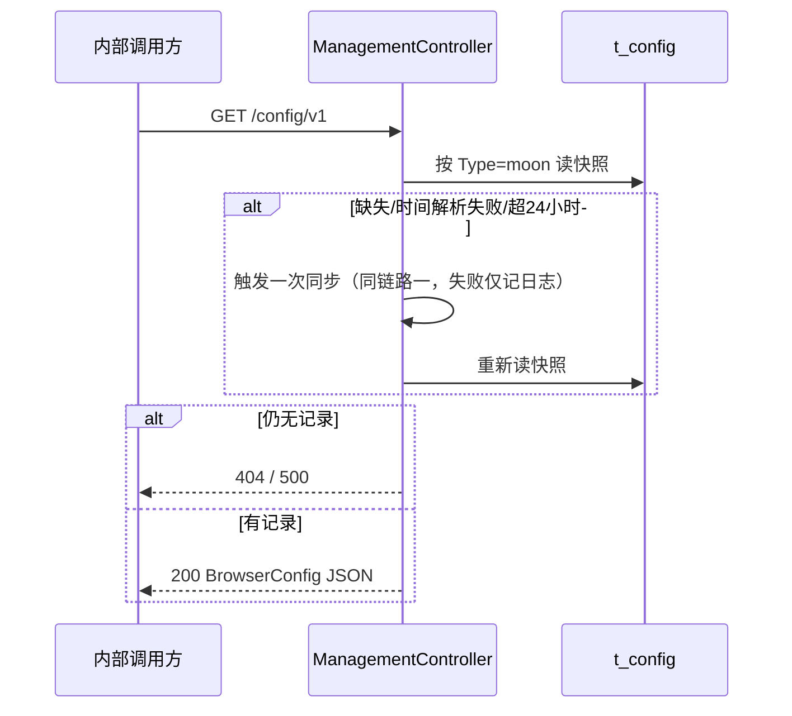
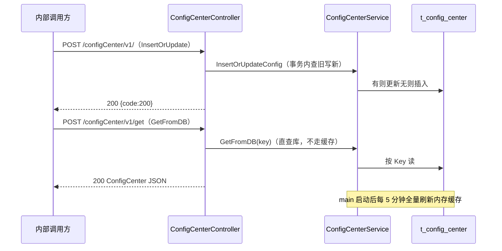

# 配置管理

> 功能域概述：从 Moon 云配置服务拉取浏览器配置并落库为本地快照，同时提供键值配置的读写与定时缓存刷新。
> 接口数：4（外部 0 / 内部 4）　出向调用：2　核心模块：controllers, service, dao, common/https

## 1. 功能故事（多彩建模）

实现逻辑速览（每句 ≤30 字）：

收到同步请求后从云端拉取浏览器配置，落库为本地快照。
同步失败上报告警，成功则恢复告警。
查询时配置缺失或超 24 小时会先补同步。

术语表：

| 术语 | 人话解释 | 出处 |
|---|---|---|
| Moon（沐恩） | 外部云配置服务，浏览器配置的来源端，地址由 moon:: 系列配置项指定 | src/controllers/management_controller.go、src/common/https/client.go |
| BrowserConfig | 浏览器配置总集，含路由 APP、Chrome 参数、URL 三类清单 | src/controllers/management_controller.go |
| t_config | 浏览器配置快照表，按 Type=moon 单行存储 JSON 全文 | src/models/db/browser_config.go |
| t_config_center | 键值配置表，存 key/value/describe/enable | src/models/db/config_center.go |
| 告警 300010 | 浏览器配置同步失败的告警 ID，同步成功即恢复 | src/service/alarm_service.go |
| FMService | 故障管理微服务，进程启动时用于清理本机历史告警 | src/service/alarm_service.go |
| 懒同步 | 查询配置时发现缺失或超 24 小时，先触发一次同步再返回 | src/controllers/management_controller.go |

## 2. 模块划分

| 模块 | 承载功能（引用文件） |
|---|---|
| controllers/management_controller.go | 浏览器配置同步与查询入口、云端地址拼装、快照落库、告警联动（src/controllers/management_controller.go） |
| controllers/config_center_controller.go | 键值配置写入与查询入口、key 非空校验（src/controllers/config_center_controller.go） |
| service/config_center_service.go | 键值配置事务写库、内存缓存、5 分钟定时全量刷新（src/service/config_center_service.go） |
| service/alarm_service.go | 告警 300010 异步上报/恢复、10 分钟抑制、启动清历史告警（src/service/alarm_service.go） |
| dao/browser_config.go、dao/config_center.go | t_config 与 t_config_center 的 ORM 读写（src/dao/browser_config.go、src/dao/config_center.go、src/dao/base_dao.go） |
| common/https | 出向 HTTP 客户端与请求构建器（src/common/https/client.go、src/common/https/builder.go） |

## 3. 接口清单

| 接口 | 路径/入口（含注册处） | 请求结构 | 响应结构 | 状态 |
|---|---|---|---|---|
| SyncBrowserConfig | POST /rpc-api/center/config/syncBrowserConfig；入口 src/controllers/management_controller.go；注册 src/routers/beego_router.go（仅内部端口） | 无请求体（仓内 SyncBrowserConfigRequest 定义未被该接口引用，src/models/req/request_entity.go） | BaseResponse（src/models/resp/base.go）：{code, msg} | 在用 |
| ListConfig | GET /config/v1；入口 src/controllers/management_controller.go；注册 src/routers/beego_router.go（仅内部端口） | 无请求体 | BrowserConfig JSON（src/controllers/management_controller.go）：{routeAppConfigList, chromeConfigList, urlConfigList} | 在用 |
| InsertOrUpdate | POST /configCenter/v1/；入口 src/controllers/config_center_controller.go；注册 src/routers/beego_router.go（仅内部端口） | db.ConfigCenter（src/models/db/config_center.go）：{key, value, describe, enable}，key 必填 | BaseResponse：{code, msg} | 在用 |
| GetFromDB | POST /configCenter/v1/get；入口 src/controllers/config_center_controller.go；注册 src/routers/beego_router.go（仅内部端口） | db.ConfigCenter：{key}，key 必填 | db.ConfigCenter JSON：{key, value, describe, enable}；查不到返回空结构 | 在用 |
| （出向）Moon 云配置拉取 | GET {moon::configEndpoint 或 moon::httpsConfigEndpoint}（src/controllers/management_controller.go） | 无请求体；重试 2 次、客户端超时 240s（src/common/https/client.go） | DataResponse{data: BrowserConfig}（src/models/resp/response_entity.go）；HTTP 2xx 视为成功 | 在用 |
| （出向）CSP 告警上报/恢复（300010） | AlarmSDK SendAlarm，事件经 channel 异步发送（src/service/alarm_service.go） | 告警事件 {alarmId, EventMessage, 上报/恢复类型} | 上报失败重试 2 次、间隔 10s；同 ID 10 分钟内抑制 | 在用 |

## 4. 关键数据结构

| 结构 | 定义位置 | 关键字段（含义+约束） |
|---|---|---|
| Config（t_config） | src/models/db/browser_config.go | Type（配置类型，固定 moon，查询键）；Content（配置 JSON 全文，text 类型）；UpdatedAt（懒同步判断依据，超 24h 触发同步） |
| ConfigCenter（t_config_center） | src/models/db/config_center.go | Key（配置键，接口必填，查询/更新键）；Value（配置值）；Describe（描述）；Enable（启用标志）；ID 不对外（json:"-"） |
| BrowserConfig | src/controllers/management_controller.go | RouteAPPConfigList（路由 APP 清单，omitempty）；ChromeConfigList（Chrome 参数清单）；URLConfigs（URL 清单）；落库前整体序列化为 JSON |
| RouterAPPConfig | src/models/db/browser_config.go | Manufacturer/Model（厂商型号）；Type/Mode（类型与模式，int）；Name/Description（名称描述） |
| ChromeConfig | src/models/db/browser_config.go | Manufacturer/Model/Country（适配维度）；AppFrameRate/AppBitRate/SampleRate 等（帧率码率采样参数）；Resolution/FFCode（分辨率与编码） |
| URLConfig | src/models/db/browser_config.go | NodeIdent/APPType（节点与应用类型）；URL/AppID（访问地址）；IsVideoType/IsWebType/IsShortType（类型标志）；UserAgent |
| AlarmEvent | src/service/alarm_service.go | AlarmID（本功能固定 300010）；EventMessage（事件信息）；Type（上报 GenerateAlarm / 恢复 ClearAlarm） |

## 5. 调用关系

链路一：浏览器配置同步（手动触发与懒同步共用同一实现）：

链路二：浏览器配置查询（含懒同步）：

链路三：键值配置读写与缓存刷新：

关键分支与异步环节（各一句，带证据文件）：

- 云端地址优先取配置中心键值，缺失再回退本地 appconf 的 moon:: 配置项（src/controllers/management_controller.go）
- enableHttps=true 时改用沐恩证书客户端拉配置（src/controllers/management_controller.go、src/common/https/client.go）
- 懒同步失败仅记日志，查询仍返回库中旧快照（src/controllers/management_controller.go）
- 告警经带缓冲 channel 异步发送，入队超时 5s 丢弃；同 ID 10 分钟内抑制（src/service/alarm_service.go）
- 键值写库走事务，但内存缓存要等下一次 5 分钟刷新才生效（src/service/config_center_service.go）
- 进程启动时异步清理 FM 上本机的历史 300010 告警（src/main.go、src/service/alarm_service.go）
- 本功能不调用 BrowserGW，出向仅 Moon 配置服务与 CSP 告警（src/controllers/management_controller.go、src/service/alarm_service.go）

## 6. 框架引用

| 基础框架 | 框架文档 | 本功能中的用途（引用文件） |
|---|---|---|
| Beego Web 路由/Controller | [rpc-beego-web.md](../framework-usage/rpc-beego-web.md) | 内部路由注册与请求处理（src/routers/beego_router.go、src/controllers/management_controller.go、src/controllers/config_center_controller.go） |
| Beego ORM | [storage-beego-orm.md](../framework-usage/storage-beego-orm.md) | t_config/t_config_center 读写与事务（src/dao/base_dao.go、src/dao/browser_config.go、src/dao/config_center.go） |
| HTTP Client Builder | [rpc-http-client-builder.md](../framework-usage/rpc-http-client-builder.md) | 拉取 Moon 云配置，重试与 2xx 判定（src/common/https/builder.go、src/controllers/management_controller.go） |
| AppConf 配置 | [config-appconf-flagutil-configcenter.md](../framework-usage/config-appconf-flagutil-configcenter.md) | 读取 moon:: 系列本地配置项（src/controllers/management_controller.go、src/common/conf/config.go） |
| 日志 Lager | [log-lager-auditlog-event.md](../framework-usage/log-lager-auditlog-event.md) | 同步与告警全过程运行日志（src/controllers/management_controller.go、src/service/config_center_service.go） |
| CSP 监控告警 | [metrics-csp-monitor-alarm.md](../framework-usage/metrics-csp-monitor-alarm.md) | AlarmSDK 上报/恢复告警 300010（src/service/alarm_service.go） |
| 协程并发 | [concurrency-goroutine.md](../framework-usage/concurrency-goroutine.md) | 配置缓存刷新协程与告警处理协程（src/service/config_center_service.go、src/service/alarm_service.go） |
| 定时器 | [schedule-timer.md](../framework-usage/schedule-timer.md) | 5 分钟 ticker 刷新缓存、24 小时同步间隔判断（src/service/config_center_service.go、src/controllers/management_controller.go） |
| JSON 编解码 | [codec-json-yaml.md](../framework-usage/codec-json-yaml.md) | 配置快照 JSON 序列化落库与解析（src/controllers/management_controller.go） |

## 7. AI 编码指南

- 改路由只动各 Controller 的 RouteInfo()，注册自动生效（src/routers/beego_router.go）
- 云端地址有两级回退：配置中心键值优先于本地 appconf（src/controllers/management_controller.go）
- 同步失败必须配套 300010 告警上报与恢复（src/service/alarm_service.go）
- 键值写库走事务，缓存生效最长延迟 5 分钟（src/service/config_center_service.go）
- 出向拉配置复用 builder 重试与 2xx 判定约定（src/common/https/builder.go）
