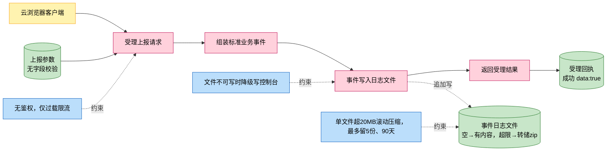
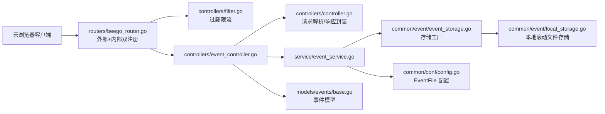
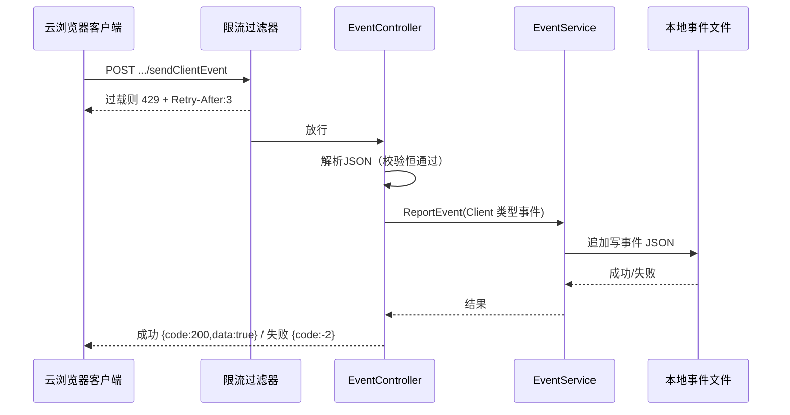
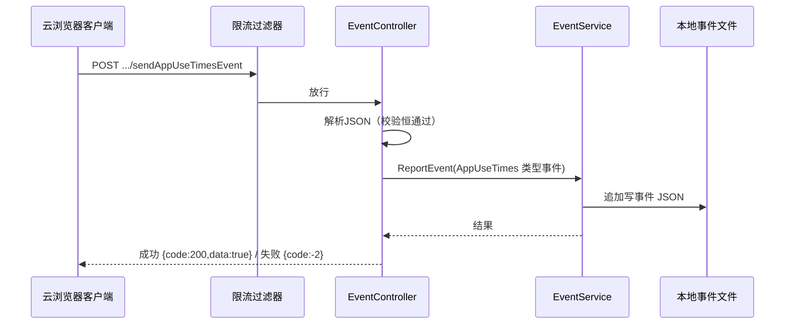

# 事件上报

> 功能域概述：接收云浏览器客户端上报的异常事件与应用使用时长事件，组装为标准业务事件后写入本地滚动事件日志文件留痕。
> 接口数：2（外部 2 / 内部 2，同一路由双监听同注册）　核心模块：controllers, service, common/event, models

## 1. 功能故事（多彩建模）

实现逻辑速览（1~3 句，每句 ≤30 字，业务语言，禁文件名/函数名/行号）：

客户端上报事件，服务端不校验字段直接受理。请求参数被组装成带类型描述的标准事件。事件以 JSON 追加进本地日志文件，超限自动滚动压缩。

术语表：

| 术语 | 人话解释 | 出处 |
|---|---|---|
| HSMan | 终端设备厂商名（handset manufacturer） | src/models/req/event_request.go |
| HSType | 终端设备机型 | src/models/req/event_request.go |
| IMEI | 国际移动设备识别码，标识一台物理终端 | src/models/req/event_request.go |
| IMSI | 国际移动用户识别码，标识一张 SIM 卡用户 | src/models/req/event_request.go |
| AppUseTimes | 应用使用时长，客户端统计某应用用了多久后上报 | src/models/events/base.go |
| 事件（Event） | 带类型、描述、触发者、时间的业务留痕记录，JSON 落盘 | src/models/events/base.go |
| 云浏览器（cloud-browser） | 事件归属对象，本仓服务承载的业务名 | src/models/events/base.go |
| localAuditComponent | 事件存储在工厂里的注册名，当前唯一实现是本地文件存储 | src/service/event_service.go |
| EventFile | 事件日志文件路径配置项，为空时事件打到标准输出 | src/common/conf/config.go |
| 过载限流 | 请求量超阈值时直接拒绝并提示稍后重试的全局拦截 | src/controllers/filter.go |

## 2. 模块划分

| 模块 | 承载功能（引用文件） |
|---|---|
| routers/beego_router.go | 将两个事件接口同时注册到外部与内部两个监听实例，并挂载全局限流过滤器（src/routers/beego_router.go） |
| controllers/event_controller.go | 路由表声明、请求受理、事件组装、响应封装（src/controllers/event_controller.go） |
| controllers/controller.go | 请求体 JSON 解析与校验入口、成功/失败响应写回（src/controllers/controller.go） |
| controllers/filter.go | 全局限流过滤器，过载时返回 429（src/controllers/filter.go） |
| service/event_service.go | 事件存储工厂初始化与存储选取，转调存储落盘（src/service/event_service.go） |
| common/event | 存储工厂注册/获取与本地文件存储实现：追加写、超限滚动压缩、定期清理（src/common/event/event_storage.go、src/common/event/local_storage.go） |
| models/events/base.go | 事件类型枚举、类型描述表、事件通用结构与两种事件数据载荷（src/models/events/base.go） |
| models/req/event_request.go | 两个上报接口的请求结构，校验恒通过（src/models/req/event_request.go） |

## 3. 接口清单

| 接口 | 路径/入口（含注册处） | 请求结构 | 响应结构 | 状态 |
|---|---|---|---|---|
| SendClientEvent（上报客户端异常事件） | POST /app-api/center/public/client/sendClientEvent；入口 src/controllers/event_controller.go；注册 src/routers/beego_router.go（外部与内部双注册） | ClientEventRequest（src/models/req/event_request.go）：{hsman, hstype, appType, imei, imsi, type}，Validate 恒通过无必填约束 | DataResponse（src/models/resp/response_entity.go）：{code, msg, data}，成功 code=200、msg="record success"、data=true；失败 code=-2 | 在用（27.0 起注入终端鉴权，鉴权失败 code=401，见 [feature-terminal-auth.md](feature-terminal-auth.md)） |
| SendAppUseTimesEvent（上报应用使用时长事件） | POST /app-api/center/public/client/sendAppUseTimesEvent；入口 src/controllers/event_controller.go；注册 src/routers/beego_router.go（外部与内部双注册） | AppUseTimesEvent（src/models/req/event_request.go）：{useTimes, hsman, hstype, exttype, appType, appId, scheight, scwidth, imei, imsi, playMode}，Validate 恒通过无必填约束 | DataResponse（src/models/resp/response_entity.go）：同上约定 | 在用（27.0 起注入终端鉴权，鉴权失败 code=401） |

本功能无出向调用：事件仅写本地文件，不调用任何外部服务（src/common/event/local_storage.go）。

## 4. 关键数据结构

| 结构 | 定义位置 | 关键字段（含义+约束） |
|---|---|---|
| ClientEventRequest | src/models/req/event_request.go | hsman（厂商）、hstype（机型）、appType（应用类型）、imei、imsi、type（事件类型）；Validate 恒返回 nil，无必填 |
| AppUseTimesEvent（请求） | src/models/req/event_request.go | useTimes（使用时长）、appId（应用标识）、scwidth/scheight（屏幕宽高）、playMode（播放模式）等 11 字段；Validate 恒返回 nil |
| Info（标准事件） | src/models/events/base.go | Event（事件类型串）、EventDesc（中文描述）、EventTrigger（触发者，固定 client）、Service（固定 GIDS）、EventTime（yyyy-MM-dd HH:mm:ss）、Object（固定 cloud-browser）、EventData（载荷） |
| ClientEventData | src/models/events/base.go | 与 ClientEventRequest 六字段一一对应，作为 Client 类型事件的载荷 |
| AppUseTimesEvent（载荷） | src/models/events/base.go | 与请求同名字段，作为 AppUseTimes 类型事件的载荷 |
| DataResponse | src/models/resp/response_entity.go | code（200 成功 / -2 客户端失败）、msg、data（成功固定 true） |

## 5. 调用关系

主链路一：上报客户端异常事件

主链路二：上报应用使用时长事件

关键分支与异步环节（各一句，带证据文件）：

- 请求体读取或 JSON 解析失败返回 HTTP 400、code=-2（src/controllers/controller.go、src/common/constants/retcode/retcode.go）
- 两个请求结构 Validate 恒返回 nil，字段为空也照常受理落盘（src/models/req/event_request.go）
- 事件写文件失败同样返回 code=-2 告知客户端（src/controllers/event_controller.go）
- 事件文件路径未配置或创建失败时降级写到标准输出，不报错（src/common/event/local_storage.go）
- 异步：存储创建时起一个每小时执行的协程清理过期转储文件（src/common/event/local_storage.go）
- 事件路径无任何鉴权过滤器，拒绝码只有限流的 429；401 常量在仓内定义但无任何代码引用（src/controllers/filter.go、src/common/constants/retcode/retcode.go）
- 明确不走：不落数据库、不发 HTTP/RPC 出向调用、不写审计日志通道（src/service/event_service.go、src/common/event/local_storage.go）

## 6. 框架引用

| 基础框架 | 框架文档 | 本功能中的用途（引用文件） |
|---|---|---|
| Beego Web 路由/Controller | [rpc-beego-web.md](../framework-usage/rpc-beego-web.md) | 双监听路由注册与请求处理（src/routers/beego_router.go、src/controllers/event_controller.go、src/controllers/controller.go） |
| 日志体系（auditlog 事件存储） | [log-lager-auditlog-event.md](../framework-usage/log-lager-auditlog-event.md) | 事件经 auditlog 引擎写入本地滚动文件（src/common/event/local_storage.go、src/service/event_service.go） |
| 配置（flagutil） | [config-appconf-flagutil-configcenter.md](../framework-usage/config-appconf-flagutil-configcenter.md) | 事件文件路径取自 Logger.EventFile 配置（src/common/conf/config.go、src/service/event_service.go） |
| 协程与单例 | [concurrency-goroutine.md](../framework-usage/concurrency-goroutine.md) | sync.Once 初始化存储工厂、每小时清理协程（src/service/event_service.go、src/common/event/local_storage.go） |
| 定时调度 | [schedule-timer.md](../framework-usage/schedule-timer.md) | time.Tick 每小时例行清理转储文件（src/common/event/local_storage.go） |
| JSON 编解码 | [codec-json-yaml.md](../framework-usage/codec-json-yaml.md) | 请求体解析与事件序列化落盘（src/controllers/controller.go、src/models/events/base.go） |

## 7. AI 编码指南

- 新增事件接口只在路由表加映射即双端生效（src/controllers/event_controller.go）
- 新事件类型先加枚举与描述表再组装（src/models/events/base.go）
- 事件写盘失败要对客户端返回 code=-2（src/controllers/event_controller.go）
- 事件文件路径走 log.event 配置，空则降级 stdout（src/common/conf/config.go）
- 勿给事件路径加鉴权过滤器，现状仅全局限流（src/controllers/filter.go）
