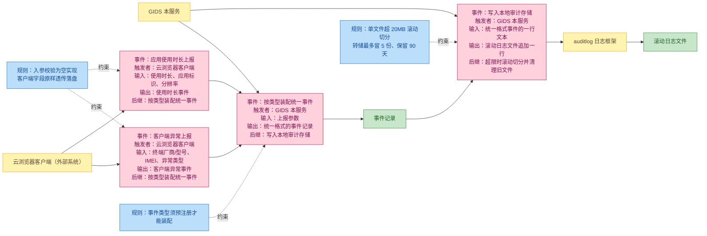
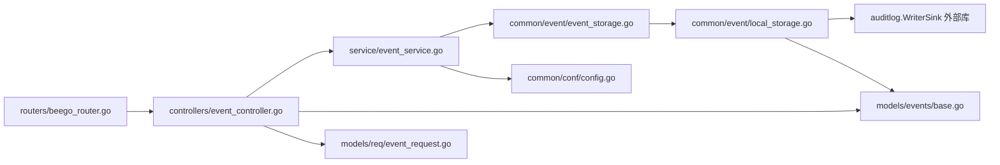
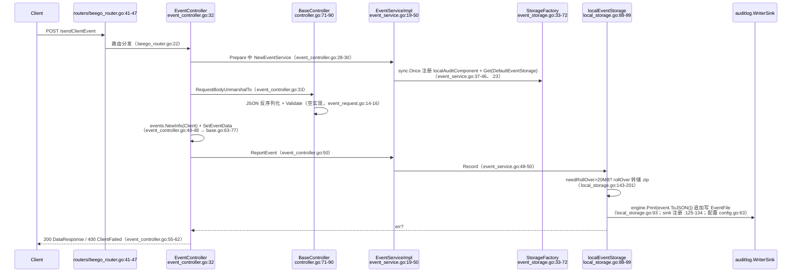

# 事件上报

> 功能域概述：接收云浏览器客户端上报的客户端异常事件与应用使用时长事件，封装为统一事件信封后经事件存储工厂写入本地事件日志文件（auditlog 组件落盘，不对外转发）。
> 接口数：2（外部 2 / 内部 2，同一 Controller 双侧注册）　核心模块：controllers.EventController, service.EventService, common/event（Storage/StorageFactory + localEventStorage）

## 1. 功能故事（多彩建模）

### 术语表

| 术语 | 人话解释 | 出处 |
| --- | --- | --- |
| 事件信封（events.Info） | 所有事件共用的外层包装：事件名、时间、来源服务固定为 GIDS，载荷挂在 EventData 上 | src/models/events/base.go:53-73 |
| 事件描述表（eventTypeMap） | 事件类型到名称/描述/触发方的登记表，新类型必须先登记才能被装配 | src/models/events/base.go:22-51 |
| 事件存储工厂（StorageFactory） | 按字符串名字挑选存储实现的注册表，当前只注册了本地文件这一种 | src/common/event/event_storage.go:21-72 |
| 本地审计存储（localEventStorage） | 把事件逐行追加写进本地日志文件的实现，文件不可用时降级打到控制台 | src/common/event/local_storage.go:40-86 |
| 滚动切分（rollOver） | 单文件超过 20MB 时把旧内容压缩成 zip 存档、清空原文件继续写 | src/common/event/local_storage.go:143-201 |
| 转储文件清理（FileDeleter） | 定期删掉过期存档：最多留 5 份、最多保留 90 天 | src/common/event/local_storage.go:246-322 |
| 事件文件路径（EventFile） | 启动参数指定事件日志写到哪个文件 | src/common/conf/config.go:63 |
| 双侧注册 | 同一组接口同时挂在对外端口和对内 127.0.0.1:9090 端口上 | src/routers/beego_router.go:22、:32 |
| 空校验（Validate） | 请求结构自带的校验方法是空函数，收到什么字段就原样落盘 | src/models/req/event_request.go:14-16、:32-34 |
| 事件是否转发到外部审计服务 | 代码中未体现：仅见本地文件/控制台两种去处 | src/common/event/local_storage.go:65、:72、:132 |

## 2. 模块划分

| 模块/包 | 承载功能 | 证据 |
| --- | --- | --- |
| routers | 双侧（外部+内部 127.0.0.1:9090）注册 EventController | src/routers/beego_router.go:22、:32 |
| controllers | HTTP 入口：解析请求体、组装事件、调用 EventService | src/controllers/event_controller.go:14-101 |
| service | 业务门面：初始化存储工厂、选取存储实现、透传 Record | src/service/event_service.go:15-50 |
| common/event | 存储抽象与工厂 + 本地文件存储与转储清理 | src/common/event/event_storage.go:16-72；src/common/event/local_storage.go:40-322 |
| models/events | 事件类型枚举、描述表、统一信封 Info 与载荷结构 | src/models/events/base.go:14-130 |
| models/req | 上报请求体结构与校验（空实现） | src/models/req/event_request.go:5-34 |

## 3. 接口清单

### HTTP 接口

| 接口 | 路径/入口 | 请求结构 | 响应结构 | 状态 |
| --- | --- | --- | --- | --- |
| SendClientEvent | POST /app-api/center/public/client/sendClientEvent；路由 src/controllers/event_controller.go:22；注册 src/routers/beego_router.go:22、:32；入口 src/controllers/event_controller.go:32-63 | req.ClientEventRequest（src/models/req/event_request.go:5-16） | resp.DataResponse{Code, Message:"record success", Data:true}（src/controllers/event_controller.go:56-61）；失败 400 + retcode.ClientFailed（:34-37、:50-53） | 在用 |
| SendAppUseTimesEvent | POST /app-api/center/public/client/sendAppUseTimesEvent；路由 src/controllers/event_controller.go:23；注册 src/routers/beego_router.go:22、:32；入口 src/controllers/event_controller.go:65-101 | req.AppUseTimesEvent（src/models/req/event_request.go:18-34） | 同上（src/controllers/event_controller.go:94-100） | 在用 |

### 语言级内部接口

| 接口 | 定义位置 | 实现 | 选择机制 |
| --- | --- | --- | --- |
| EventService（ReportEvent） | src/service/event_service.go:15-17 | 唯一实现 EventServiceImpl（src/service/event_service.go:33-50），Record 透传（:48-50）；登录链路亦复用（src/controllers/login_controller.go:201、src/controllers/exlogin_controller.go:153） | 无选择逻辑，Controller.Prepare 每次 NewEventService（src/controllers/event_controller.go:28-30） |
| event.Storage | src/common/event/event_storage.go:16-18 | 仓内唯一实现 localEventStorage（src/common/event/local_storage.go:40-47，构造 :50-86） | 见下 |
| event.StorageFactory | src/common/event/event_storage.go:21-26（实现 :50-72，单例 :33-48） | map+RWMutex 注册表，按 location 字符串键 Get/Register | sync.Once 初始化时仅注册键 "localAuditComponent"（src/service/event_service.go:39-46）；取用键写死 DefaultEventStorage（src/service/event_service.go:23），取失败同键兜底（:24-27），无配置化，恒为本地文件存储 |

## 4. 关键数据结构

| 结构 | 定义位置 | 关键字段（含义+约束） |
| --- | --- | --- |
| events.Info | src/models/events/base.go:53-61 | EventDesc（内嵌事件名/描述/触发方，:16-20）；Service 固定 "GIDS"（src/common/constants/base.go:9，赋值 src/models/events/base.go:66）；EventTime 格式 "2006-01-02 15:04:05"（:67）；Object 固定 "cloud-browser"（:30、:70）；Env/Hostname 恒为空串（:68-69）；EventData interface{} 承载载荷（:60） |
| events.EventType / eventTypeMap | src/models/events/base.go:14、:22-51 | 四类事件；本域用 Client="browser_client_error"（:25）、AppUseTimes="browser_client_app_use_times"（:26） |
| events.ClientEventData | src/models/events/base.go:109-116 | HSMan/HSType、AppType、IMEI/IMSI、Type（异常类型）；全字符串无必填约束 |
| events.AppUseTimesEvent | src/models/events/base.go:118-130 | UseTimes（时长，字符串）、AppId、EXTType（json tag "exttype"，:122）、SCWidth/SCHeight、PlayMode、IMEI/IMSI；无约束 |
| req.ClientEventRequest | src/models/req/event_request.go:5-16 | 同 ClientEventData；Validate 空实现恒 nil（:14-16） |
| req.AppUseTimesEvent | src/models/req/event_request.go:18-34 | 同 AppUseTimesEvent；Validate 空实现（:32-34） |
| event.FileDeleter | src/common/event/local_storage.go:246-248 | DayBasedDeleter 保留 90 天（FileRemainDay :28，实现 :250-298）；CountBasedDeleter 最多 5 个（FileMaxNum :27，实现 :300-322） |

## 5. 调用关系

以 SendClientEvent 为代表（SendAppUseTimesEvent 同构，src/controllers/event_controller.go:65-101）：

- 无外发：auditlog 仅作 WriterSink 写本地文件/stdout，无向事件服务转发的 HTTP 逻辑（src/common/event/local_storage.go:65、:72、:132）。
- 同步逐条写入，无批量/异步队列/重试；Record 失败仅记日志并返回 err（src/common/event/local_storage.go:93-96）。
- 仅清理异步：goroutine 每小时删过期转储 zip，rollOver 末尾同步再清一次（src/common/event/local_storage.go:77-84、:200）。

## 6. AI 编码指南

- 新事件类型注册eventTypeMap并复用NewInfo（src/models/events/base.go:34-51、:63-73）。
- 新存储实现须同步改注册键与取用键（src/service/event_service.go:23-27、:39-46）。
- 请求Validate为空，校验在Service层补（src/models/req/event_request.go:14-16、:32-34）。
- Record/rollOver无锁，勿加并发状态（src/common/event/local_storage.go:88-99、:157-201）。
