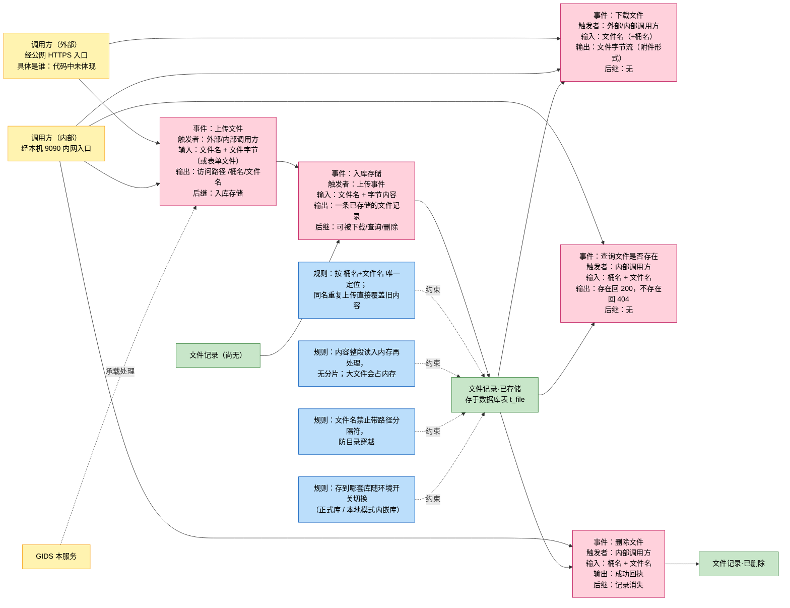
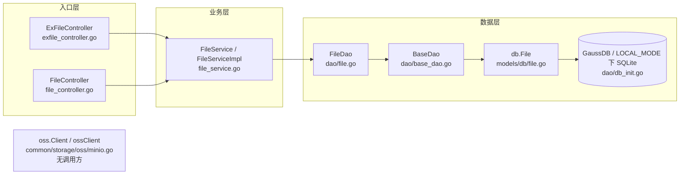
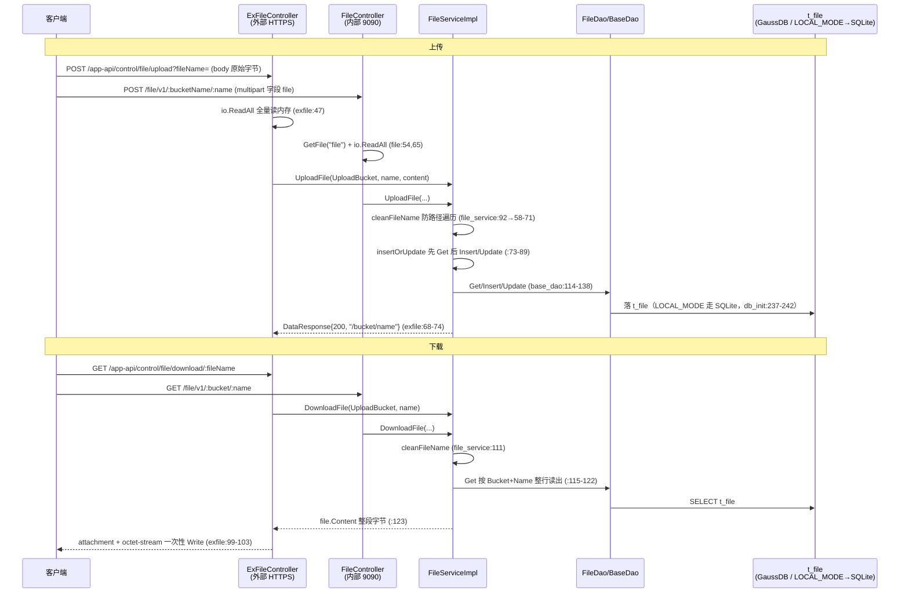

# 文件管理

> 功能域概述：提供文件上传、下载、存在性查询与删除能力；实际存储为关系数据库 `t_file`（bytea 整存整取），minio 封装存在但未被使用。
> 接口数：8（外部 2 / 内部 6，其中 2 条内部路由与外部同路径重复注册）　核心模块：controllers（ExFileController/FileController）、service（FileServiceImpl）、dao（FileDao + BaseDao）

## 1. 功能故事（多彩建模）

### 术语表

| 术语 | 人话解释 | 出处 |
| --- | --- | --- |
| bucket（桶） | 文件的逻辑分组名，本域上传时写死为 `upload-bucket`，并非真正的对象存储桶 | src/common/constants/base.go:13；src/controllers/file_controller.go:52-53 |
| t_file | 存文件的数据库表，一行 = 一个文件（元信息 + 全部字节内容） | src/models/db/file.go:25 |
| bytea 整存 | 文件内容作为一个二进制大字段整体存进数据库行，读写都整段进行，不支持分片 | src/models/db/file.go:19；src/service/file_service.go:99、:123 |
| OSS | 日志报错文案里的叫法，容易误导；文件实际并未走对象存储，minio 封装全仓无人调用 | src/service/file_service.go:104-105、:120-121；src/common/storage/oss/minio.go:20-26 |
| LOCAL_MODE | 环境开关：置 true 时数据库换成本机内嵌 SQLite，文件随之落到本地库，代码路径不变 | src/dao/db_init.go:236-242 |
| cleanFileName | 文件名清洗：去掉路径跳转并拒绝含 `/`、`\` 的名字，防目录穿越 | src/service/file_service.go:58-71 |
| multipart 表单上传 | 内部上传接口的另一种收文件方式：从表单字段 `file` 取文件 | src/controllers/file_controller.go:54 |
| 外部/内部双入口 | 同一套上传下载逻辑注册了两遍：公网 HTTPS 一份、本机 9090 内网一份，代码重复 | src/controllers/exfile_controller.go:24-28；src/controllers/file_controller.go:23-31 |

## 2. 模块划分

| 模块 | 承载功能（文件:行号） |
| --- | --- |
| ExFileController | 外部 HTTPS 上传/下载入口与路由注册（src/controllers/exfile_controller.go:22-29、:35、:77） |
| FileController | 内部 127.0.0.1:9090 入口，同路径 2 接口 + bucket 维度 4 接口（src/controllers/file_controller.go:21-33、:51、:80、:35、:181） |
| FileServiceImpl | 文件名清洗防路径遍历 cleanFileName（src/service/file_service.go:58-71）、先查后写 insertOrUpdate（:73-89）、四大业务方法（:41、:45、:91、:110） |
| FileDao / BaseDao | 实体绑定 NewFileDao（src/dao/file.go:22-28）、Exist 原生 SQL 计数（:13-20）、通用 ORM 增删改查（src/dao/base_dao.go:114-142） |
| models/db.File | `t_file` 表结构与 ByteArrayField 自定义字段类型（src/models/db/file.go:15-56） |
| common/storage/oss | minio Client 接口与 ossClient 实现，全仓无 import、未被文件域调用（src/common/storage/oss/minio.go:20-26、:50-117） |

## 3. 接口清单

### HTTP 接口

| 接口 | 路径/入口（含注册处） | 请求结构 | 响应结构 | 状态 |
| --- | --- | --- | --- | --- |
| 上传文件（外部） | POST /app-api/control/file/upload；注册 src/routers/beego_router.go:23、:44；入口 src/controllers/exfile_controller.go:25、:35 | query `fileName` + body 原始字节（:37、:47） | DataResponse{Code:200, Data:"/{bucket}/{name}"}（:68-74；resp src/models/resp/response_entity.go:6-9） | 在用 |
| 下载文件（外部） | GET /app-api/control/file/download/:fileName；注册 src/routers/beego_router.go:23、:45；入口 src/controllers/exfile_controller.go:26、:77 | path `:fileName`（:78） | 二进制流，头 Content-Disposition: attachment + application/octet-stream（:99-103）；失败 BaseResponse | 在用 |
| 上传文件（内部，同路径） | POST /app-api/control/file/upload；注册 src/routers/beego_router.go:33、:44；入口 src/controllers/file_controller.go:24、:103 | query `fileName` + body 原始字节（:108、:115） | 同外部 DataResponse（:136-142） | 在用（与外部重复实现） |
| 下载文件（内部，同路径） | GET /app-api/control/file/download/:fileName；注册 src/routers/beego_router.go:33、:45；入口 src/controllers/file_controller.go:25、:145 | path `:fileName`（:146） | 同外部二进制流（:167-171） | 在用（与外部重复实现） |
| 按 bucket 上传 | POST /file/v1/:bucketName/:name；注册 src/routers/beego_router.go:36；入口 src/controllers/file_controller.go:28、:51 | path bucket/name 固定为 upload-bucket（:52-53）+ multipart 表单字段 `file`（:54） | DataResponse{Code:200, Data:"/{bucket}/{name}"}（:70-76） | 在用（内部） |
| 按 bucket 下载 | GET /file/v1/:bucket/:name；注册 src/routers/beego_router.go:35；入口 src/controllers/file_controller.go:27、:80 | path bucket/name（:81-82） | 二进制流 + attachment 头（:88-95） | 在用（内部） |
| 存在性查询 | GET /file/v1/:bucket/:name/exist；注册 src/routers/beego_router.go:37；入口 src/controllers/file_controller.go:29、:35 | path bucket/name（:36-37） | 存在 200 空 body，否则 404（:44-48；BaseController.NotFound src/controllers/controller.go:120） | 在用（内部） |
| 删除文件 | DELETE /file/v1/:bucketName/:fileName；注册 src/routers/beego_router.go:38；入口 src/controllers/file_controller.go:30、:181 | path bucket/fileName（:182-183） | DataResponse{Code:200}（:194-198） | 在用（内部） |

### 语言级内部接口

| 接口 | 定义位置 | 实现 | 选择机制 |
| --- | --- | --- | --- |
| service.FileService（UploadFile/DownloadFile/DeleteFile/Exist） | src/service/file_service.go:22-27 | 唯一实现 FileServiceImpl（:29、:37-39） | 无多实现；NewFileService() 直接构造（:31-35） |
| oss.Client（PutObject/EnsureBucket/IsOnline/DeleteObject/GetObject） | src/common/storage/oss/minio.go:20-26 | 唯一实现 ossClient（:50-117） | 包级单例 Init/Instance（:28-48）；但全仓无 `GIDS/common/storage/oss` import，属无调用方预置代码，不存在「本地 vs minio」后端选择逻辑 |

## 4. 关键数据结构

| 结构 | 定义位置 | 关键字段（含义+约束） |
| --- | --- | --- |
| db.File | src/models/db/file.go:15-26 | ID 自增主键；Bucket 桶名（上传固定 `upload-bucket`，src/common/constants/base.go:13）；Name 文件名（经 cleanFileName 清洗，禁含 `/`、`\`，src/service/file_service.go:65-68）；Content 文件字节 bytea；Size 字节数；CreatedAt 字符串时间（file_service.go:83） |
| db.ByteArrayField | src/models/db/file.go:28-56 | []byte 自定义 ORM 字段：SetRaw 支持 []byte/string（:31-44），FieldType 报 TypeTextField（:51-53） |
| resp.BaseResponse | src/models/resp/base.go:6-9 | Code：200 成功 / -1 内部错 / -2 参数错（src/common/constants/retcode/retcode.go:7-9） |
| resp.DataResponse | src/models/resp/response_entity.go:6-9 | Data：上传成功返回 `/{bucket}/{name}`（src/service/file_service.go:107） |
| oss.PutObject / GetObjectOptions | src/common/storage/oss/minio.go:54-64 | BucketName、FileName、File io.Reader、Size（当前未被文件域调用） |

说明：文件域无 req 请求结构体，入参全部来自 query/path 参数或原始 body/multipart 表单。

## 5. 调用关系

关键分支：

- 全程同步、无队列/异步；唯一环境分支为 `LOCAL_MODE=true` 时改用嵌入式 SQLite（src/dao/db_init.go:236-242）。
- Exist 走唯一原生 SQL count（src/dao/file.go:15），存在返 200 空、否则 404（src/controllers/file_controller.go:44-48）。
- multipart 上传 `header == nil` 分支直接返 500（src/controllers/file_controller.go:60-64）；删除按 Bucket+Name 删行（src/service/file_service.go:50-54）。

## 6. AI 编码指南

- 存储只走 FileDao/t_file，勿引 oss。（src/service/file_service.go:42、:119；oss 无 import 方）
- 入库文件名必须过 cleanFileName 防路径遍历。（src/service/file_service.go:58-71、:92、:111、:46）
- 改上传/下载需同步内外两份重复 Controller。（src/controllers/exfile_controller.go:35、:77；file_controller.go:103、:145）
- 链路为整读整写非流式，引流式须评估 bytea 整存模型。（src/controllers/exfile_controller.go:47、:103；src/models/db/file.go:19）
- LOCAL_MODE 仅切换 DB 类型，代码路径不变。（src/dao/db_init.go:237-242）
