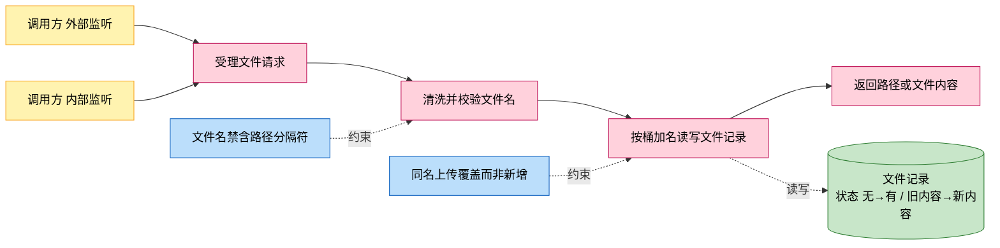
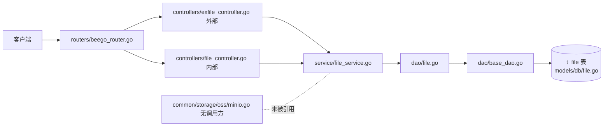
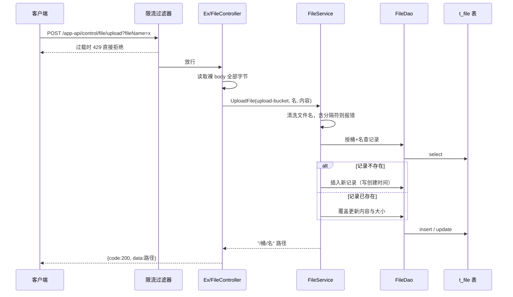
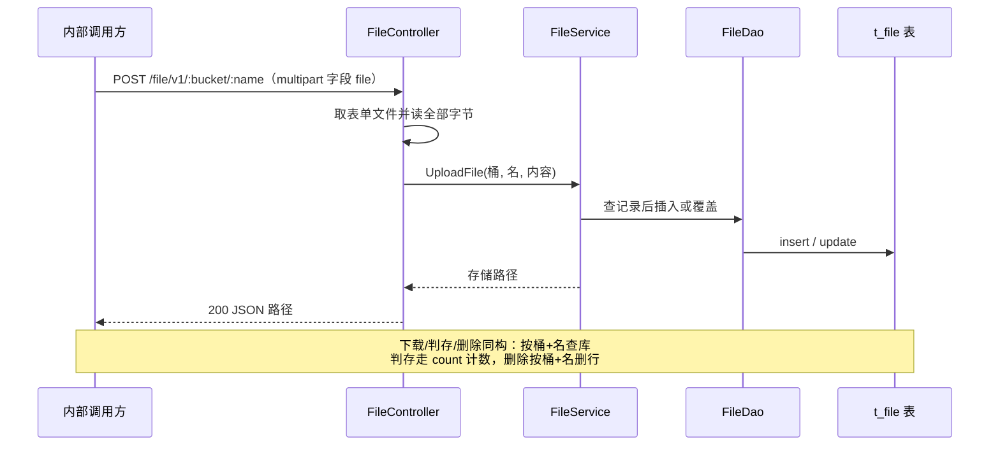

# 文件管理

> 功能域概述：提供文件的上传、下载、删除与存在性判断，文件内容以字节形式整体落入数据库表。
> 接口数：8（外部 2 / 内部 6）　核心模块：controllers, service, dao, models/db

## 1. 功能故事（多彩建模）

实现逻辑速览（1~3 句，每句 ≤30 字，业务语言，禁文件名/函数名/行号）：

收到文件请求后先清洗文件名，防路径穿越。
上传按桶名加文件名落库，同名则覆盖内容。
下载删除判存均按桶名加文件名查库。

术语表：

| 术语 | 人话解释 | 出处 |
|---|---|---|
| 桶（bucket） | 文件的逻辑分组名，类似目录命名空间 | src/common/constants/base.go |
| upload-bucket | /app-api 系列接口固定使用的桶名常量 | src/common/constants/base.go |
| t_file | 存文件内容的数据库表，内容以字节数组入库 | src/models/db/file.go |
| OSS | 日志报错文案里的对象存储称呼，实际并未接对象存储 | src/service/file_service.go |
| MinIO | 仓内封装的对象存储组件，当前无任何调用方 | src/common/storage/oss/minio.go |
| 路径穿越 | 文件名带目录分隔符越权读写他处文件的攻击手法 | src/service/file_service.go |
| 外部监听 | 对外 HTTPS 服务，仅暴露上传下载两个接口 | src/routers/beego_router.go |
| 内部监听 | 对内 HTTP 服务，另暴露 RESTful 增删查接口 | src/routers/beego_router.go |

## 2. 模块划分

| 模块 | 承载功能（引用文件） |
|---|---|
| controllers/exfile_controller.go | 外部监听入口：上传（query 传名+裸 body）、下载（src/controllers/exfile_controller.go） |
| controllers/file_controller.go | 内部监听入口：/app-api 上传下载 + /file/v1 RESTful 上传/下载/判存/删除（src/controllers/file_controller.go） |
| controllers/controller.go | BaseController 约定：取参、裸 body 读取、统一 JSON/错误响应（src/controllers/controller.go） |
| controllers/filter.go | 全局限流过滤器，过载返回 429（src/controllers/filter.go） |
| service/file_service.go | 文件名清洗防穿越、上传同名覆盖、下载删除判存编排（src/service/file_service.go） |
| dao/file.go + dao/base_dao.go | t_file 表增删改查与原生 SQL 计数（src/dao/file.go、src/dao/base_dao.go） |
| models/db/file.go | t_file 表结构与字节数组字段类型（src/models/db/file.go） |

## 3. 接口清单

| 接口 | 路径/入口（含注册处） | 请求结构 | 响应结构 | 状态 |
|---|---|---|---|---|
| HandleUpload（外部） | POST /app-api/control/file/upload；入口 src/controllers/exfile_controller.go；注册 src/routers/beego_router.go | query：fileName 必填；body：文件原始字节流，无大小校验 | DataResponse（src/models/resp/response_entity.go）：{code, msg, data=存储路径}；失败 code=-1/-2 | 在用 |
| HandleDownload（外部） | GET /app-api/control/file/download/:fileName；入口 src/controllers/exfile_controller.go；注册 src/routers/beego_router.go | path：fileName | 文件字节流，头 Content-Disposition/Content-Type=application/octet-stream；失败 JSON {code, msg} | 在用 |
| HandleUpload（内部） | POST /app-api/control/file/upload；入口 src/controllers/file_controller.go；注册 src/routers/beego_router.go | query：fileName 必填；body：文件原始字节流 | DataResponse：{code, msg, data=存储路径} | 在用 |
| HandleDownload（内部） | GET /app-api/control/file/download/:fileName；入口 src/controllers/file_controller.go；注册 src/routers/beego_router.go | path：fileName | 文件字节流 + 下载响应头 | 在用 |
| Upload（RESTful） | POST /file/v1/:bucketName/:name；入口 src/controllers/file_controller.go；注册 src/routers/beego_router.go | multipart 表单字段 file；path：bucketName、name | 200 JSON 字符串：存储路径 "/桶/名"；失败 500 {code, msg} | 在用 |
| Download（RESTful） | GET /file/v1/:bucket/:name；入口 src/controllers/file_controller.go；注册 src/routers/beego_router.go | path：bucket、name | 文件字节流 + 下载响应头 | 在用 |
| Exist | GET /file/v1/:bucket/:name/exist；入口 src/controllers/file_controller.go；注册 src/routers/beego_router.go | path：bucket、name | 存在：200 BaseResponse {code:200, msg}；不存在：404 空体 | 在用 |
| HandleDelete | DELETE /file/v1/:bucketName/:fileName；入口 src/controllers/file_controller.go；注册 src/routers/beego_router.go | path：bucketName、fileName | BaseResponse {code:200, msg:"success"}；失败 500 | 在用 |

出向调用：无（本功能不调用任何下游服务，数据落本机所连数据库）。

## 4. 关键数据结构

| 结构 | 定义位置 | 关键字段（含义+约束） |
|---|---|---|
| File（t_file 表） | src/models/db/file.go | ID（自增主键）；Bucket（桶名，与 Name 联合定位）；Name（文件名，入库前清洗，禁含 / 与 \）；Content（文件字节，bytea 类型）；Size（字节数）；CreatedAt（字符串时间，仅首次插入时写入） |
| BaseResponse | src/models/resp/base.go | Code（200 成功 / -1 内部失败 / -2 客户端失败，见 src/common/constants/retcode/retcode.go）；Message（json msg） |
| DataResponse | src/models/resp/response_entity.go | 内嵌 BaseResponse；Data（上传成功时存放 "/桶/名" 路径字符串） |

## 5. 调用关系

主链路一：/app-api 上传与下载（外部、内部监听同逻辑）：

主链路二：/file/v1 RESTful 上传/下载/判存/删除（仅内部监听）：

关键分支与异步环节（各一句，带证据文件）：

- 文件名清洗失败（空名或含 / \）直接报错，不触库（src/service/file_service.go）
- 同名上传覆盖更新内容与大小，不新增行，创建时间保留旧值（src/service/file_service.go）
- /app-api 上传读裸 body，RESTful 上传读 multipart 表单，两条读取方式不同（src/controllers/file_controller.go）
- 上传全程将文件读入内存，无大小上限校验（src/controllers/exfile_controller.go）
- 内部 RESTful 下载的 Content-Length 头按字符转换写入，值为异常字符（src/controllers/file_controller.go）
- 判存不存在返回 404 空体而非 JSON 错误体（src/controllers/controller.go）
- 全链路同步执行，无异步与缓存环节（src/service/file_service.go）
- 明确不走：MinIO 对象存储封装注册后无任何调用方，文件实际落数据库（src/common/storage/oss/minio.go）

## 6. 框架引用

| 基础框架 | 框架文档 | 本功能中的用途（引用文件） |
|---|---|---|
| Beego Web 路由/Controller | [rpc-beego-web.md](../framework-usage/rpc-beego-web.md) | 双监听路由注册与请求处理（src/routers/beego_router.go、src/controllers/file_controller.go、src/controllers/exfile_controller.go） |
| Beego ORM | [storage-beego-orm.md](../framework-usage/storage-beego-orm.md) | t_file 表模型注册与增删改查（src/models/db/file.go、src/dao/base_dao.go、src/dao/file.go） |
| lager 日志/审计 | [log-lager-auditlog-event.md](../framework-usage/log-lager-auditlog-event.md) | 各环节错误与信息日志（src/service/file_service.go、src/controllers/file_controller.go） |

## 7. AI 编码指南

- 改路由需同步内外两个控制器与注册处（src/routers/beego_router.go）
- 文件名必须先清洗再入库，禁含路径分隔符（src/service/file_service.go）
- 同名上传是覆盖语义，改新增语义需先判存（src/service/file_service.go）
- 上传无大小限制，加限制需在两处上传入口同改（src/controllers/exfile_controller.go）
- 文件实际落库非对象存储，换存储需重写数据层（src/dao/file.go）
