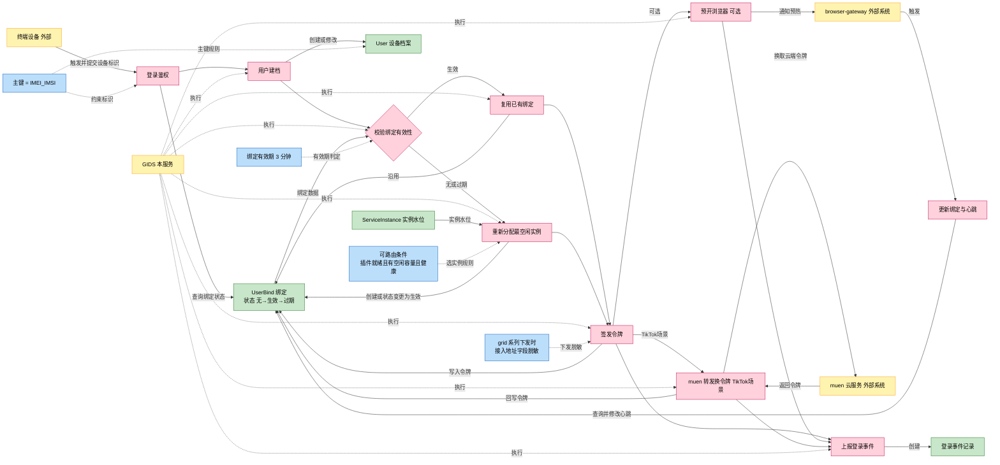
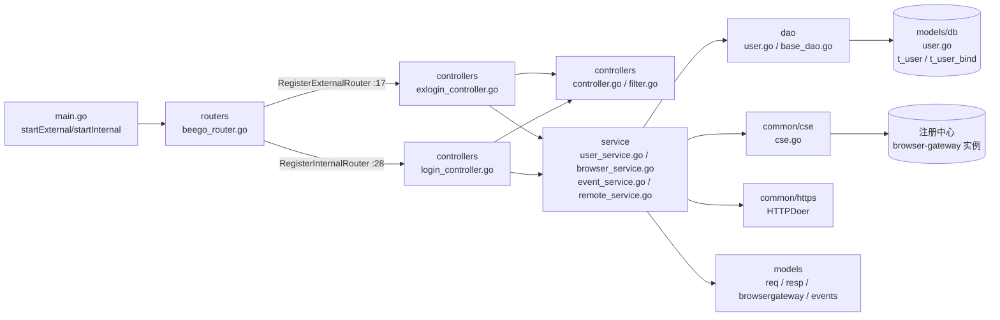
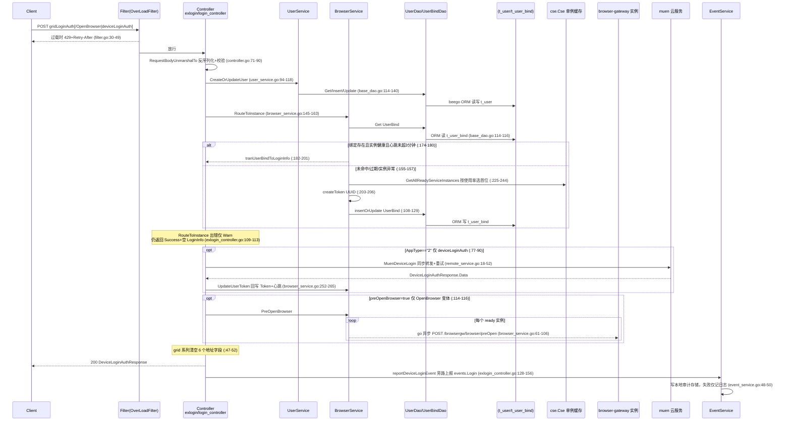

# 登录鉴权

> 功能域概述：处理终端登录鉴权，为用户（IMEI_IMSI）分配/复用健康 browser-gateway 实例，签发 Token 与接入地址（LoginInfo），维护 UserBind 绑定并上报登录事件。
> 接口数：6（外部 3 / 内部 6，3 个登录接口内外同名重复注册）　核心模块：controllers、service、dao、common/cse

## 1. 功能故事（多彩建模）

业务背景说明：为什么拆分外部/内部双监听、grid 系列为何要脱敏下发地址，**代码中未体现**（实现可见，设计意图无注释或文档佐证）。

### 术语表

| 术语 | 人话解释 | 出处 |
| --- | --- | --- |
| IMEI/IMSI | 设备本身和手机卡的两串身份号码，登录请求必带，用来认出"哪台设备的哪个用户" | src/models/req/request_entity.go:24-27 |
| IMEI_IMSI | 把上面两串号码用下划线拼起来，作为用户档案和绑定关系的唯一主键 | src/service/browser_service.go:147 |
| UserBind | "用户该连哪个浏览器实例"的绑定小账本，记着实例地址和访问令牌 | src/models/db/user.go:34-54 |
| BrowserGW / browser-gateway | 真正运行云浏览器的后端实例集群，GIDS 负责把用户分派到其中一台 | src/service/browser_service.go:87-92 |
| muen | TikTok 场景的云端上级服务，设备登录要转发过去换一枚云端令牌 | src/service/remote_service.go:18-52 |
| Token | 登录成功后签发的访问令牌（UUID 串），客户端凭它接入浏览器实例 | src/service/browser_service.go:203-206 |
| 预开浏览器 | 登录时提前通知各浏览器实例把浏览器进程热起来，缩短首开等待 | src/service/browser_service.go:61-80 |
| 心跳 | 绑定记录上的"最近活跃时间"，超过 3 分钟不刷新就视为绑定过期 | src/service/browser_service.go:165-172 |
| gridLoginAuth | 网格场景登录接口，特点是返回时下发的接入地址字段被清空脱敏 | src/controllers/exlogin_controller.go:42-54 |
| CSE/注册中心 | 微服务注册中心，browser-gateway 实例的上下线与水位变化从这里监听同步 | src/common/cse/cse.go:84,100-145 |

## 2. 模块划分

| 模块 | 承载功能（文件:行号） |
| --- | --- |
| routers | 双监听路由注册与限流过滤器挂载（src/routers/beego_router.go:17-47） |
| controllers | 登录/绑定 HTTP 入口、请求解析校验、统一响应、限流（src/controllers/exlogin_controller.go:19、src/controllers/login_controller.go:20、src/controllers/controller.go:71-146、src/controllers/filter.go:30-49） |
| service | 用户建档、实例路由、Token 更新、预开浏览器、事件上报、muen 转发（src/service/user_service.go:23、src/service/browser_service.go:37、src/service/event_service.go:15、src/service/remote_service.go:18） |
| dao | User/UserBind 实体的 beego ORM 读写（src/dao/user.go:7-29、src/dao/base_dao.go:78-174） |
| common/cse | browser-gateway 实例发现与本地缓存（单例 sync.Map）（src/common/cse/cse.go:23-29,66-70,84） |
| models | 请求/响应/实体/实例/事件数据结构（src/models/req/request_entity.go:29、src/models/resp/response_entity.go:46、src/models/db/user.go:10,34、src/models/browsergateway/service_instance.go:9、src/models/events/base.go:23,90） |

## 3. 接口清单

### 3.1 HTTP 接口

| 接口 | 路径/入口（含注册处） | 请求结构 | 响应结构 | 状态 |
| --- | --- | --- | --- | --- |
| GridLoginAuth（外部） | POST /app-api/devicetcp/app/login/v1/gridLoginAuth；注册 src/routers/beego_router.go:20，入口 src/controllers/exlogin_controller.go:42（路由声明 :29） | req.LoginAuthRequest（src/models/req/request_entity.go:29-52） | resp.DeviceLoginAuthResponse（src/models/resp/response_entity.go:23-26），6 个地址字段被清空（src/controllers/exlogin_controller.go:47-52） | 灰度中 |
| GridLoginAuthOpenBrowser（外部） | POST /app-api/devicetcp/app/login/v1/gridLoginAuthOpenBrowser；注册 src/routers/beego_router.go:20，入口 src/controllers/exlogin_controller.go:56（声明 :30） | req.LoginAuthRequest（:29-52） | resp.DeviceLoginAuthResponse（:23-26），同样清空地址字段（:62-66） | 在用（含异步预开 :114-116） |
| DeviceLoginAuth（外部） | POST /app-api/devicetcp/app/login/v1/deviceLoginAuth；注册 src/routers/beego_router.go:20，入口 src/controllers/exlogin_controller.go:70（声明 :31） | req.LoginAuthRequest（:29-52） | resp.DeviceLoginAuthResponse（:23-26），保留接入地址仅清 NodeIntranetWayURL（:75） | 在用（AppType=="2" 走 muen :77-90） |
| GridLoginAuth（内部） | 同路径；注册 src/routers/beego_router.go:34，入口 src/controllers/login_controller.go:94（声明 :30） | req.LoginAuthRequest（:29-52） | resp.DeviceLoginAuthResponse（:23-26），实现与外部逐行相同 | 在用 |
| GridLoginAuthOpenBrowser（内部） | 同路径；注册 src/routers/beego_router.go:34，入口 src/controllers/login_controller.go:108（声明 :31） | req.LoginAuthRequest（:29-52） | resp.DeviceLoginAuthResponse（:23-26），同外部实现 | 在用 |
| DeviceLoginAuth（内部） | 同路径；注册 src/routers/beego_router.go:34，入口 src/controllers/login_controller.go:122（声明 :32） | req.LoginAuthRequest（:29-52） | resp.DeviceLoginAuthResponse（:23-26），同外部实现 | 在用 |
| GetUserBind | GET /user-bind/v1/:sessionID；注册 src/routers/beego_router.go:34，入口 src/controllers/login_controller.go:46（声明 :33） | 路径参数 sessionID | db.UserBind（src/models/db/user.go:34-50），ErrNoRows 返回 404（src/controllers/login_controller.go:49-52） | 在用 |
| ExpiredUserBind | PUT /user-bind/v1/:sessionId；注册 src/routers/beego_router.go:34，入口 src/controllers/login_controller.go:62（声明 :34，参数名大小写与 GET 不一致） | 路径参数 sessionId | resp.BaseResponse 默认成功（src/controllers/login_controller.go:75） | 在用 |
| UpdateUserBind | POST /user-bind/v1/update；注册 src/routers/beego_router.go:34，入口 src/controllers/login_controller.go:78（声明 :35） | req.UpdateUserBindRequest（src/models/req/request_entity.go:135-151，SessionID 必填） | resp.BaseResponse 默认成功（src/controllers/login_controller.go:91） | 在用 |

### 3.2 语言级内部接口

| 接口 | 定义位置 | 实现 | 选择机制 |
| --- | --- | --- | --- |
| UserService | src/service/user_service.go:23-28 | UserServiceImpl（:39-42，断言 :37） | 唯一实现；Prepare 每请求 NewUserService()（src/controllers/login_controller.go:40-44） |
| BrowserService | src/service/browser_service.go:37-43 | BrowserServiceImpl（:55-59，断言 :45） | 唯一实现；NewBrowserService 注入 UserBindDao/cse.Cse/HTTPDoer（:47-53） |
| EventService | src/service/event_service.go:15-17 | EventServiceImpl（:33-35） | 唯一实现；包级 sync.Once 保证工厂初始化一次（:19-20,37） |
| cse.Cse | src/common/cse/cse.go:23-29 | 小写实现 cse（:31-36） | 包级单例 cseService，NewCse 恒返回同一指针（:66-70） |
| dao.BaseInterface | src/dao/base_dao.go:56-73 | BaseDao（:78，断言 :75） | 构造期注入实体类型分表：&db.User{} / &db.UserBind{}（src/dao/user.go:13-15,25-27） |

## 4. 关键数据结构

| 结构 | 定义位置 | 关键字段（含义+约束） |
| --- | --- | --- |
| req.LoginAuthRequest | src/models/req/request_entity.go:29-52 | UserIdentity{IMSI,IMEI}（:24-27）拼成 IMEI_IMSI 主键（src/service/browser_service.go:147）；AppType=="2" 触发 TikTok 分支（src/common/constants/base.go:19）；Validate() 空实现（:50-52） |
| req.UpdateUserBindRequest | src/models/req/request_entity.go:135-151 | SessionID 必填（:146-150）对应 UserBind.Key；endpoint 空串不覆盖（src/service/user_service.go:50-70） |
| resp.LoginInfo | src/models/resp/response_entity.go:46-49 | 内嵌 AuthInfo（:28-32）+AssignInfo（:34-44）；Token 为 UUID（src/service/browser_service.go:203-206）；ExpiresTime/TimeAxis 恒为 time.Now()（:186-187）；ShortAddr 等来自 conf.Instance().Node（:193-196，src/common/conf/config.go:45-48） |
| resp.DeviceLoginAuthResponse | src/models/resp/response_entity.go:23-26 | BaseResponse{Code,Message}+Data LoginInfo；grid 系列返回前清空 6 个地址字段（src/controllers/exlogin_controller.go:47-52） |
| db.User | src/models/db/user.go:10-32 | 表 t_user（:26-28）；Key 主键（:11）；设备指纹字段；CreatedAt/UpdatedAt 为字符串（:22-23） |
| db.UserBind | src/models/db/user.go:34-54 | 表 t_user_bind（:52-54）；Key=IMEI_IMSI；BrowserCap 不持久化 orm:"-"（:37）；Heartbeats 映射 updated_at，过期窗口 3 分钟（src/service/browser_service.go:29,34,171） |
| browsergateway.ServiceInstance | src/models/browsergateway/service_instance.go:9-21 | Cap/Used 容量水位，Less 按使用率升序（:33-37）；可路由条件 PluginStatus==Complete && Cap>0 && IsHealthy（src/service/browser_service.go:239，src/models/db/plugin_info.go:44） |
| browsergateway.InitBrowserRequest | src/models/browsergateway/req.go:14-28 | 由 LoginAuthRequest 平移（src/service/browser_service.go:62-73），POST /browsergw/browser/preOpen（:87-92） |

## 5. 调用关系

关键分支补充：

- 外部/内部路由差异仅在监听与注册处（src/routers/beego_router.go:17-25 vs 28-39），三个登录 Handler 实现逐行相同；内部监听绑定 FABRIC_ETH 本机 IP+`httpport`（默认 9090），外部 HTTPS 默认 40051（src/main.go:153-199）。
- 异步环节仅预开浏览器：`go instancePreOpenBrowser` 不等待结果（src/service/browser_service.go:77,82-106）。
- 内部 user-bind 三接口（GET/PUT/POST update）供 browser-gateway 回调维护绑定与心跳（src/controllers/login_controller.go:46-92；src/service/user_service.go:44-84）。

## 6. AI 编码指南

- 新登录接口须双Controller同步登记路由（src/controllers/exlogin_controller.go:29-31、src/controllers/login_controller.go:30-32）
- 登录Handler须复用loginAuth统一流程（src/controllers/exlogin_controller.go:94-126、src/controllers/controller.go:71-90）
- UserBind 主键保持 `IMEI_IMSI` 格式（src/service/browser_service.go:147、src/service/user_service.go:97）
- 绑定有效期改动只限defaultHeartbeats（src/service/browser_service.go:29,34,174-180）
- 新service遵循接口+Impl+断言，全局态单例化（src/service/user_service.go:23,37、src/common/cse/cse.go:66-70、src/service/event_service.go:37）
