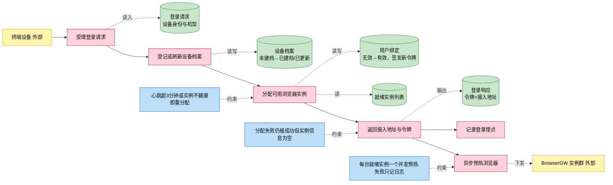
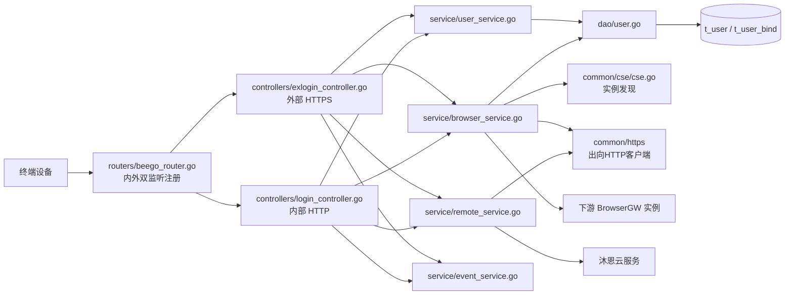
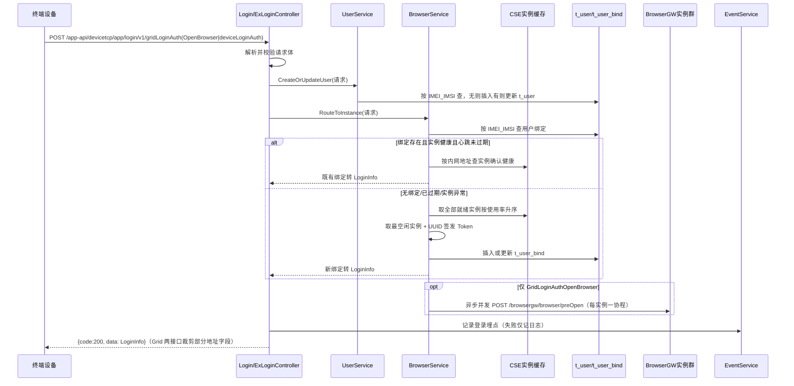
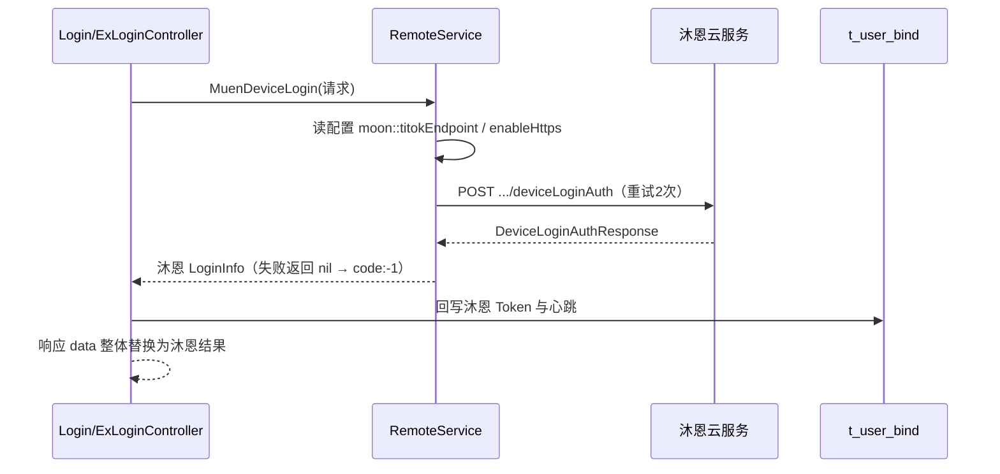
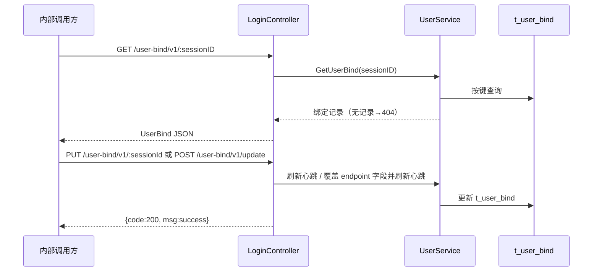

# 登录鉴权

> 功能域概述：终端设备登录鉴权，登记设备档案、分配云浏览器实例并签发接入令牌，支持登录即预热浏览器与用户绑定维护。
> 接口数：6（外部 3 / 内部 6，其中 3 个登录接口内外双监听同名注册）　核心模块：controllers, service, dao, common/cse, common/https

## 1. 功能故事（多彩建模）

实现逻辑速览（业务语言）：

终端登录后登记设备档案，分配健康浏览器实例并签发令牌。
绑定过期或实例异常时按空闲率重新分配。
可并发预热全部就绪实例；分配失败仍返回成功。

术语表：

| 术语 | 人话解释 | 出处 |
|---|---|---|
| IMEI / IMSI | 设备号 / SIM 卡号，拼成「IMEI_IMSI」作为用户唯一键 | src/models/req/request_entity.go |
| 用户绑定（UserBind） | 设备到浏览器实例的绑定关系，含接入地址与令牌，落库 t_user_bind | src/models/db/user.go |
| 设备档案（User） | 终端机型、屏幕、归属地等静态信息，落库 t_user | src/models/db/user.go |
| BrowserGW / browser-gateway | 下游云浏览器网关微服务，真正承载浏览器会话 | src/common/cse/cse.go |
| 就绪实例 | 插件安装完成（Completed）、容量大于 0 且健康的 BrowserGW 实例 | src/service/browser_service.go |
| 心跳过期 | 绑定记录的心跳时间距今超 3 分钟即视为失效 | src/service/browser_service.go |
| CSE | 微服务注册发现组件，监听 browser-gateway 实例上下线 | src/common/cse/cse.go |
| 预开浏览器（preOpen） | 登录成功后异步通知各就绪实例提前拉起浏览器 | src/service/browser_service.go |
| 沐恩（Muen / moon） | 外部云服务，TikTok 登录需向其二次鉴权换取令牌 | src/service/remote_service.go |
| TikTokAppType | AppType 取值 "2" 表示 TikTok 应用登录 | src/common/constants/base.go |
| Token | 登录令牌，每次重新分配实例时用 UUID 重新生成 | src/service/browser_service.go |
| sessionID | 用户绑定键，即「IMEI_IMSI」 | src/controllers/login_controller.go |

## 2. 模块划分

| 模块 | 承载功能（引用文件） |
|---|---|
| controllers/exlogin_controller.go | 外部 HTTPS 侧 3 个登录接口入口、响应字段裁剪、登录埋点（src/controllers/exlogin_controller.go） |
| controllers/login_controller.go | 内部 HTTP 侧 3 个登录接口 + 3 个用户绑定维护接口（src/controllers/login_controller.go） |
| controllers/controller.go | 请求体 JSON 解析与校验、OK/Failed/404/500 响应约定（src/controllers/controller.go） |
| service/user_service.go | 设备档案建档/更新、用户绑定查询/心跳刷新/字段更新（src/service/user_service.go） |
| service/browser_service.go | 实例筛选与按空闲率分配、绑定有效性校验、令牌签发、异步预开浏览器（src/service/browser_service.go） |
| service/remote_service.go | TikTok 登录出向沐恩二次鉴权（src/service/remote_service.go） |
| service/event_service.go | 登录事件落本地审计文件，失败仅记日志（src/service/event_service.go） |
| dao/user.go + dao/base_dao.go | t_user / t_user_bind 的 ORM 增删改查（src/dao/user.go、src/dao/base_dao.go） |
| common/cse/cse.go | 监听 browser-gateway 实例变化并缓存实例列表（src/common/cse/cse.go） |
| common/https | 出向 HTTP 客户端与请求构造器（src/common/https/client.go、src/common/https/builder.go） |

## 3. 接口清单

| 接口 | 路径/入口（含注册处） | 请求结构 | 响应结构 | 状态 |
|---|---|---|---|---|
| GridLoginAuth | POST /app-api/devicetcp/app/login/v1/gridLoginAuth；入口 src/controllers/exlogin_controller.go（外部）+ src/controllers/login_controller.go（内部）；注册 src/routers/beego_router.go | LoginAuthRequest（src/models/req/request_entity.go）：{imei, imsi, manufacturer, model, appType, extendModel, country, platform, width, height, mcc, mnc, deviceType, clientLanguage 等}，Validate 为空实现无强制项 | DeviceLoginAuthResponse（src/models/resp/response_entity.go）：{code, msg, data: LoginInfo}；返回前 tcpAddr/tlsTcpAddr/videoMode/shortAddr/httpsShortAddr/nodeIntranetWayUrl 置空 | 在用 |
| GridLoginAuthOpenBrowser | POST /app-api/devicetcp/app/login/v1/gridLoginAuthOpenBrowser；入口 src/controllers/exlogin_controller.go（外部）+ src/controllers/login_controller.go（内部）；注册 src/routers/beego_router.go | 同 GridLoginAuth | 同 GridLoginAuth（字段裁剪相同） | 在用 |
| DeviceLoginAuth | POST /app-api/devicetcp/app/login/v1/deviceLoginAuth；入口 src/controllers/exlogin_controller.go（外部）+ src/controllers/login_controller.go（内部）；注册 src/routers/beego_router.go | 同 GridLoginAuth；appType="2" 时触发沐恩二次鉴权 | DeviceLoginAuthResponse：仅 nodeIntranetWayUrl 置空；TikTok 场景 data 整体替换为沐恩返回的 LoginInfo | 在用 |
| GetUserBind | GET /user-bind/v1/:sessionID；入口 src/controllers/login_controller.go；注册 src/routers/beego_router.go（仅内部） | path 参数 sessionID | db.UserBind JSON（src/models/db/user.go）；无记录返回 HTTP 404 | 在用 |
| ExpiredUserBind | PUT /user-bind/v1/:sessionId；入口 src/controllers/login_controller.go；注册 src/routers/beego_router.go（仅内部） | path 参数 sessionId | BaseResponse {code, msg}；无记录返回 HTTP 404 | 在用 |
| UpdateUserBind | POST /user-bind/v1/update；入口 src/controllers/login_controller.go；注册 src/routers/beego_router.go（仅内部） | UpdateUserBindRequest（src/models/req/request_entity.go）：{sessionID 必填， 各 endpoint 可选} | BaseResponse {code, msg} | 在用 |
| （出向）BrowserGW 预开浏览器 | POST http://{browserGWInnerEndpoint}/browsergw/browser/preOpen（src/service/browser_service.go） | InitBrowserRequest（src/models/browsergateway/req.go）：{factory, dev_type, ext_type, plat_type, lcd_width, lcd_height, imsi, imei, device_type, client_language} | 仅判定 HTTP 2xx，失败只记日志 | 在用 |
| （出向）沐恩设备登录鉴权 | POST http(s)://{moon::titokEndpoint}/app-api/devicetcp/app/login/v1/deviceLoginAuth（src/service/remote_service.go） | LoginAuthRequest 原样转发；重试 2 次，https 时走专用证书客户端 | DeviceLoginAuthResponse，取 data 作为登录结果 | 在用 |

## 4. 关键数据结构

| 结构 | 定义位置 | 关键字段（含义+约束） |
|---|---|---|
| LoginAuthRequest | src/models/req/request_entity.go | IMEI/IMSI（json imei/imsi，用户键来源）；AppType（"2"=TikTok 触发沐恩鉴权）；Manufacturer/Model/ExtendModel/Platform/Width/Height/DeviceType（建档与预开透传）；Validate() 为空实现，无强制校验 |
| LoginInfo（AuthInfo+AssignInfo） | src/models/resp/response_entity.go | Token（UUID）；ExpiresTime/TimeAxis（均为当前 Unix 秒）；TcpAddr/TlsTcpAddr（实例控制面地址）；NodeGateWayURL/HttpsNodeGateWayUrl（本节点对外地址，取自配置 node::endpoint/node::httpsendpoint）；NodeIntranetWayURL（实例内网地址）；NodeCapacity（实例容量） |
| DeviceLoginAuthResponse | src/models/resp/response_entity.go | BaseResponse{code, msg} + Data LoginInfo；code 取 200/-1/-2（src/common/constants/retcode/retcode.go） |
| UserBind（t_user_bind） | src/models/db/user.go | Key（pk，IMEI_IMSI）；BrowserInstance（实例内网地址作标识）；Control/Media 及 TLS 四类 Endpoint；Token；Heartbeats（最近心跳，yyyy-MM-dd HH:mm:ss，+3 分钟过期） |
| User（t_user） | src/models/db/user.go | Key（pk，IMEI_IMSI）；Manufacturer/Model/Country/Platform/MCC/MNC/DeviceType 等；CreatedAt/UpdatedAt |
| ServiceInstance | src/models/browsergateway/service_instance.go | BrowserInnerEndpoint（实例键）；Cap/Used（容量/已用，按使用率升序排序）；PluginStatus（Completed 才算就绪）；IsHealthy |
| UpdateUserBindRequest | src/models/req/request_entity.go | SessionID（必填，Validate 非空校验）；各 Endpoint 非空才覆盖 |

## 5. 调用关系

登录鉴权主链路（GridLoginAuth / GridLoginAuthOpenBrowser / DeviceLoginAuth 共用，内外两控制器逻辑一致）：

TikTok 设备登录分支（仅 DeviceLoginAuth 且 AppType="2"）：

用户绑定维护链路（仅内部 HTTP）：

关键分支与异步环节（各一句，带证据文件）：

- 请求体解析/校验失败返回 HTTP 400、code=-2（src/controllers/controller.go）
- 建档失败返回 HTTP 400、code=-1；实例分配失败仅告警，仍返回 code=200 与空 LoginInfo（src/controllers/login_controller.go）
- 无空闲实例时报「no idle instances available」走上条空响应分支（src/service/browser_service.go）
- 绑定心跳超 3 分钟或所属实例不在线/不健康即重新分配（src/service/browser_service.go）
- 预开浏览器每台就绪实例一个 goroutine 并发下发，单台失败只记日志（src/service/browser_service.go）
- 沐恩鉴权失败或回写令牌失败，登录整体返回 code=-1（src/controllers/login_controller.go）
- 登录埋点写本地审计文件，失败不影响登录结果（src/service/event_service.go）
- ExpiredUserBind 实现为把心跳刷新为当前时间（与「过期」字面相反，业务意图代码中未体现）（src/service/user_service.go）
- 响应结构 GridLoginAuthResponse 已定义但三个登录接口实际均用 DeviceLoginAuthResponse（src/models/resp/response_entity.go）

## 6. 框架引用

| 基础框架 | 框架文档 | 本功能中的用途（引用文件） |
|---|---|---|
| Beego Web 路由/Controller | [rpc-beego-web.md](../framework-usage/rpc-beego-web.md) | 内外双监听路由注册与请求处理（src/routers/beego_router.go、src/controllers/login_controller.go、src/controllers/exlogin_controller.go） |
| Beego ORM | [storage-beego-orm.md](../framework-usage/storage-beego-orm.md) | t_user / t_user_bind 增删改查（src/dao/user.go、src/dao/base_dao.go、src/models/db/user.go） |
| CSE/GSF 服务发现 | [resilience-cse-gsf.md](../framework-usage/resilience-cse-gsf.md) | 监听 browser-gateway 实例上下线并缓存实例列表（src/common/cse/cse.go） |
| HTTP Client Builder | [rpc-http-client-builder.md](../framework-usage/rpc-http-client-builder.md) | preOpen 与沐恩鉴权出向调用、重试与超时（src/service/browser_service.go、src/service/remote_service.go、src/common/https/builder.go） |
| Goroutine 并发 | [concurrency-goroutine.md](../framework-usage/concurrency-goroutine.md) | 每台就绪实例一个协程并发预开浏览器（src/service/browser_service.go） |
| UUID 工具 | [base-uuid-utils.md](../framework-usage/base-uuid-utils.md) | 重新分配实例时签发登录令牌（src/service/browser_service.go） |
| 配置（appconf/配置中心） | [config-appconf-flagutil-configcenter.md](../framework-usage/config-appconf-flagutil-configcenter.md) | 节点对外地址、沐恩端点与 https 开关读取（src/common/conf/config.go、src/service/remote_service.go） |
| 日志/审计事件 | [log-lager-auditlog-event.md](../framework-usage/log-lager-auditlog-event.md) | 登录埋点落本地审计文件、错误日志（src/service/event_service.go、src/models/events/base.go） |

## 7. AI 编码指南

- 三个登录接口内外双注册，改动须同步两个控制器（src/controllers/login_controller.go、src/controllers/exlogin_controller.go）
- 路由只动 RouteInfo()，内外监听各自注册生效（src/routers/beego_router.go）
- 失败约定：解析-2、内部-1、分配失败仍返 200 空实例（src/controllers/login_controller.go）
- 出向沿用 builder，preOpen 每实例一协程（src/service/browser_service.go）
- 绑定有效期=心跳+3分钟，实例不健康即重分配（src/service/browser_service.go）
