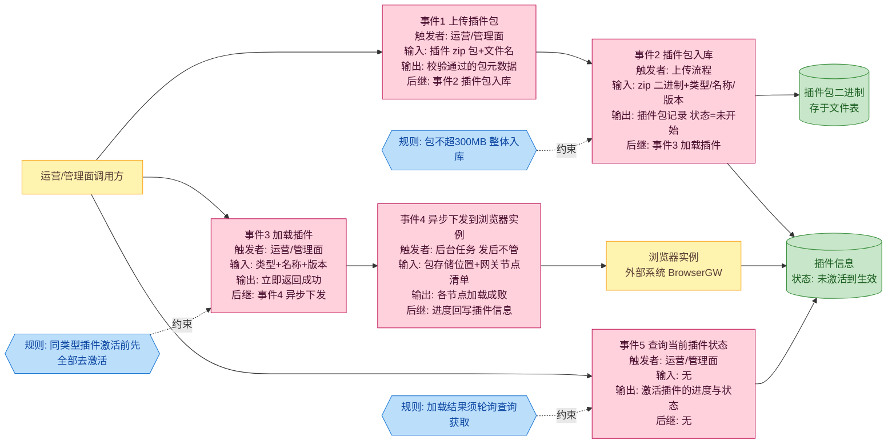
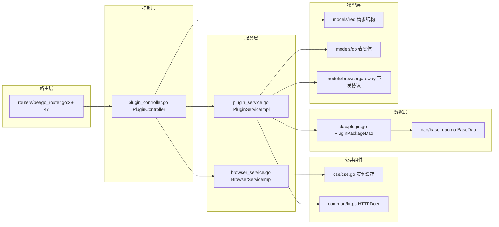
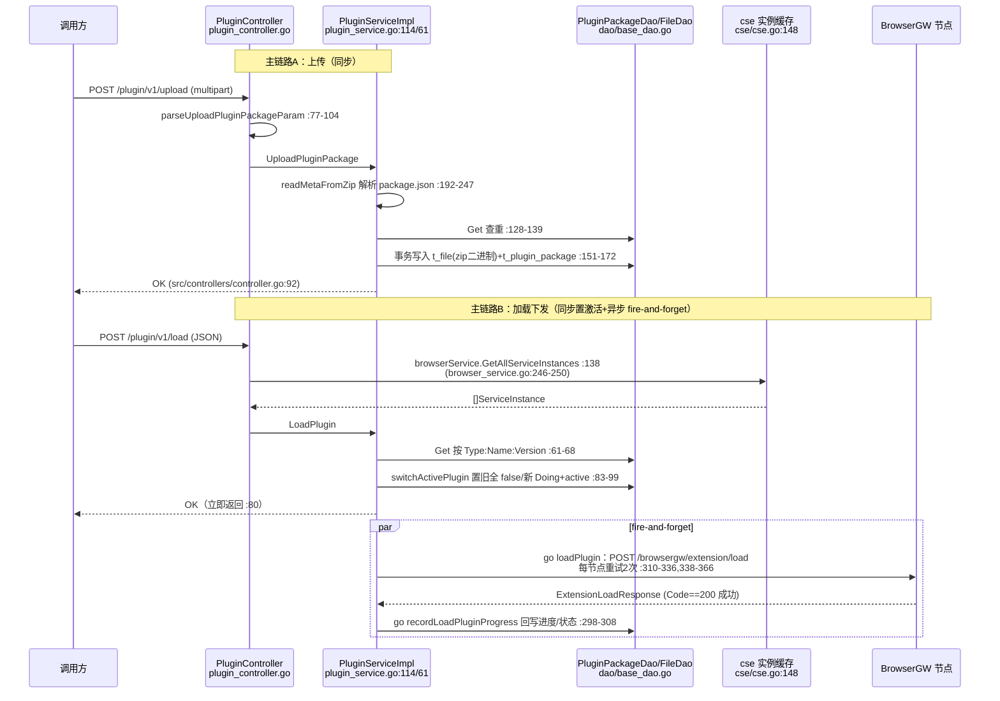

# 插件管理

> 功能域概述：负责 Chrome 扩展插件包（zip）的上传、删除、查询，并将激活插件异步下发加载到全部 BrowserGW 节点、记录下发进度。
> 接口数：5（外部 0 / 内部 5）　核心模块：PluginController, PluginService, PluginPackageDao

## 1. 功能故事（多彩建模）

### 术语表

| 术语 | 人话解释 | 出处 |
|---|---|---|
| 插件包 | Chrome 浏览器扩展的 zip 压缩包，整个文件直接存数据库 | src/service/plugin_service.go:146-160 |
| package.json（扩展描述文件） | zip 内的说明书，写明插件的类型、名称、版本 | src/service/plugin_service.go:218-223；src/common/constants/base.go:16 |
| BrowserGW（浏览器网关） | 承载浏览器实例的网关节点，负责接收并执行插件加载指令 | src/service/plugin_service.go:338-366 |
| 激活插件 | 当前生效的插件；同类型同一时刻只保留一个生效，激活新版前旧版全部去激活 | src/service/plugin_service.go:83-99 |
| fire-and-forget（发后不管） | 加载接口立即返回成功，真正的下发在后台进行，结果不在接口响应里 | src/service/plugin_service.go:76-80 |
| 下发进度 | 按加载成功的网关节点比例算出的 0-100 进度，全部成功才算完成 | src/service/plugin_service.go:322-330 |
| 实例清单 | 从注册中心缓存拿到的全部网关节点地址，下发的目标列表 | src/common/cse/cse.go:148-158 |
| 桶（Bucket） | 存插件包的逻辑分区，固定叫 "extension" | src/common/constants/base.go:12 |
| 运营/管理面调用方 | 发起上传/加载/查询的人或上游系统；代码中未体现（接口为内部路由，无鉴权与角色信息） | src/controllers/plugin_controller.go:26-33 |

## 2. 模块划分

| 模块/包 | 承载功能（文件:行号） |
|---|---|
| controllers.PluginController | 5 个内部路由入口：multipart/JSON 参数解析、调用 service、错误码转换（src/controllers/plugin_controller.go:18-155） |
| service.PluginServiceImpl | 业务核心：读 zip 元数据、落库、激活切换、异步下发、进度回写（src/service/plugin_service.go:36-366） |
| service.BrowserServiceImpl | 提供 BrowserGW 实例清单（src/service/browser_service.go:246-250） |
| common/cse | watch 注册中心维护实例缓存，供实例清单查询（src/common/cse/cse.go:148-158） |
| common/https | HTTP 客户端抽象，跨服务调用 BrowserGW（注入点 src/service/plugin_service.go:47、53） |
| dao.PluginPackageDao / BaseDao | t_plugin_package 表 ORM 封装与事务（src/dao/plugin.go:7-17、src/dao/base_dao.go:82-159） |
| models | 请求/表实体/browsergateway 下发协议结构（src/models/req/plugin_entity.go:13、src/models/db/plugin_info.go:13、src/models/browsergateway/req.go:6） |

## 3. 接口清单

| 接口 | 路径/入口（含注册处） | 请求结构 | 响应结构 | 状态 |
|---|---|---|---|---|
| 上传插件包 | POST /plugin/v1/upload（multipart），注册 src/controllers/plugin_controller.go:27，入口 :47 | multipart：filename + file（src/models/req/plugin_entity.go:13-17） | 通用 BaseResponse（src/controllers/controller.go:92-98） | 在用 |
| 删除插件包 | POST /plugin/v1/delete（JSON），注册 :28，入口 :106 | req.PluginPackageReq（Name/Type/Version 必填，src/models/req/plugin_entity.go:27-42） | BaseResponse | 在用 |
| 查询全部插件包 | POST /plugin/v1/getAll，注册 :29，入口 :121 | 空 body | []*db.PluginPackage（src/controllers/plugin_controller.go:128） | 在用 |
| 加载（激活）插件 | POST /plugin/v1/load（JSON），注册 :30，入口 :131 | req.PluginPackageReq（src/models/req/plugin_entity.go:27-42） | BaseResponse（异步下发，结果不在响应中） | 在用 |
| 查询当前激活插件 | POST /plugin/v1/current，注册 :31，入口 :148 | 空 body | []*db.PluginPackage（src/controllers/plugin_controller.go:154） | 在用 |

### 语言级内部接口

| 接口 | 定义位置 | 实现 | 选择机制 |
|---|---|---|---|
| PluginService | src/service/plugin_service.go:36-42 | PluginServiceImpl（:50，断言 :44） | 无多实现；NewPluginService（:46）直接注入 Controller（src/controllers/plugin_controller.go:37） |
| BrowserService | src/service/browser_service.go:37-43 | BrowserServiceImpl（:55） | 无多实现，直接注入 |
| https.HTTPDoer | src/service/plugin_service.go:47（字段） | https.Instance() 单例（:53） | 单例注入，无选择机制 |

## 4. 关键数据结构

| 结构 | 定义位置 | 关键字段（含义+约束） |
|---|---|---|
| req.UploadPluginPackageReq | src/models/req/plugin_entity.go:13-25 | Filename 可缺省（取 header.Filename）；File multipart 流；Size 必非 0 且 ≤300MB（src/common/constants/base.go:11） |
| req.PluginPackageReq | src/models/req/plugin_entity.go:27-42 | Name/Type/Version 均必填；GetKey 拼 `Type:Name:Version` 主键（:33-35） |
| db.PluginPackage | src/models/db/plugin_info.go:13-48 | Field 主键列 `key`（GetField :34-39）；Type 须为 "ChromeExtend"（src/common/constants/base.go:15）；Status ∈ NotStart/Doing/Complete/Failed（:43-48）；IfActive 激活标记；Progress 0-100；PackageBucket 固定 "extension"（base.go:12） |
| db.File | src/models/db/file.go:15-26 | Bucket+Name 定位；Content 为 bytea 存 zip 二进制（t_file 表） |
| browsergateway.ServiceInstance | src/models/browsergateway/service_instance.go:9-21 | BrowserInnerEndpoint 下发目标地址；IsHealthy 健康标记（load 路径未过滤） |
| browsergateway.ExtensionLoadRequest / ExtensionLoadResponse | src/models/browsergateway/req.go:6-12、resp.go:6-10 | 请求带 BucketName、ExtensionFilePath、Name/Version/Type；响应 Code==200 视为该节点成功 |

## 5. 调用关系

关键分支：
1. 上传仅支持 ".zip" 后缀且元数据 Type 硬编码须为 "ChromeExtend"，其余直接拒绝（src/service/plugin_service.go:176-178、236）。
2. LoadPlugin 中 switchActivePlugin 失败仅记日志并 `return nil`，接口仍返回成功（src/service/plugin_service.go:70-74）。
3. 下发循环按成功数计算进度，达 100 置 Complete 否则 Failed，结束后 close channel 触发回写退出（src/service/plugin_service.go:322-334）。

## 6. AI 编码指南

- 新接口用RequestBodyUnmarshalTo校验（src/controllers/plugin_controller.go:108、133；src/controllers/controller.go:71-90）
- LoadPlugin 异步下发，轮询 current 查结果（src/service/plugin_service.go:76-80；src/controllers/plugin_controller.go:148-155）
- 插件包存 t_file bytea，300MB 整体读内存（src/service/plugin_service.go:146-160）
- 新增插件类型须改后缀分发、Type 校验、去激活 SQL（src/service/plugin_service.go:176-178、236、89-90）
- 查询直接返回 db 实体，resp 结构未用（src/models/resp/plugin_entity.go:13-31；src/controllers/plugin_controller.go:128、154）
